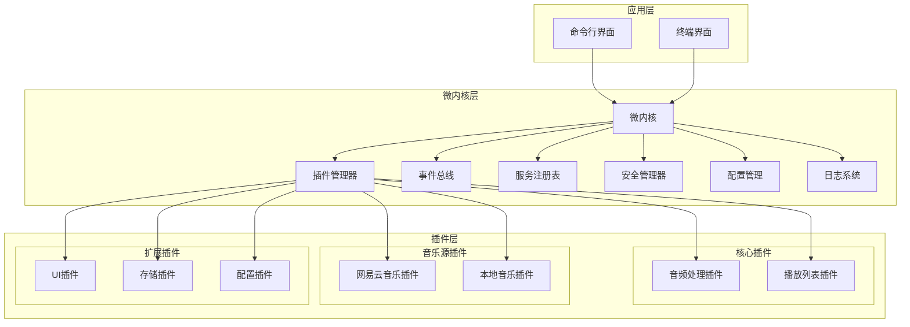
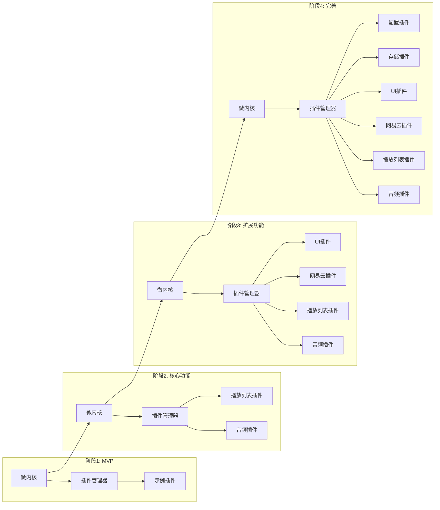
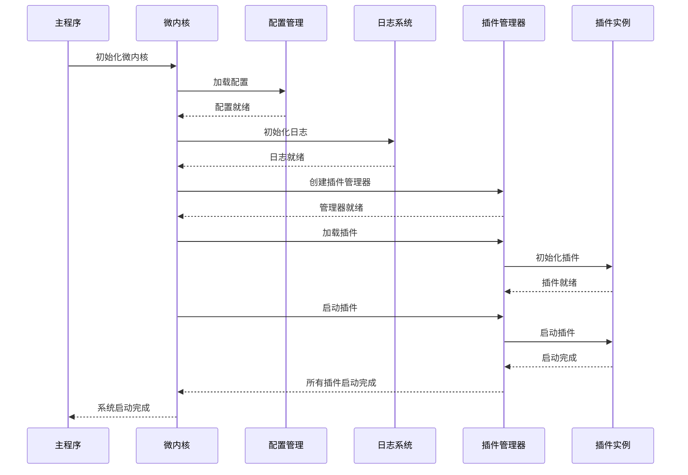

# go-musicfox 旧版代码迁移设计文档

## Overview

本设计文档基于渐进式迁移方案，详细描述了将go-musicfox v1单体架构迁移到v2微内核插件架构的技术实现。项目采用分阶段、风险可控的迁移策略，确保每个阶段都有可运行的系统版本，同时保持功能完整性和用户体验一致性。

### 设计目标

- **架构现代化**：从单体架构转换为微内核插件架构
- **功能一致性**：确保迁移后功能与v1版本完全一致
- **渐进式实施**：每个阶段都产出可运行的程序版本
- **风险可控**：建立完善的错误处理和恢复机制
- **高质量交付**：通过全面测试保证代码质量

### 核心原则

1. **最小化风险**：每个迁移步骤都可回滚
2. **持续可用**：系统在迁移过程中始终可用
3. **质量优先**：不以速度牺牲质量
4. **用户体验**：保持用户使用习惯不变

## Architecture

### 整体架构设计



### 迁移架构演进



### 系统启动流程



## Components and Interfaces

### 核心组件接口

#### 微内核接口

```go
type MicroKernel interface {
    // 生命周期管理
    Initialize(ctx context.Context, config *Config) error
    Start(ctx context.Context) error
    Stop(ctx context.Context) error
    Shutdown(ctx context.Context) error
    
    // 组件访问
    GetPluginManager() PluginManager
    GetEventBus() EventBus
    GetServiceRegistry() ServiceRegistry
    GetSecurityManager() SecurityManager
    
    // 系统服务
    GetConfig() *koanf.Koanf
    GetLogger() *slog.Logger
    GetContainer() *dig.Container
    
    // 健康检查
    HealthCheck() (*HealthStatus, error)
}
```

#### 插件基础接口

```go
type Plugin interface {
    // 插件基本信息
    ID() string
    Name() string
    Version() string
    Description() string
    
    // 生命周期管理
    Initialize(ctx context.Context, config *PluginConfig) error
    Start(ctx context.Context) error
    Stop(ctx context.Context) error
    Cleanup(ctx context.Context) error
    
    // 健康检查
    HealthCheck() HealthStatus
    
    // 依赖管理
    Dependencies() []string
    Provides() []string
}
```

#### 音频处理插件接口

```go
type AudioPlugin interface {
    Plugin
    
    // 播放控制
    Play(music *Music) error
    Pause() error
    Resume() error
    Stop() error
    Seek(position time.Duration) error
    
    // 状态查询
    GetState() PlayState
    GetPosition() time.Duration
    GetDuration() time.Duration
    
    // 音量控制
    SetVolume(volume int) error
    GetVolume() int
    
    // 事件回调
    OnStateChanged(callback StateChangeCallback)
    OnPositionChanged(callback PositionChangeCallback)
    OnError(callback ErrorCallback)
}
```

#### 音乐源插件接口

```go
type MusicSourcePlugin interface {
    Plugin
    
    // 搜索功能
    Search(ctx context.Context, query string, searchType SearchType) (*SearchResult, error)
    
    // 播放列表
    GetPlaylist(ctx context.Context, playlistID string) (*Playlist, error)
    GetUserPlaylists(ctx context.Context, userID string) ([]*Playlist, error)
    
    // 歌曲信息
    GetSongInfo(ctx context.Context, songID string) (*Song, error)
    GetSongURL(ctx context.Context, songID string, quality Quality) (string, error)
    
    // 用户认证
    Login(ctx context.Context, credentials *Credentials) error
    Logout(ctx context.Context) error
    IsLoggedIn() bool
    
    // 缓存管理
    ClearCache() error
    GetCacheSize() int64
}
```

#### UI插件接口

```go
type UIPlugin interface {
    Plugin
    
    // UI生命周期
    Render(ctx context.Context) error
    Update(event *UIEvent) error
    Refresh() error
    
    // 事件处理
    HandleKeyEvent(key KeyEvent) error
    HandleMouseEvent(mouse MouseEvent) error
    
    // 状态管理
    SetState(state *UIState) error
    GetState() *UIState
    
    // 组件管理
    AddComponent(component UIComponent) error
    RemoveComponent(componentID string) error
    GetComponent(componentID string) (UIComponent, error)
}
```

### 事件系统设计

```go
type EventType string

const (
    // 播放事件
    EventPlayStateChanged EventType = "play.state.changed"
    EventSongChanged     EventType = "song.changed"
    EventVolumeChanged   EventType = "volume.changed"
    EventPositionChanged EventType = "position.changed"
    
    // 播放列表事件
    EventPlaylistChanged EventType = "playlist.changed"
    EventPlaylistAdded   EventType = "playlist.added"
    EventPlaylistRemoved EventType = "playlist.removed"
    
    // 用户事件
    EventUserLogin  EventType = "user.login"
    EventUserLogout EventType = "user.logout"
    
    // 系统事件
    EventPluginLoaded   EventType = "plugin.loaded"
    EventPluginUnloaded EventType = "plugin.unloaded"
    EventSystemError    EventType = "system.error"
)

type Event struct {
    Type      EventType              `json:"type"`
    Source    string                 `json:"source"`
    Timestamp time.Time              `json:"timestamp"`
    Data      map[string]interface{} `json:"data"`
    Priority  EventPriority          `json:"priority"`
}

type EventBus interface {
    // 事件发布订阅
    Publish(ctx context.Context, event *Event) error
    Subscribe(eventType EventType, handler EventHandler) (SubscriptionID, error)
    Unsubscribe(subscriptionID SubscriptionID) error
    
    // 批量操作
    PublishBatch(ctx context.Context, events []*Event) error
    SubscribeBatch(subscriptions []Subscription) error
    
    // 事件过滤
    SubscribeWithFilter(eventType EventType, filter EventFilter, handler EventHandler) (SubscriptionID, error)
}
```

## Data Models

### 核心数据结构

```go
// 歌曲信息
type Song struct {
    ID          string            `json:"id"`
    Name        string            `json:"name"`
    Artist      string            `json:"artist"`
    Album       string            `json:"album"`
    Duration    time.Duration     `json:"duration"`
    URL         string            `json:"url"`
    CoverURL    string            `json:"cover_url"`
    Quality     Quality           `json:"quality"`
    Source      string            `json:"source"`
    Metadata    map[string]string `json:"metadata"`
    CreatedAt   time.Time         `json:"created_at"`
    UpdatedAt   time.Time         `json:"updated_at"`
}

// 播放列表
type Playlist struct {
    ID          string    `json:"id"`
    Name        string    `json:"name"`
    Description string    `json:"description"`
    CoverURL    string    `json:"cover_url"`
    Songs       []*Song   `json:"songs"`
    CreatedAt   time.Time `json:"created_at"`
    UpdatedAt   time.Time `json:"updated_at"`
    Source      string    `json:"source"`
    IsPublic    bool      `json:"is_public"`
    Owner       string    `json:"owner"`
}

// 播放状态
type PlayState struct {
    State       State         `json:"state"`
    CurrentSong *Song         `json:"current_song"`
    Position    time.Duration `json:"position"`
    Volume      int           `json:"volume"`
    PlayMode    PlayMode      `json:"play_mode"`
    Playlist    *Playlist     `json:"playlist"`
    PlayIndex   int           `json:"play_index"`
    Shuffle     bool          `json:"shuffle"`
    Repeat      RepeatMode    `json:"repeat"`
}

// 插件配置
type PluginConfig struct {
    ID       string                 `json:"id"`
    Name     string                 `json:"name"`
    Enabled  bool                   `json:"enabled"`
    Settings map[string]interface{} `json:"settings"`
    Priority int                    `json:"priority"`
    Version  string                 `json:"version"`
}

// 用户信息
type User struct {
    ID       string            `json:"id"`
    Username string            `json:"username"`
    Email    string            `json:"email"`
    Avatar   string            `json:"avatar"`
    Profile  map[string]string `json:"profile"`
    Source   string            `json:"source"`
}
```

### 枚举类型定义

```go
type State int

const (
    StateStopped State = iota
    StatePlaying
    StatePaused
    StateBuffering
    StateError
)

type PlayMode int

const (
    PlayModeSequential PlayMode = iota
    PlayModeRandom
    PlayModeSingle
)

type RepeatMode int

const (
    RepeatNone RepeatMode = iota
    RepeatOne
    RepeatAll
)

type Quality int

const (
    QualityLow Quality = iota
    QualityMedium
    QualityHigh
    QualityLossless
)

type SearchType int

const (
    SearchTypeSong SearchType = iota
    SearchTypeAlbum
    SearchTypeArtist
    SearchTypePlaylist
)
```

### 数据存储设计

```go
type StoragePlugin interface {
    Plugin
    
    // 基础存储操作
    Get(ctx context.Context, key string) (interface{}, error)
    Set(ctx context.Context, key string, value interface{}, ttl time.Duration) error
    Delete(ctx context.Context, key string) error
    Exists(ctx context.Context, key string) bool
    
    // 批量操作
    GetBatch(ctx context.Context, keys []string) (map[string]interface{}, error)
    SetBatch(ctx context.Context, data map[string]interface{}) error
    DeleteBatch(ctx context.Context, keys []string) error
    
    // 查询操作
    Find(ctx context.Context, pattern string) (map[string]interface{}, error)
    Count(ctx context.Context, pattern string) (int, error)
    Keys(ctx context.Context, pattern string) ([]string, error)
    
    // 事务支持
    BeginTransaction(ctx context.Context) (Transaction, error)
    
    // 缓存管理
    ClearCache(ctx context.Context) error
    GetCacheStats(ctx context.Context) (*CacheStats, error)
}

type Transaction interface {
    Get(key string) (interface{}, error)
    Set(key string, value interface{}) error
    Delete(key string) error
    Commit() error
    Rollback() error
}
```

## Error Handling

### 错误分类和定义

```go
type ErrorCode int

const (
    // 系统错误 (1000-1999)
    ErrSystemInitFailed    ErrorCode = 1001
    ErrSystemShutdown      ErrorCode = 1002
    ErrSystemConfigInvalid ErrorCode = 1003
    
    // 插件错误 (2000-2999)
    ErrPluginNotFound      ErrorCode = 2001
    ErrPluginLoadFailed    ErrorCode = 2002
    ErrPluginStartFailed   ErrorCode = 2003
    ErrPluginCrashed       ErrorCode = 2004
    ErrPluginTimeout       ErrorCode = 2005
    ErrPluginDependency    ErrorCode = 2006
    
    // 音频错误 (3000-3999)
    ErrAudioPlayFailed     ErrorCode = 3001
    ErrAudioFormatError    ErrorCode = 3002
    ErrAudioDeviceError    ErrorCode = 3003
    ErrAudioStreamError    ErrorCode = 3004
    
    // 网络错误 (4000-4999)
    ErrNetworkTimeout      ErrorCode = 4001
    ErrNetworkUnreachable  ErrorCode = 4002
    ErrAPIError            ErrorCode = 4003
    ErrAuthenticationError ErrorCode = 4004
    
    // 存储错误 (5000-5999)
    ErrStorageReadFailed   ErrorCode = 5001
    ErrStorageWriteFailed  ErrorCode = 5002
    ErrStorageCorrupted    ErrorCode = 5003
    ErrStorageNotFound     ErrorCode = 5004
)

type MusicFoxError struct {
    Code      ErrorCode         `json:"code"`
    Message   string            `json:"message"`
    Details   string            `json:"details"`
    Source    string            `json:"source"`
    Timestamp time.Time         `json:"timestamp"`
    Stack     string            `json:"stack,omitempty"`
    Context   map[string]string `json:"context,omitempty"`
}

func (e *MusicFoxError) Error() string {
    return fmt.Sprintf("[%d] %s: %s", e.Code, e.Source, e.Message)
}

func (e *MusicFoxError) Is(target error) bool {
    if t, ok := target.(*MusicFoxError); ok {
        return e.Code == t.Code
    }
    return false
}
```

### 错误处理策略

```go
type ErrorHandler interface {
    HandleError(ctx context.Context, err error) error
    ShouldRetry(err error) bool
    GetRetryDelay(attempt int) time.Duration
    GetMaxRetries() int
}

type RecoveryStrategy interface {
    CanRecover(err error) bool
    Recover(ctx context.Context, err error) error
    GetRecoveryTimeout() time.Duration
}

// 插件错误恢复
type PluginRecovery struct {
    maxRetries   int
    retryDelay   time.Duration
    fallbackMode bool
    logger       *slog.Logger
}

func (pr *PluginRecovery) Recover(ctx context.Context, pluginID string, err error) error {
    pr.logger.Error("Plugin error occurred", 
        "plugin_id", pluginID, 
        "error", err)
    
    switch e := err.(type) {
    case *MusicFoxError:
        switch e.Code {
        case ErrPluginCrashed:
            return pr.restartPlugin(ctx, pluginID)
        case ErrPluginLoadFailed:
            return pr.reloadPlugin(ctx, pluginID)
        case ErrPluginTimeout:
            return pr.resetPlugin(ctx, pluginID)
        default:
            return pr.enableFallbackMode(ctx, pluginID)
        }
    default:
        return pr.handleUnknownError(ctx, pluginID, err)
    }
}

func (pr *PluginRecovery) restartPlugin(ctx context.Context, pluginID string) error {
    // 实现插件重启逻辑
    return nil
}
```

### 监控和告警

```go
type Monitor interface {
    // 指标记录
    RecordMetric(name string, value float64, tags map[string]string)
    RecordCounter(name string, tags map[string]string)
    RecordHistogram(name string, value float64, tags map[string]string)
    
    // 错误记录
    RecordError(err error, context map[string]string)
    RecordEvent(event string, data map[string]interface{})
    
    // 查询接口
    GetMetrics(name string, duration time.Duration) (*MetricData, error)
    GetErrorRate(duration time.Duration) (float64, error)
    GetHealthStatus() (*HealthStatus, error)
}

type AlertManager interface {
    RegisterAlert(alert *AlertRule) error
    TriggerAlert(alertID string, data map[string]interface{}) error
    GetActiveAlerts() ([]*Alert, error)
    AcknowledgeAlert(alertID string) error
}

type AlertRule struct {
    ID          string            `json:"id"`
    Name        string            `json:"name"`
    Condition   string            `json:"condition"`
    Threshold   float64           `json:"threshold"`
    Duration    time.Duration     `json:"duration"`
    Severity    AlertSeverity     `json:"severity"`
    Actions     []AlertAction     `json:"actions"`
    Metadata    map[string]string `json:"metadata"`
}
```

## Testing Strategy

### 测试层次结构

```mermaid
pyramid
    title 测试金字塔
    "E2E测试" : 10
    "集成测试" : 30
    "单元测试" : 60
```

### 单元测试策略

```go
// 插件测试接口
type PluginTester interface {
    SetupTest() error
    TeardownTest() error
    TestPluginLifecycle() error
    TestPluginFunctionality() error
    TestPluginErrorHandling() error
    TestPluginPerformance() error
}

// Mock插件实现
type MockAudioPlugin struct {
    state     PlayState
    callbacks map[string][]func()
    errors    map[string]error
    mutex     sync.RWMutex
}

func (m *MockAudioPlugin) Play(music *Music) error {
    m.mutex.Lock()
    defer m.mutex.Unlock()
    
    if err, exists := m.errors["play"]; exists {
        return err
    }
    
    m.state.State = StatePlaying
    m.state.CurrentSong = music
    m.triggerCallback("stateChanged")
    return nil
}

// 测试用例示例
func TestAudioPluginPlay(t *testing.T) {
    plugin := &MockAudioPlugin{
        callbacks: make(map[string][]func()),
        errors:    make(map[string]error),
    }
    
    music := &Music{
        ID:   "test-id",
        Name: "Test Song",
        URL:  "http://example.com/test.mp3",
    }
    
    err := plugin.Play(music)
    assert.NoError(t, err)
    assert.Equal(t, StatePlaying, plugin.GetState().State)
    assert.Equal(t, music, plugin.GetState().CurrentSong)
}

func TestAudioPluginErrorHandling(t *testing.T) {
    plugin := &MockAudioPlugin{
        callbacks: make(map[string][]func()),
        errors:    map[string]error{
            "play": &MusicFoxError{
                Code:    ErrAudioPlayFailed,
                Message: "Failed to play audio",
                Source:  "MockAudioPlugin",
            },
        },
    }
    
    music := &Music{ID: "test-id"}
    err := plugin.Play(music)
    
    assert.Error(t, err)
    var musicFoxErr *MusicFoxError
    assert.True(t, errors.As(err, &musicFoxErr))
    assert.Equal(t, ErrAudioPlayFailed, musicFoxErr.Code)
}
```

### 集成测试策略

```go
// 集成测试框架
type IntegrationTestSuite struct {
    kernel        *MicroKernel
    pluginManager *PluginManager
    testPlugins   map[string]Plugin
    testConfig    *Config
    cleanup       []func()
}

func (its *IntegrationTestSuite) SetupSuite() {
    // 初始化测试环境
    its.testConfig = LoadTestConfig()
    its.kernel = NewMicroKernel(its.testConfig)
    its.pluginManager = its.kernel.GetPluginManager()
    
    // 加载测试插件
    its.loadTestPlugins()
    
    // 启动系统
    ctx := context.Background()
    err := its.kernel.Start(ctx)
    if err != nil {
        panic(fmt.Sprintf("Failed to start kernel: %v", err))
    }
}

func (its *IntegrationTestSuite) TeardownSuite() {
    // 清理资源
    for _, cleanup := range its.cleanup {
        cleanup()
    }
    
    ctx := context.Background()
    its.kernel.Shutdown(ctx)
}

func (its *IntegrationTestSuite) TestPluginCommunication() {
    // 测试插件间通信
    audioPlugin := its.testPlugins["audio"]
    sourcePlugin := its.testPlugins["source"]
    
    // 模拟播放流程
    song, err := sourcePlugin.(*MockMusicSourcePlugin).GetSong("test-id")
    assert.NoError(its.T(), err)
    
    err = audioPlugin.(*MockAudioPlugin).Play(song)
    assert.NoError(its.T(), err)
    
    // 验证状态变化
    time.Sleep(100 * time.Millisecond) // 等待异步处理
    state := audioPlugin.(*MockAudioPlugin).GetState()
    assert.Equal(its.T(), StatePlaying, state.State)
}

func (its *IntegrationTestSuite) TestEventBusIntegration() {
    eventBus := its.kernel.GetEventBus()
    
    // 订阅事件
    received := make(chan *Event, 1)
    _, err := eventBus.Subscribe(EventSongChanged, func(event *Event) error {
        received <- event
        return nil
    })
    assert.NoError(its.T(), err)
    
    // 发布事件
    event := &Event{
        Type:   EventSongChanged,
        Source: "test",
        Data:   map[string]interface{}{"song_id": "test-123"},
    }
    
    err = eventBus.Publish(context.Background(), event)
    assert.NoError(its.T(), err)
    
    // 验证事件接收
    select {
    case receivedEvent := <-received:
        assert.Equal(its.T(), EventSongChanged, receivedEvent.Type)
        assert.Equal(its.T(), "test-123", receivedEvent.Data["song_id"])
    case <-time.After(1 * time.Second):
        its.T().Fatal("Event not received within timeout")
    }
}
```

### 端到端测试策略

```go
// E2E测试场景
type E2ETestScenario struct {
    name        string
    description string
    steps       []TestStep
    expected    ExpectedResult
    timeout     time.Duration
}

type TestStep struct {
    name        string
    action      string
    parameters  map[string]interface{}
    waitTime    time.Duration
    validation  func() error
}

// 播放音乐E2E测试
func TestPlayMusicE2E(t *testing.T) {
    scenario := &E2ETestScenario{
        name:        "Play Music End to End",
        description: "Test complete music playback flow",
        timeout:     30 * time.Second,
        steps: []TestStep{
            {
                name:   "Search Song",
                action: "search_song",
                parameters: map[string]interface{}{
                    "query": "test song",
                    "type":  SearchTypeSong,
                },
                waitTime: 2 * time.Second,
                validation: func() error {
                    return validateSearchResults()
                },
            },
            {
                name:   "Play Song",
                action: "play_song",
                parameters: map[string]interface{}{
                    "song_id": "test-id",
                },
                waitTime: 3 * time.Second,
                validation: func() error {
                    return validatePlayingState()
                },
            },
            {
                name:   "Pause Song",
                action: "pause_song",
                waitTime: 1 * time.Second,
                validation: func() error {
                    return validatePausedState()
                },
            },
        },
    }
    
    executeE2EScenario(t, scenario)
}

func executeE2EScenario(t *testing.T, scenario *E2ETestScenario) {
    ctx, cancel := context.WithTimeout(context.Background(), scenario.timeout)
    defer cancel()
    
    // 初始化测试环境
    testEnv := setupE2ETestEnvironment()
    defer testEnv.Cleanup()
    
    // 执行测试步骤
    for _, step := range scenario.steps {
        t.Run(step.name, func(t *testing.T) {
            err := executeTestStep(ctx, testEnv, step)
            assert.NoError(t, err, "Step %s failed", step.name)
            
            if step.waitTime > 0 {
                time.Sleep(step.waitTime)
            }
            
            if step.validation != nil {
                err = step.validation()
                assert.NoError(t, err, "Validation for step %s failed", step.name)
            }
        })
    }
}
```

### 性能测试策略

```go
// 性能测试指标
type PerformanceMetrics struct {
    StartupTime      time.Duration `json:"startup_time"`
    PluginLoadTime   map[string]time.Duration `json:"plugin_load_time"`
    MemoryUsage      int64         `json:"memory_usage"`
    CPUUsage         float64       `json:"cpu_usage"`
    ResponseTime     time.Duration `json:"response_time"`
    Throughput       float64       `json:"throughput"`
    ErrorRate        float64       `json:"error_rate"`
}

// 基准测试
func BenchmarkPluginLoad(b *testing.B) {
    pluginManager := NewPluginManager()
    pluginPath := "./test-plugins/audio-plugin.so"
    
    b.ResetTimer()
    for i := 0; i < b.N; i++ {
        err := pluginManager.LoadPlugin(pluginPath, PluginTypeDynamic)
        if err != nil {
            b.Fatal(err)
        }
        pluginManager.UnloadPlugin("audio-plugin")
    }
}

func BenchmarkAudioPlayback(b *testing.B) {
    audioPlugin := setupTestAudioPlugin()
    testMusic := &Music{
        ID:  "bench-test",
        URL: "./testdata/test.mp3",
    }
    
    b.ResetTimer()
    for i := 0; i < b.N; i++ {
        err := audioPlugin.Play(testMusic)
        if err != nil {
            b.Fatal(err)
        }
        audioPlugin.Stop()
    }
}

// 压力测试
func TestSystemUnderLoad(t *testing.T) {
    system := setupTestSystem()
    defer system.Cleanup()
    
    // 模拟高并发场景
    concurrency := 100
    duration := 30 * time.Second
    
    var wg sync.WaitGroup
    ctx, cancel := context.WithTimeout(context.Background(), duration)
    defer cancel()
    
    // 启动并发测试
    for i := 0; i < concurrency; i++ {
        wg.Add(1)
        go func(id int) {
            defer wg.Done()
            simulateUserInteraction(ctx, system, id)
        }(i)
    }
    
    wg.Wait()
    
    // 验证系统稳定性
    healthStatus, err := system.HealthCheck()
    assert.NoError(t, err)
    assert.True(t, healthStatus.IsHealthy)
    
    // 检查性能指标
    metrics := system.GetPerformanceMetrics()
    assert.Less(t, metrics.ErrorRate, 0.01) // 错误率小于1%
    assert.Less(t, metrics.ResponseTime, 100*time.Millisecond) // 响应时间小于100ms
}

func simulateUserInteraction(ctx context.Context, system *TestSystem, userID int) {
    for {
        select {
        case <-ctx.Done():
            return
        default:
            // 模拟用户操作
            actions := []string{"search", "play", "pause", "next", "volume"}
            action := actions[rand.Intn(len(actions))]
            
            err := system.ExecuteAction(action, map[string]interface{}{
                "user_id": userID,
            })
            if err != nil {
                // 记录错误但继续测试
                system.RecordError(err)
            }
            
            // 随机等待
            time.Sleep(time.Duration(rand.Intn(1000)) * time.Millisecond)
        }
    }
}
```

### 测试覆盖率要求

- **单元测试覆盖率**：≥ 80%
- **集成测试覆盖率**：≥ 70%
- **E2E测试覆盖率**：≥ 90%（核心用户流程）
- **性能测试**：所有关键路径

### 持续集成测试

```yaml
# .github/workflows/test.yml
name: Test Suite

on:
  push:
    branches: [ main, develop ]
  pull_request:
    branches: [ main ]

jobs:
  unit-tests:
    runs-on: ubuntu-latest
    steps:
      - uses: actions/checkout@v3
      - uses: actions/setup-go@v3
        with:
          go-version: '1.21'
      
      - name: Run Unit Tests
        run: |
          go test -v -race -coverprofile=coverage.out ./...
          go tool cover -html=coverage.out -o coverage.html
      
      - name: Upload Coverage
        uses: codecov/codecov-action@v3
        with:
          file: ./coverage.out

  integration-tests:
    runs-on: ubuntu-latest
    needs: unit-tests
    steps:
      - uses: actions/checkout@v3
      - uses: actions/setup-go@v3
        with:
          go-version: '1.21'
      
      - name: Run Integration Tests
        run: |
          go test -v -tags=integration ./test/integration/...

  e2e-tests:
    runs-on: ubuntu-latest
    needs: integration-tests
    steps:
      - uses: actions/checkout@v3
      - uses: actions/setup-go@v3
        with:
          go-version: '1.21'
      
      - name: Run E2E Tests
        run: |
          go test -v -tags=e2e ./test/e2e/...

  performance-tests:
    runs-on: ubuntu-latest
    needs: integration-tests
    steps:
      - uses: actions/checkout@v3
      - uses: actions/setup-go@v3
        with:
          go-version: '1.21'
      
      - name: Run Performance Tests
        run: |
          go test -v -bench=. -benchmem ./...
```

通过这个comprehensive的设计文档，我们为go-musicfox的渐进式迁移提供了详细的技术指导，确保迁移过程的可控性和最终系统的高质量。