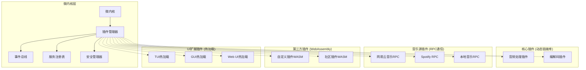
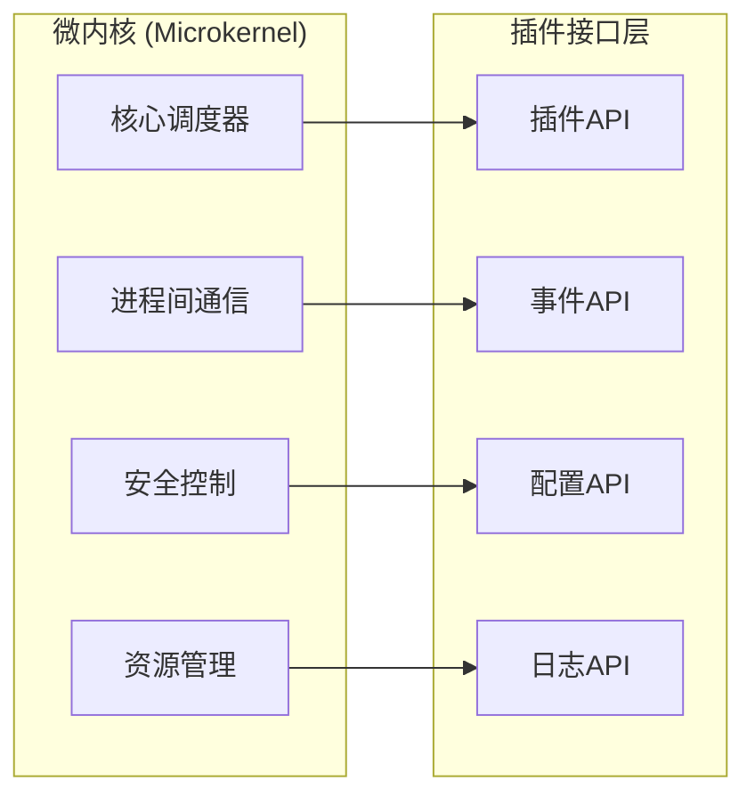

# go-musicfox 微内核插件架构设计文档

## 概述

基于用户选择的**方案二：基于插件系统的微内核架构方案**和**混合插件实现方案**，本文档详细设计 go-musicfox 的新架构。该架构采用微内核设计模式，通过插件系统实现高度的模块化和可扩展性。

### 设计目标

* 构建轻量级微内核，核心功能最小化

* 实现混合插件系统，支持多种插件实现方式

* 建立标准化的插件协议和接口规范

* 提供完整的插件生命周期管理

* 支持插件的动态加载、卸载和热更新

* 建立安全可靠的插件沙箱机制

### 技术栈

* **语言**：Go 1.25+

* **依赖注入**：dig

* **配置管理**：koanf

* **日志**：slog

* **测试**：testify

* **文档**：godoc

## 架构设计

### 整体架构



### 微内核设计



## 组件和接口

### 微内核核心接口

```go
// pkg/kernel/kernel.go
package kernel

import (
    "context"
    "go.uber.org/dig"
    "github.com/knadh/koanf/v2"
    "log/slog"
)

// 微内核接口
type Kernel interface {
    // 生命周期管理
    Initialize(ctx context.Context) error
    Start(ctx context.Context) error
    Stop(ctx context.Context) error
    Shutdown(ctx context.Context) error
    
    // 插件管理
    GetPluginManager() PluginManager
    GetEventBus() EventBus
    GetServiceRegistry() ServiceRegistry
    GetSecurityManager() SecurityManager
    
    // 配置和日志
    GetConfig() *koanf.Koanf
    GetLogger() *slog.Logger
    GetContainer() *dig.Container
}

// 微内核实现
type MicroKernel struct {
    container       *dig.Container
    config          *koanf.Koanf
    logger          *slog.Logger
    pluginManager   PluginManager
    eventBus        EventBus
    serviceRegistry ServiceRegistry
    securityManager SecurityManager
    
    ctx    context.Context
    cancel context.CancelFunc
}

func NewMicroKernel() *MicroKernel {
    ctx, cancel := context.WithCancel(context.Background())
    
    return &MicroKernel{
        container: dig.New(),
        ctx:       ctx,
        cancel:    cancel,
    }
}

func (k *MicroKernel) Initialize(ctx context.Context) error {
    // 初始化配置
    if err := k.initializeConfig(); err != nil {
        return fmt.Errorf("failed to initialize config: %w", err)
    }
    
    // 初始化日志
    if err := k.initializeLogger(); err != nil {
        return fmt.Errorf("failed to initialize logger: %w", err)
    }
    
    // 初始化依赖注入容器
    if err := k.initializeContainer(); err != nil {
        return fmt.Errorf("failed to initialize container: %w", err)
    }
    
    // 初始化核心组件
    if err := k.initializeCoreComponents(); err != nil {
        return fmt.Errorf("failed to initialize core components: %w", err)
    }
    
    k.logger.Info("Microkernel initialized successfully")
    return nil
}

func (k *MicroKernel) initializeCoreComponents() error {
    // 初始化事件总线
    k.eventBus = NewEventBus(k.logger)
    if err := k.container.Provide(func() EventBus { return k.eventBus }); err != nil {
        return err
    }
    
    // 初始化服务注册表
    k.serviceRegistry = NewServiceRegistry(k.logger)
    if err := k.container.Provide(func() ServiceRegistry { return k.serviceRegistry }); err != nil {
        return err
    }
    
    // 初始化安全管理器
    k.securityManager = NewSecurityManager(k.config, k.logger)
    if err := k.container.Provide(func() SecurityManager { return k.securityManager }); err != nil {
        return err
    }
    
    // 初始化插件管理器
    k.pluginManager = NewPluginManager(k.container, k.eventBus, k.serviceRegistry, k.securityManager, k.logger)
    if err := k.container.Provide(func() PluginManager { return k.pluginManager }); err != nil {
        return err
    }
    
    return nil
}
```

### 混合插件管理器

```go
// pkg/plugin/manager.go
package plugin

import (
    "context"
    "fmt"
    "sync"
    "go.uber.org/dig"
    "log/slog"
)

// 插件类型
type PluginType string

const (
    PluginTypeDynamicLibrary PluginType = "dynamic_library"
    PluginTypeRPC           PluginType = "rpc"
    PluginTypeWebAssembly   PluginType = "webassembly"
    PluginTypeHotReload     PluginType = "hot_reload"
)

// 混合插件管理器
type HybridPluginManager struct {
    container       *dig.Container
    eventBus        EventBus
    serviceRegistry ServiceRegistry
    securityManager SecurityManager
    logger          *slog.Logger
    
    // 不同类型的插件加载器
    loaders map[PluginType]PluginLoader
    
    // 已加载的插件
    plugins map[string]*LoadedPlugin
    mutex   sync.RWMutex
}

// 已加载的插件信息
type LoadedPlugin struct {
    Plugin      Plugin
    Type        PluginType
    Info        *PluginInfo
    State       PluginState
    LoadTime    time.Time
    Loader      PluginLoader
    Context     PluginContext
    HealthCheck *HealthChecker
}

func NewPluginManager(
    container *dig.Container,
    eventBus EventBus,
    serviceRegistry ServiceRegistry,
    securityManager SecurityManager,
    logger *slog.Logger,
) *HybridPluginManager {
    pm := &HybridPluginManager{
        container:       container,
        eventBus:        eventBus,
        serviceRegistry: serviceRegistry,
        securityManager: securityManager,
        logger:          logger,
        loaders:         make(map[PluginType]PluginLoader),
        plugins:         make(map[string]*LoadedPlugin),
    }
    
    // 初始化各种插件加载器
    pm.initializeLoaders()
    
    return pm
}

func (pm *HybridPluginManager) initializeLoaders() {
    // 动态链接库加载器
    pm.loaders[PluginTypeDynamicLibrary] = NewDynamicLibraryLoader(pm.logger)
    
    // RPC插件加载器
    pm.loaders[PluginTypeRPC] = NewRPCPluginLoader(pm.logger)
    
    // WebAssembly插件加载器
    pm.loaders[PluginTypeWebAssembly] = NewWASMPluginLoader(pm.securityManager, pm.logger)
    
    // 热加载插件加载器
    pm.loaders[PluginTypeHotReload] = NewHotReloadPluginLoader(pm.eventBus, pm.logger)
}

// 加载插件
func (pm *HybridPluginManager) LoadPlugin(pluginPath string, pluginType PluginType) error {
    pm.mutex.Lock()
    defer pm.mutex.Unlock()
    
    // 检查插件是否已加载
    if _, exists := pm.plugins[pluginPath]; exists {
        return fmt.Errorf("plugin already loaded: %s", pluginPath)
    }
    
    // 获取对应的加载器
    loader, exists := pm.loaders[pluginType]
    if !exists {
        return fmt.Errorf("unsupported plugin type: %s", pluginType)
    }
    
    // 安全检查
    if err := pm.securityManager.ValidatePlugin(pluginPath, pluginType); err != nil {
        return fmt.Errorf("plugin security validation failed: %w", err)
    }
    
    // 加载插件
    plugin, err := loader.LoadPlugin(pluginPath)
    if err != nil {
        return fmt.Errorf("failed to load plugin: %w", err)
    }
    
    // 创建插件上下文
    pluginCtx := NewPluginContext(pm.container, pm.eventBus, pm.serviceRegistry, pm.logger)
    
    // 初始化插件
    if err := plugin.Initialize(pluginCtx); err != nil {
        loader.UnloadPlugin(plugin)
        return fmt.Errorf("failed to initialize plugin: %w", err)
    }
    
    // 创建健康检查器
    healthChecker := NewHealthChecker(plugin, pm.logger)
    
    // 记录已加载的插件
    loadedPlugin := &LoadedPlugin{
        Plugin:      plugin,
        Type:        pluginType,
        Info:        plugin.GetInfo(),
        State:       PluginStateLoaded,
        LoadTime:    time.Now(),
        Loader:      loader,
        Context:     pluginCtx,
        HealthCheck: healthChecker,
    }
    
    pm.plugins[pluginPath] = loadedPlugin
    
    // 注册插件服务
    if err := pm.serviceRegistry.RegisterPlugin(plugin); err != nil {
        pm.logger.Warn("Failed to register plugin services", "error", err)
    }
    
    // 发送插件加载事件
    pm.eventBus.Publish(EventPluginLoaded, &PluginEvent{
        Plugin: plugin,
        Type:   pluginType,
        Path:   pluginPath,
    })
    
    pm.logger.Info("Plugin loaded successfully",
        "name", plugin.GetInfo().Name,
        "version", plugin.GetInfo().Version,
        "type", pluginType)
    
    return nil
}

// 启动插件
func (pm *HybridPluginManager) StartPlugin(pluginName string) error {
    pm.mutex.Lock()
    defer pm.mutex.Unlock()
    
    loadedPlugin := pm.findPluginByName(pluginName)
    if loadedPlugin == nil {
        return fmt.Errorf("plugin not found: %s", pluginName)
    }
    
    if loadedPlugin.State != PluginStateLoaded {
        return fmt.Errorf("plugin not in loaded state: %s", pluginName)
    }
    
    // 启动插件
    if err := loadedPlugin.Plugin.Start(); err != nil {
        return fmt.Errorf("failed to start plugin: %w", err)
    }
    
    loadedPlugin.State = PluginStateRunning
    
    // 启动健康检查
    loadedPlugin.HealthCheck.Start()
    
    // 发送插件启动事件
    pm.eventBus.Publish(EventPluginStarted, &PluginEvent{
        Plugin: loadedPlugin.Plugin,
        Type:   loadedPlugin.Type,
    })
    
    pm.logger.Info("Plugin started successfully", "name", pluginName)
    return nil
}
```

### 插件接口规范

```go
// pkg/plugin/interface.go
package plugin

import (
    "context"
    "time"
)

// 插件基础接口
type Plugin interface {
    // 插件元信息
    GetInfo() *PluginInfo
    GetCapabilities() []string
    GetDependencies() []string
    
    // 生命周期管理
    Initialize(ctx PluginContext) error
    Start() error
    Stop() error
    Cleanup() error
    
    // 健康检查
    HealthCheck() error
    
    // 配置管理
    ValidateConfig(config map[string]interface{}) error
    UpdateConfig(config map[string]interface{}) error
}

// 插件信息
type PluginInfo struct {
    Name        string            `json:"name"`
    Version     string            `json:"version"`
    Description string            `json:"description"`
    Author      string            `json:"author"`
    License     string            `json:"license"`
    Homepage    string            `json:"homepage"`
    Tags        []string          `json:"tags"`
    Config      map[string]string `json:"config"`
    CreatedAt   time.Time         `json:"created_at"`
    UpdatedAt   time.Time         `json:"updated_at"`
}

// 音频处理插件接口（动态链接库实现）
type AudioProcessorPlugin interface {
    Plugin
    
    // 音频处理
    ProcessAudio(input []byte, sampleRate int, channels int) ([]byte, error)
    
    // 音效处理
    ApplyEffect(input []byte, effect AudioEffect) ([]byte, error)
    
    // 音量控制
    AdjustVolume(input []byte, volume float64) ([]byte, error)
    
    // 格式转换
    ConvertFormat(input []byte, fromFormat, toFormat AudioFormat) ([]byte, error)
}

// 音乐源插件接口（RPC实现）
type MusicSourcePlugin interface {
    Plugin
    
    // 搜索功能
    Search(ctx context.Context, query string, options SearchOptions) (*SearchResult, error)
    
    // 播放列表
    GetPlaylist(ctx context.Context, id string) (*Playlist, error)
    GetPlaylistSongs(ctx context.Context, playlistID string, offset, limit int) ([]*Song, error)
    
    // 歌曲信息
    GetSongURL(ctx context.Context, songID string, quality Quality) (string, error)
    GetSongLyrics(ctx context.Context, songID string) (*Lyrics, error)
    GetSongDetail(ctx context.Context, songID string) (*Song, error)
    
    // 用户相关
    Login(ctx context.Context, credentials map[string]string) error
    GetUserPlaylists(ctx context.Context, userID string) ([]*Playlist, error)
    GetUserLikedSongs(ctx context.Context, userID string) ([]*Song, error)
}

// 第三方插件接口（WebAssembly实现）
type ThirdPartyPlugin interface {
    Plugin
    
    // WASM特定方法
    GetWASMModule() []byte
    GetExportedFunctions() []string
    
    // 沙箱执行
    ExecuteFunction(functionName string, args []interface{}) (interface{}, error)
    
    // 资源限制
    GetResourceLimits() ResourceLimits
    SetResourceLimits(limits ResourceLimits) error
}

// UI扩展插件接口（热加载实现）
type UIExtensionPlugin interface {
    Plugin
    
    // UI渲染
    Render(ctx context.Context, state *AppState) error
    HandleInput(ctx context.Context, input *InputEvent) error
    
    // 布局管理
    GetLayout() Layout
    SetLayout(layout Layout) error
    
    // 主题支持
    GetSupportedThemes() []*Theme
    ApplyTheme(theme *Theme) error
    
    // 热更新
    CanHotReload() bool
    HotReload(newVersion []byte) error
}
```

## 数据模型

### 核心数据结构

```go
// pkg/model/core.go
package model

import (
    "time"
)

// 音乐信息
type Song struct {
    ID          string            `json:"id"`
    Title       string            `json:"title"`
    Artist      string            `json:"artist"`
    Album       string            `json:"album"`
    Duration    time.Duration     `json:"duration"`
    Source      string            `json:"source"`
    URL         string            `json:"url"`
    CoverURL    string            `json:"cover_url"`
    Quality     Quality           `json:"quality"`
    Metadata    map[string]string `json:"metadata"`
    CreatedAt   time.Time         `json:"created_at"`
    UpdatedAt   time.Time         `json:"updated_at"`
}

// 播放列表
type Playlist struct {
    ID          string    `json:"id"`
    Name        string    `json:"name"`
    Description string    `json:"description"`
    Songs       []*Song   `json:"songs"`
    Source      string    `json:"source"`
    CreatedBy   string    `json:"created_by"`
    IsPublic    bool      `json:"is_public"`
    CreatedAt   time.Time `json:"created_at"`
    UpdatedAt   time.Time `json:"updated_at"`
}

// 播放器状态
type PlayerState struct {
    Status      PlayStatus    `json:"status"`
    CurrentSong *Song         `json:"current_song"`
    Position    time.Duration `json:"position"`
    Duration    time.Duration `json:"duration"`
    Volume      float64       `json:"volume"`
    IsMuted     bool          `json:"is_muted"`
    PlayMode    PlayMode      `json:"play_mode"`
    Queue       []*Song       `json:"queue"`
    History     []*Song       `json:"history"`
}

// 应用状态
type AppState struct {
    Player      *PlayerState      `json:"player"`
    CurrentView string            `json:"current_view"`
    User        *User             `json:"user"`
    Config      map[string]string `json:"config"`
    Plugins     []*PluginInfo     `json:"plugins"`
    UpdatedAt   time.Time         `json:"updated_at"`
}

// 枚举类型
type PlayStatus int

const (
    PlayStatusStopped PlayStatus = iota
    PlayStatusPlaying
    PlayStatusPaused
    PlayStatusBuffering
    PlayStatusError
)

type PlayMode int

const (
    PlayModeSequential PlayMode = iota
    PlayModeRepeatOne
    PlayModeRepeatAll
    PlayModeShuffle
)

type Quality int

const (
    QualityLow Quality = iota
    QualityMedium
    QualityHigh
    QualityLossless
)
```

### 插件配置模型

```go
// pkg/config/plugin.go
package config

// 插件配置
type PluginConfig struct {
    // 基础配置
    Name        string            `koanf:"name"`
    Type        string            `koanf:"type"`
    Path        string            `koanf:"path"`
    Enabled     bool              `koanf:"enabled"`
    AutoStart   bool              `koanf:"auto_start"`
    Priority    int               `koanf:"priority"`
    
    // 特定配置
    Config      map[string]string `koanf:"config"`
    
    // 资源限制
    Resources   ResourceLimits    `koanf:"resources"`
    
    // 安全配置
    Security    SecurityConfig    `koanf:"security"`
}

// 资源限制
type ResourceLimits struct {
    MaxMemory     int64         `koanf:"max_memory"`      // 最大内存使用量（字节）
    MaxCPU        float64       `koanf:"max_cpu"`         // 最大CPU使用率（0-1）
    MaxDiskIO     int64         `koanf:"max_disk_io"`     // 最大磁盘IO（字节/秒）
    MaxNetworkIO  int64         `koanf:"max_network_io"`  // 最大网络IO（字节/秒）
    Timeout       time.Duration `koanf:"timeout"`         // 执行超时时间
    MaxGoroutines int           `koanf:"max_goroutines"`  // 最大协程数
}

// 安全配置
type SecurityConfig struct {
    Sandbox         bool     `koanf:"sandbox"`           // 是否启用沙箱
    AllowedPaths    []string `koanf:"allowed_paths"`     // 允许访问的路径
    AllowedNetworks []string `koanf:"allowed_networks"`  // 允许访问的网络
    AllowedSyscalls []string `koanf:"allowed_syscalls"`  // 允许的系统调用
    TrustedSources  []string `koanf:"trusted_sources"`   // 可信的插件源
}
```

## 错误处理

### 错误分类和处理策略

```go
// pkg/errors/plugin.go
package errors

import (
    "fmt"
)

// 插件错误类型
type PluginErrorType int

const (
    PluginErrorTypeLoad PluginErrorType = iota
    PluginErrorTypeInitialize
    PluginErrorTypeStart
    PluginErrorTypeStop
    PluginErrorTypeExecute
    PluginErrorTypeSecurity
    PluginErrorTypeResource
    PluginErrorTypeTimeout
    PluginErrorTypeCommunication
)

// 插件错误
type PluginError struct {
    Type        PluginErrorType `json:"type"`
    Code        string          `json:"code"`
    Message     string          `json:"message"`
    PluginName  string          `json:"plugin_name"`
    PluginType  string          `json:"plugin_type"`
    Cause       error           `json:"cause,omitempty"`
    Recoverable bool            `json:"recoverable"`
    Timestamp   time.Time       `json:"timestamp"`
}

func (e *PluginError) Error() string {
    return fmt.Sprintf("plugin error [%s:%s]: %s", e.PluginName, e.Code, e.Message)
}

// 错误处理策略
type ErrorHandlingStrategy interface {
    HandleError(err *PluginError) error
    CanRecover(err *PluginError) bool
    GetRecoveryAction(err *PluginError) RecoveryAction
}

// 恢复动作
type RecoveryAction interface {
    Execute() error
    GetDescription() string
    GetTimeout() time.Duration
}

// 插件重启恢复动作
type RestartPluginAction struct {
    pluginManager PluginManager
    pluginName    string
    maxRetries    int
    retryDelay    time.Duration
}

func (r *RestartPluginAction) Execute() error {
    for i := 0; i < r.maxRetries; i++ {
        if i > 0 {
            time.Sleep(r.retryDelay)
        }
        
        // 停止插件
        if err := r.pluginManager.StopPlugin(r.pluginName); err != nil {
            continue
        }
        
        // 重新启动插件
        if err := r.pluginManager.StartPlugin(r.pluginName); err != nil {
            continue
        }
        
        return nil
    }
    
    return fmt.Errorf("failed to restart plugin after %d retries", r.maxRetries)
}
```

### 熔断器机制

```go
// pkg/circuit/breaker.go
package circuit

import (
    "sync"
    "time"
)

// 熔断器状态
type State int

const (
    StateClosed State = iota
    StateHalfOpen
    StateOpen
)

// 熔断器
type CircuitBreaker struct {
    name           string
    maxFailures    int
    resetTimeout   time.Duration
    state          State
    failures       int
    lastFailTime   time.Time
    mutex          sync.RWMutex
    onStateChange  func(name string, from State, to State)
}

func NewCircuitBreaker(name string, maxFailures int, resetTimeout time.Duration) *CircuitBreaker {
    return &CircuitBreaker{
        name:         name,
        maxFailures:  maxFailures,
        resetTimeout: resetTimeout,
        state:        StateClosed,
    }
}

// 执行操作
func (cb *CircuitBreaker) Execute(operation func() error) error {
    if !cb.canExecute() {
        return fmt.Errorf("circuit breaker is open for %s", cb.name)
    }
    
    err := operation()
    
    if err != nil {
        cb.recordFailure()
        return err
    }
    
    cb.recordSuccess()
    return nil
}

func (cb *CircuitBreaker) canExecute() bool {
    cb.mutex.RLock()
    defer cb.mutex.RUnlock()
    
    if cb.state == StateClosed {
        return true
    }
    
    if cb.state == StateOpen {
        if time.Since(cb.lastFailTime) > cb.resetTimeout {
            cb.setState(StateHalfOpen)
            return true
        }
        return false
    }
    
    // StateHalfOpen
    return true
}

func (cb *CircuitBreaker) recordFailure() {
    cb.mutex.Lock()
    defer cb.mutex.Unlock()
    
    cb.failures++
    cb.lastFailTime = time.Now()
    
    if cb.state == StateHalfOpen {
        cb.setState(StateOpen)
    } else if cb.failures >= cb.maxFailures {
        cb.setState(StateOpen)
    }
}

func (cb *CircuitBreaker) recordSuccess() {
    cb.mutex.Lock()
    defer cb.mutex.Unlock()
    
    cb.failures = 0
    
    if cb.state == StateHalfOpen {
        cb.setState(StateClosed)
    }
}
```

## 测试策略

### 插件测试框架

```go
// pkg/testing/plugin.go
package testing

import (
    "context"
    "testing"
    "time"
    
    "github.com/stretchr/testify/assert"
    "github.com/stretchr/testify/mock"
)

// 插件测试套件
type PluginTestSuite struct {
    kernel        Kernel
    pluginManager PluginManager
    testPlugins   map[string]TestPlugin
    cleanup       []func() error
}

// 测试插件接口
type TestPlugin interface {
    Plugin
    GetTestCases() []TestCase
    SetupTest() error
    TeardownTest() error
}

// 测试用例
type TestCase struct {
    Name        string
    Description string
    Setup       func() error
    Execute     func() error
    Verify      func() error
    Cleanup     func() error
    Timeout     time.Duration
}

// 插件性能测试
func BenchmarkPluginLoad(b *testing.B) {
    suite := NewPluginTestSuite()
    defer suite.Cleanup()
    
    pluginPath := "testdata/benchmark-plugin.so"
    
    b.ResetTimer()
    for i := 0; i < b.N; i++ {
        err := suite.pluginManager.LoadPlugin(pluginPath, PluginTypeDynamicLibrary)
        assert.NoError(b, err)
        
        err = suite.pluginManager.UnloadPlugin("benchmark-plugin")
        assert.NoError(b, err)
    }
}

// 插件并发测试
func TestPluginConcurrency(t *testing.T) {
    suite := NewPluginTestSuite()
    defer suite.Cleanup()
    
    const numGoroutines = 100
    const numOperations = 1000
    
    // 加载测试插件
    err := suite.pluginManager.LoadPlugin("testdata/concurrent-plugin.so", PluginTypeDynamicLibrary)
    assert.NoError(t, err)
    
    plugin := suite.pluginManager.GetPlugin("concurrent-plugin")
    assert.NotNil(t, plugin)
    
    // 并发执行操作
    done := make(chan bool, numGoroutines)
    
    for i := 0; i < numGoroutines; i++ {
        go func(id int) {
            defer func() { done <- true }()
            
            for j := 0; j < numOperations; j++ {
                // 执行插件操作
                err := plugin.HealthCheck()
                assert.NoError(t, err)
            }
        }(i)
    }
    
    // 等待所有协程完成
    for i := 0; i < numGoroutines; i++ {
        <-done
    }
}

// 插件内存泄漏测试
func TestPluginMemoryLeak(t *testing.T) {
    suite := NewPluginTestSuite()
    defer suite.Cleanup()
    
    var m1, m2 runtime.MemStats
    
    // 获取初始内存状态
    runtime.GC()
    runtime.ReadMemStats(&m1)
    
    // 重复加载和卸载插件
    for i := 0; i < 1000; i++ {
        err := suite.pluginManager.LoadPlugin("testdata/memory-test-plugin.so", PluginTypeDynamicLibrary)
        assert.NoError(t, err)
        
        err = suite.pluginManager.UnloadPlugin("memory-test-plugin")
        assert.NoError(t, err)
    }
    
    // 获取最终内存状态
    runtime.GC()
    runtime.ReadMemStats(&m2)
    
    // 检查内存增长
    memoryIncrease := m2.Alloc - m1.Alloc
    assert.Less(t, memoryIncrease, uint64(10*1024*1024), "Memory leak detected: %d bytes", memoryIncrease)
}
```

### 集成测试

```go
// tests/integration/plugin_integration_test.go
package integration

import (
    "context"
    "testing"
    "time"
    
    "github.com/stretchr/testify/suite"
)

// 插件集成测试套件
type PluginIntegrationTestSuite struct {
    suite.Suite
    kernel        Kernel
    pluginManager PluginManager
    testContext   context.Context
    cancel        context.CancelFunc
}

func (s *PluginIntegrationTestSuite) SetupSuite() {
    s.testContext, s.cancel = context.WithTimeout(context.Background(), 30*time.Second)
    
    // 初始化微内核
    s.kernel = NewMicroKernel()
    err := s.kernel.Initialize(s.testContext)
    s.Require().NoError(err)
    
    err = s.kernel.Start(s.testContext)
    s.Require().NoError(err)
    
    s.pluginManager = s.kernel.GetPluginManager()
}

func (s *PluginIntegrationTestSuite) TearDownSuite() {
    if s.cancel != nil {
        s.cancel()
    }
    
    if s.kernel != nil {
        s.kernel.Shutdown(context.Background())
    }
}

// 测试混合插件系统
func (s *PluginIntegrationTestSuite) TestHybridPluginSystem() {
    // 测试动态链接库插件
    err := s.pluginManager.LoadPlugin("testdata/audio-processor.so", PluginTypeDynamicLibrary)
    s.NoError(err)
    
    // 测试RPC插件
    err = s.pluginManager.LoadPlugin("testdata/netease-rpc", PluginTypeRPC)
    s.NoError(err)
    
    // 测试WebAssembly插件
    err = s.pluginManager.LoadPlugin("testdata/custom-plugin.wasm", PluginTypeWebAssembly)
    s.NoError(err)
    
    // 测试热加载插件
    err = s.pluginManager.LoadPlugin("testdata/ui-extension.js", PluginTypeHotReload)
    s.NoError(err)
    
    // 验证所有插件都已加载
    plugins := s.pluginManager.ListPlugins()
    s.Len(plugins, 4)
    
    // 启动所有插件
    for _, plugin := range plugins {
        err := s.pluginManager.StartPlugin(plugin.GetInfo().Name)
        s.NoError(err)
    }
    
    // 验证插件状态
    for _, plugin := range plugins {
        err := plugin.HealthCheck()
        s.NoError(err)
    }
}

func TestPluginIntegrationTestSuite(t *testing.T) {
    suite.Run(t, new(PluginIntegrationTestSuite))
}
```

### 测试覆盖率要求

* **单元测试覆盖率**：≥ 85%

* **集成测试覆盖率**：≥ 70%

* **关键路径覆盖率**：100%

* **插件接口覆盖率**：100%

### 自动化测试流水线

```yaml
# .github/workflows/plugin-tests.yml
name: Plugin System Tests

on:
  push:
    branches: [ main, develop ]
  pull_request:
    branches: [ main ]

jobs:
  unit-tests:
    runs-on: ubuntu-latest
    steps:
      - uses: actions/checkout@v4
      - uses: actions/setup-go@v4
        with:
          go-version: '1.25'
      
      - name: Install Dependencies
        run: |
          go mod download
          go install github.com/golangci/golangci-lint/cmd/golangci-lint@latest
      
      - name: Run Linting
        run: golangci-lint run
      
      - name: Run Unit Tests
        run: |
          go test -v -race -coverprofile=coverage.out ./...
          go tool cover -html=coverage.out -o coverage.html
      
      - name: Check Coverage
        run: |
          COVERAGE=$(go tool cover -func=coverage.out | grep total | awk '{print $3}' | sed 's/%//')
          echo "Coverage: $COVERAGE%"
          if (( $(echo "$COVERAGE < 85" | bc -l) )); then
            echo "Coverage $COVERAGE% is below 85% threshold"
            exit 1
          fi
      
      - name: Upload Coverage
        uses: codecov/codecov-action@v3
        with:
          file: ./coverage.out

  integration-tests:
    runs-on: ubuntu-latest
    needs: unit-tests
    steps:
      - uses: actions/checkout@v4
      - uses: actions/setup-go@v4
        with:
          go-version: '1.25'
      
      - name: Build Test Plugins
        run: |
          make build-test-plugins
      
      - name: Run Integration Tests
        run: |
          go test -v -tags=integration ./tests/integration/...
      
      - name: Run Performance Tests
        run: |
          go test -v -bench=. -benchmem ./tests/performance/...

  plugin-compatibility:
    runs-on: ${{ matrix.os }}
    strategy:
      matrix:
        os: [ubuntu-latest, macos-latest, windows-latest]
    steps:
      - uses: actions/checkout@v4
      - uses: actions/setup-go@v4
        with:
          go-version: '1.25'
      
      - name: Test Plugin Loading
        run: |
          go test -v ./tests/compatibility/...
```

## 实施计划

### 第一阶段：微内核基础设施（4周）

1. **Week 1-2**: 微内核架构实现

   * 核心调度器

   * 事件总线

   * 服务注册表

   * 安全管理器

2. **Week 3-4**: 插件管理器基础功能

   * 插件发现和加载

   * 生命周期管理

   * 基础接口定义

### 第二阶段：混合插件系统（6周）

1. **Week 5-6**: 动态链接库插件支持

   * 动态库加载器

   * 音频处理插件接口

   * 性能优化

2. **Week 7-8**: RPC插件系统

   * RPC通信框架

   * 音乐源插件接口

   * 进程管理

3. **Week 9-10**: WebAssembly插件支持

   * WASM运行时集成

   * 沙箱安全机制

   * 资源限制

### 第三阶段：高级特性（4周）

1. **Week 11-12**: 热加载机制

   * 文件监控

   * 热更新逻辑

   * UI扩展支持

2. **Week 13-14**: 错误处理和监控

   * 熔断器机制

   * 健康检查

   * 性能监控

### 第四阶段：测试和优化（2周）

1. **Week 15**: 全面测试

   * 单元测试完善

   * 集成测试

   * 性能测试

2. **Week 16**: 优化和文档

   * 性能优化

   * 文档完善

   * 部署准备

## 风险评估和缓解策略

### 技术风险

1. **插件兼容性问题**

   * 风险：不同类型插件间的兼容性问题

   * 缓解：标准化接口设计，充分的兼容性测试

2. **性能开销**

   * 风险：插件系统引入的性能开销

   * 缓解：性能基准测试，关键路径优化

3. **安全漏洞**

   * 风险：第三方插件的安全风险

   * 缓解：沙箱机制，权限控制，代码审查

### 实施风险

1. **开发复杂度**

   * 风险：架构复杂度超出团队能力

   * 缓解：分阶段实施，技术培训，外部咨询

2. **时间延期**

   * 风险：开发时间超出预期

   * 缓解：详细的项目计划，定期评估，灵活调整

### 缓解措施

1. **技术验证**：在关键技术点进行原型验证
2. **渐进式实施**：分阶段实施，降低风险
3. **充分测试**：建立完善的测试体系
4. **监控告警**：实时监控系统状态
5. **回滚机制**：准备回滚方案

## 插件发现和注册机制

### 插件自动发现机制

```go
// pkg/plugin/discovery.go
package plugin

import (
    "context"
    "fmt"
    "os"
    "path/filepath"
    "strings"
    "sync"
    "time"
    "github.com/fsnotify/fsnotify"
    "log/slog"
)

// 插件发现器接口
type PluginDiscovery interface {
    // 扫描插件目录
    ScanPlugins(ctx context.Context) ([]*DiscoveredPlugin, error)
    
    // 监控插件变化
    WatchPlugins(ctx context.Context, callback PluginChangeCallback) error
    
    // 验证插件
    ValidatePlugin(pluginPath string) (*PluginManifest, error)
    
    // 解析插件依赖
    ResolveDependencies(plugins []*DiscoveredPlugin) (*DependencyGraph, error)
}

// 发现的插件信息
type DiscoveredPlugin struct {
    Path        string           `json:"path"`
    Type        PluginType       `json:"type"`
    Manifest    *PluginManifest  `json:"manifest"`
    Checksum    string           `json:"checksum"`
    Size        int64            `json:"size"`
    ModTime     time.Time        `json:"mod_time"`
    IsValid     bool             `json:"is_valid"`
    ValidationError string       `json:"validation_error,omitempty"`
}

// 插件清单文件
type PluginManifest struct {
    APIVersion   string                 `json:"api_version"`
    Kind         string                 `json:"kind"`
    Metadata     PluginMetadata         `json:"metadata"`
    Spec         PluginSpec             `json:"spec"`
    Dependencies []PluginDependency     `json:"dependencies"`
    Permissions  []PluginPermission     `json:"permissions"`
    Resources    PluginResourceLimits   `json:"resources"`
}

type PluginMetadata struct {
    Name        string            `json:"name"`
    Version     string            `json:"version"`
    Description string            `json:"description"`
    Author      string            `json:"author"`
    License     string            `json:"license"`
    Homepage    string            `json:"homepage"`
    Repository  string            `json:"repository"`
    Tags        []string          `json:"tags"`
    Labels      map[string]string `json:"labels"`
}

type PluginSpec struct {
    Type        PluginType        `json:"type"`
    EntryPoint  string            `json:"entry_point"`
    Runtime     RuntimeSpec       `json:"runtime"`
    Interfaces  []string          `json:"interfaces"`
    Config      PluginConfigSpec  `json:"config"`
}

// 插件发现器实现
type FileSystemPluginDiscovery struct {
    pluginDirs    []string
    watcher       *fsnotify.Watcher
    logger        *slog.Logger
    mutex         sync.RWMutex
    discovered    map[string]*DiscoveredPlugin
    lastScan      time.Time
}

func NewFileSystemPluginDiscovery(pluginDirs []string, logger *slog.Logger) *FileSystemPluginDiscovery {
    return &FileSystemPluginDiscovery{
        pluginDirs: pluginDirs,
        logger:     logger,
        discovered: make(map[string]*DiscoveredPlugin),
    }
}

func (d *FileSystemPluginDiscovery) ScanPlugins(ctx context.Context) ([]*DiscoveredPlugin, error) {
    d.mutex.Lock()
    defer d.mutex.Unlock()
    
    var allPlugins []*DiscoveredPlugin
    
    for _, dir := range d.pluginDirs {
        plugins, err := d.scanDirectory(ctx, dir)
        if err != nil {
            d.logger.Warn("Failed to scan plugin directory", "dir", dir, "error", err)
            continue
        }
        allPlugins = append(allPlugins, plugins...)
    }
    
    // 更新发现缓存
    for _, plugin := range allPlugins {
        d.discovered[plugin.Path] = plugin
    }
    
    d.lastScan = time.Now()
    d.logger.Info("Plugin scan completed", "count", len(allPlugins))
    
    return allPlugins, nil
}

func (d *FileSystemPluginDiscovery) scanDirectory(ctx context.Context, dir string) ([]*DiscoveredPlugin, error) {
    var plugins []*DiscoveredPlugin
    
    err := filepath.Walk(dir, func(path string, info os.FileInfo, err error) error {
        if err != nil {
            return err
        }
        
        // 检查是否为插件文件
        if d.isPluginFile(path, info) {
            plugin, err := d.analyzePlugin(path)
            if err != nil {
                d.logger.Warn("Failed to analyze plugin", "path", path, "error", err)
                return nil // 继续扫描其他文件
            }
            plugins = append(plugins, plugin)
        }
        
        return nil
    })
    
    return plugins, err
}

func (d *FileSystemPluginDiscovery) isPluginFile(path string, info os.FileInfo) bool {
    if info.IsDir() {
        return false
    }
    
    ext := strings.ToLower(filepath.Ext(path))
    switch ext {
    case ".so", ".dll", ".dylib": // 动态链接库
        return true
    case ".wasm": // WebAssembly
        return true
    default:
        // 检查是否有插件清单文件
        manifestPath := filepath.Join(filepath.Dir(path), "plugin.yaml")
        if _, err := os.Stat(manifestPath); err == nil {
            return true
        }
        return false
    }
}
```

### 插件注册表和元数据管理

```go
// pkg/plugin/registry.go
package plugin

import (
    "context"
    "encoding/json"
    "fmt"
    "sync"
    "time"
    "github.com/knadh/koanf/v2"
    "log/slog"
)

// 插件注册表接口
type PluginRegistry interface {
    // 注册插件
    RegisterPlugin(plugin *RegisteredPlugin) error
    
    // 注销插件
    UnregisterPlugin(pluginID string) error
    
    // 查询插件
    GetPlugin(pluginID string) (*RegisteredPlugin, error)
    GetPluginsByType(pluginType PluginType) ([]*RegisteredPlugin, error)
    GetPluginsByInterface(interfaceName string) ([]*RegisteredPlugin, error)
    
    // 插件状态管理
    UpdatePluginState(pluginID string, state PluginState) error
    GetPluginState(pluginID string) (PluginState, error)
    
    // 元数据管理
    UpdatePluginMetadata(pluginID string, metadata map[string]interface{}) error
    GetPluginMetadata(pluginID string) (map[string]interface{}, error)
    
    // 版本管理
    RegisterPluginVersion(pluginID, version string, info *PluginVersionInfo) error
    GetPluginVersions(pluginID string) ([]*PluginVersionInfo, error)
    GetLatestVersion(pluginID string) (*PluginVersionInfo, error)
    
    // 依赖管理
    RegisterDependency(pluginID, dependencyID string, constraint VersionConstraint) error
    GetDependencies(pluginID string) ([]PluginDependency, error)
    GetDependents(pluginID string) ([]string, error)
}

// 注册的插件信息
type RegisteredPlugin struct {
    ID           string                 `json:"id"`
    Name         string                 `json:"name"`
    Version      string                 `json:"version"`
    Type         PluginType             `json:"type"`
    State        PluginState            `json:"state"`
    Path         string                 `json:"path"`
    Manifest     *PluginManifest        `json:"manifest"`
    Metadata     map[string]interface{} `json:"metadata"`
    LoadTime     time.Time              `json:"load_time"`
    LastAccess   time.Time              `json:"last_access"`
    AccessCount  int64                  `json:"access_count"`
    Dependencies []PluginDependency     `json:"dependencies"`
    Dependents   []string               `json:"dependents"`
}

// 插件版本信息
type PluginVersionInfo struct {
    Version     string            `json:"version"`
    ReleaseDate time.Time         `json:"release_date"`
    Changelog   string            `json:"changelog"`
    Checksum    string            `json:"checksum"`
    Size        int64             `json:"size"`
    Metadata    map[string]string `json:"metadata"`
    IsStable    bool              `json:"is_stable"`
    IsDeprecated bool             `json:"is_deprecated"`
}

// 内存插件注册表实现
type InMemoryPluginRegistry struct {
    plugins     map[string]*RegisteredPlugin
    versions    map[string][]*PluginVersionInfo
    typeIndex   map[PluginType][]string
    ifaceIndex  map[string][]string
    depGraph    *DependencyGraph
    mutex       sync.RWMutex
    logger      *slog.Logger
    config      *koanf.Koanf
}

func NewInMemoryPluginRegistry(config *koanf.Koanf, logger *slog.Logger) *InMemoryPluginRegistry {
    return &InMemoryPluginRegistry{
        plugins:    make(map[string]*RegisteredPlugin),
        versions:   make(map[string][]*PluginVersionInfo),
        typeIndex:  make(map[PluginType][]string),
        ifaceIndex: make(map[string][]string),
        depGraph:   NewDependencyGraph(),
        logger:     logger,
        config:     config,
    }
}

func (r *InMemoryPluginRegistry) RegisterPlugin(plugin *RegisteredPlugin) error {
    r.mutex.Lock()
    defer r.mutex.Unlock()
    
    // 检查插件是否已存在
    if existing, exists := r.plugins[plugin.ID]; exists {
        return fmt.Errorf("plugin already registered: %s (existing version: %s)", 
            plugin.ID, existing.Version)
    }
    
    // 验证插件依赖
    if err := r.validateDependencies(plugin); err != nil {
        return fmt.Errorf("dependency validation failed: %w", err)
    }
    
    // 注册插件
    r.plugins[plugin.ID] = plugin
    
    // 更新索引
    r.updateTypeIndex(plugin.Type, plugin.ID, true)
    r.updateInterfaceIndex(plugin, true)
    
    // 更新依赖图
    r.depGraph.AddNode(plugin.ID)
    for _, dep := range plugin.Dependencies {
        r.depGraph.AddEdge(plugin.ID, dep.PluginID)
    }
    
    r.logger.Info("Plugin registered successfully", 
        "id", plugin.ID, 
        "version", plugin.Version,
        "type", plugin.Type)
    
    return nil
}
```

### 插件版本兼容性检查

```go
// pkg/plugin/compatibility.go
package plugin

import (
    "fmt"
    "regexp"
    "strconv"
    "strings"
)

// 版本约束类型
type VersionConstraint struct {
    Operator string `json:"operator"` // "=", ">=", "<=", ">", "<", "~>", "^"
    Version  string `json:"version"`
}

// 版本兼容性检查器
type CompatibilityChecker struct {
    apiVersions map[string]string // API版本映射
}

func NewCompatibilityChecker() *CompatibilityChecker {
    return &CompatibilityChecker{
        apiVersions: map[string]string{
            "v1": "1.0.0",
            "v2": "2.0.0",
        },
    }
}

// 检查版本兼容性
func (c *CompatibilityChecker) CheckCompatibility(required, available string) (bool, error) {
    requiredVer, err := ParseVersion(required)
    if err != nil {
        return false, fmt.Errorf("invalid required version: %w", err)
    }
    
    availableVer, err := ParseVersion(available)
    if err != nil {
        return false, fmt.Errorf("invalid available version: %w", err)
    }
    
    return c.compareVersions(requiredVer, availableVer), nil
}

// 检查约束条件
func (c *CompatibilityChecker) CheckConstraint(constraint VersionConstraint, version string) (bool, error) {
    constraintVer, err := ParseVersion(constraint.Version)
    if err != nil {
        return false, err
    }
    
    targetVer, err := ParseVersion(version)
    if err != nil {
        return false, err
    }
    
    switch constraint.Operator {
    case "=":
        return c.compareVersions(constraintVer, targetVer) == 0, nil
    case ">=":
        return c.compareVersions(targetVer, constraintVer) >= 0, nil
    case "<=":
        return c.compareVersions(targetVer, constraintVer) <= 0, nil
    case ">":
        return c.compareVersions(targetVer, constraintVer) > 0, nil
    case "<":
        return c.compareVersions(targetVer, constraintVer) < 0, nil
    case "~>":
        return c.checkPessimisticConstraint(constraintVer, targetVer), nil
    case "^":
        return c.checkCaretConstraint(constraintVer, targetVer), nil
    default:
        return false, fmt.Errorf("unsupported constraint operator: %s", constraint.Operator)
    }
}

// 版本结构
type Version struct {
    Major int
    Minor int
    Patch int
    Pre   string
    Build string
}

// 解析版本字符串
func ParseVersion(version string) (*Version, error) {
    // 支持语义化版本 (SemVer)
    re := regexp.MustCompile(`^v?(\d+)\.(\d+)\.(\d+)(?:-([0-9A-Za-z-]+(?:\.[0-9A-Za-z-]+)*))?(?:\+([0-9A-Za-z-]+(?:\.[0-9A-Za-z-]+)*))?$`)
    matches := re.FindStringSubmatch(version)
    
    if len(matches) < 4 {
        return nil, fmt.Errorf("invalid version format: %s", version)
    }
    
    major, _ := strconv.Atoi(matches[1])
    minor, _ := strconv.Atoi(matches[2])
    patch, _ := strconv.Atoi(matches[3])
    
    return &Version{
        Major: major,
        Minor: minor,
        Patch: patch,
        Pre:   matches[4],
        Build: matches[5],
    }, nil
}
```

## 具体插件加载器实现

### 动态链接库加载器详细实现

```go
// pkg/plugin/loader/dynamic.go
package loader

import (
    "fmt"
    "plugin"
    "runtime"
    "sync"
    "unsafe"
    "log/slog"
)

// 动态链接库加载器
type DynamicLibraryLoader struct {
    loadedLibs map[string]*LoadedLibrary
    mutex      sync.RWMutex
    logger     *slog.Logger
}

// 已加载的动态库信息
type LoadedLibrary struct {
    Plugin     *plugin.Plugin
    Path       string
    Handle     unsafe.Pointer
    Symbols    map[string]unsafe.Pointer
    RefCount   int
    LoadTime   time.Time
}

func NewDynamicLibraryLoader(logger *slog.Logger) *DynamicLibraryLoader {
    return &DynamicLibraryLoader{
        loadedLibs: make(map[string]*LoadedLibrary),
        logger:     logger,
    }
}

func (l *DynamicLibraryLoader) LoadPlugin(pluginPath string) (Plugin, error) {
    l.mutex.Lock()
    defer l.mutex.Unlock()
    
    // 检查是否已加载
    if lib, exists := l.loadedLibs[pluginPath]; exists {
        lib.RefCount++
        return l.createPluginWrapper(lib), nil
    }
    
    // 根据操作系统选择加载方式
    var lib *LoadedLibrary
    var err error
    
    switch runtime.GOOS {
    case "linux", "darwin":
        lib, err = l.loadUnixLibrary(pluginPath)
    case "windows":
        lib, err = l.loadWindowsLibrary(pluginPath)
    default:
        return nil, fmt.Errorf("unsupported operating system: %s", runtime.GOOS)
    }
    
    if err != nil {
        return nil, fmt.Errorf("failed to load dynamic library: %w", err)
    }
    
    // 验证插件接口
    if err := l.validatePluginInterface(lib); err != nil {
        l.unloadLibrary(lib)
        return nil, fmt.Errorf("plugin interface validation failed: %w", err)
    }
    
    lib.RefCount = 1
    lib.LoadTime = time.Now()
    l.loadedLibs[pluginPath] = lib
    
    l.logger.Info("Dynamic library loaded successfully", "path", pluginPath)
    
    return l.createPluginWrapper(lib), nil
}

// Unix系统动态库加载
func (l *DynamicLibraryLoader) loadUnixLibrary(path string) (*LoadedLibrary, error) {
    // 使用Go的plugin包加载
    p, err := plugin.Open(path)
    if err != nil {
        return nil, err
    }
    
    lib := &LoadedLibrary{
        Plugin:  &p,
        Path:    path,
        Symbols: make(map[string]unsafe.Pointer),
    }
    
    // 查找必需的符号
    requiredSymbols := []string{
        "GetPluginInfo",
        "Initialize",
        "Start",
        "Stop",
        "Cleanup",
    }
    
    for _, symbolName := range requiredSymbols {
        symbol, err := p.Lookup(symbolName)
        if err != nil {
            return nil, fmt.Errorf("required symbol not found: %s", symbolName)
        }
        lib.Symbols[symbolName] = unsafe.Pointer(&symbol)
    }
    
    return lib, nil
}

// Windows系统动态库加载
func (l *DynamicLibraryLoader) loadWindowsLibrary(path string) (*LoadedLibrary, error) {
    // Windows DLL加载实现
    // 注意：这里需要使用syscall或windows包
    return nil, fmt.Errorf("Windows DLL loading not implemented yet")
}
```

### RPC插件加载器通信协议

```go
// pkg/plugin/loader/rpc.go
package loader

import (
    "context"
    "fmt"
    "net"
    "net/rpc"
    "os"
    "os/exec"
    "sync"
    "time"
    "log/slog"
)

// RPC插件加载器
type RPCPluginLoader struct {
    processes map[string]*PluginProcess
    mutex     sync.RWMutex
    logger    *slog.Logger
    config    *RPCLoaderConfig
}

// RPC加载器配置
type RPCLoaderConfig struct {
    Network         string        `json:"network"`          // "tcp", "unix"
    Address         string        `json:"address"`          // 监听地址
    Timeout         time.Duration `json:"timeout"`          // 连接超时
    HeartbeatInterval time.Duration `json:"heartbeat_interval"` // 心跳间隔
    MaxRetries      int           `json:"max_retries"`      // 最大重试次数
}

// 插件进程信息
type PluginProcess struct {
    ID       string
    Path     string
    Process  *os.Process
    Client   *rpc.Client
    Config   *PluginProcessConfig
    State    ProcessState
    StartTime time.Time
    LastPing time.Time
    PingCount int64
}

// 插件进程配置
type PluginProcessConfig struct {
    Executable string            `json:"executable"`
    Args       []string          `json:"args"`
    Env        map[string]string `json:"env"`
    WorkDir    string            `json:"work_dir"`
    Network    string            `json:"network"`
    Address    string            `json:"address"`
}

// 进程状态
type ProcessState int

const (
    ProcessStateStarting ProcessState = iota
    ProcessStateRunning
    ProcessStateStopping
    ProcessStateStopped
    ProcessStateError
)

func NewRPCPluginLoader(config *RPCLoaderConfig, logger *slog.Logger) *RPCPluginLoader {
    return &RPCPluginLoader{
        processes: make(map[string]*PluginProcess),
        logger:    logger,
        config:    config,
    }
}

func (l *RPCPluginLoader) LoadPlugin(pluginPath string) (Plugin, error) {
    l.mutex.Lock()
    defer l.mutex.Unlock()
    
    // 检查是否已加载
    if process, exists := l.processes[pluginPath]; exists {
        if process.State == ProcessStateRunning {
            return l.createRPCPluginWrapper(process), nil
        }
    }
    
    // 启动插件进程
    process, err := l.startPluginProcess(pluginPath)
    if err != nil {
        return nil, fmt.Errorf("failed to start plugin process: %w", err)
    }
    
    // 建立RPC连接
    if err := l.establishRPCConnection(process); err != nil {
        l.stopPluginProcess(process)
        return nil, fmt.Errorf("failed to establish RPC connection: %w", err)
    }
    
    // 验证插件接口
    if err := l.validateRPCPluginInterface(process); err != nil {
        l.stopPluginProcess(process)
        return nil, fmt.Errorf("RPC plugin interface validation failed: %w", err)
    }
    
    process.State = ProcessStateRunning
    process.StartTime = time.Now()
    l.processes[pluginPath] = process
    
    // 启动心跳监控
    go l.monitorPluginProcess(process)
    
    l.logger.Info("RPC plugin loaded successfully", "path", pluginPath, "pid", process.Process.Pid)
    
    return l.createRPCPluginWrapper(process), nil
}

func (l *RPCPluginLoader) startPluginProcess(pluginPath string) (*PluginProcess, error) {
    // 读取插件配置
    config, err := l.loadPluginProcessConfig(pluginPath)
    if err != nil {
        return nil, err
    }
    
    // 准备环境变量
    env := os.Environ()
    for key, value := range config.Env {
        env = append(env, fmt.Sprintf("%s=%s", key, value))
    }
    
    // 添加RPC通信配置
    env = append(env, fmt.Sprintf("PLUGIN_RPC_NETWORK=%s", config.Network))
    env = append(env, fmt.Sprintf("PLUGIN_RPC_ADDRESS=%s", config.Address))
    
    // 启动进程
    cmd := exec.Command(config.Executable, config.Args...)
    cmd.Env = env
    cmd.Dir = config.WorkDir
    
    if err := cmd.Start(); err != nil {
        return nil, fmt.Errorf("failed to start plugin process: %w", err)
    }
    
    process := &PluginProcess{
        ID:      fmt.Sprintf("%s-%d", filepath.Base(pluginPath), cmd.Process.Pid),
        Path:    pluginPath,
        Process: cmd.Process,
        Config:  config,
        State:   ProcessStateStarting,
    }
    
    return process, nil
}

func (l *RPCPluginLoader) establishRPCConnection(process *PluginProcess) error {
    // 等待插件进程启动RPC服务
    var conn net.Conn
    var err error
    
    for i := 0; i < l.config.MaxRetries; i++ {
        conn, err = net.DialTimeout(process.Config.Network, process.Config.Address, l.config.Timeout)
        if err == nil {
            break
        }
        
        l.logger.Debug("Waiting for plugin RPC service", "attempt", i+1, "error", err)
        time.Sleep(time.Second)
    }
    
    if err != nil {
        return fmt.Errorf("failed to connect to plugin RPC service: %w", err)
    }
    
    process.Client = rpc.NewClient(conn)
    return nil
}

// RPC插件接口定义
type RPCPluginInterface struct {
    client *rpc.Client
    logger *slog.Logger
}

// RPC方法调用
func (r *RPCPluginInterface) CallMethod(method string, args interface{}, reply interface{}) error {
    err := r.client.Call(method, args, reply)
    if err != nil {
        r.logger.Error("RPC method call failed", "method", method, "error", err)
        return err
    }
    return nil
}

// 插件RPC服务端接口
type PluginRPCService struct {
    plugin Plugin
    logger *slog.Logger
}

// RPC方法：获取插件信息
func (s *PluginRPCService) GetInfo(args *struct{}, reply *PluginInfo) error {
    *reply = *s.plugin.GetInfo()
    return nil
}

// RPC方法：初始化插件
func (s *PluginRPCService) Initialize(args *PluginContext, reply *struct{}) error {
    return s.plugin.Initialize(*args)
}

// RPC方法：启动插件
func (s *PluginRPCService) Start(args *struct{}, reply *struct{}) error {
    return s.plugin.Start()
}

// RPC方法：停止插件
func (s *PluginRPCService) Stop(args *struct{}, reply *struct{}) error {
    return s.plugin.Stop()
}

// RPC方法：健康检查
func (s *PluginRPCService) HealthCheck(args *struct{}, reply *struct{}) error {
    return s.plugin.HealthCheck()
}
```

## 监控和诊断

### 插件性能监控实现

```go
// pkg/monitoring/manager.go
package monitoring

import (
    "context"
    "sync"
    "time"
    "log/slog"
)

// 监控管理器
type MonitoringManager struct {
    monitors     map[string]*PluginMonitor
    collectors   []MetricsCollector
    alerts       []AlertRule
    diagnostics  DiagnosticService
    logger       *slog.Logger
    mutex        sync.RWMutex
}

// 插件监控器
type PluginMonitor struct {
    PluginID     string
    Metrics      *PluginMetrics
    HealthStatus HealthStatus
    Collectors   []MetricsCollector
    Ticker       *time.Ticker
    StopChan     chan struct{}
    Logger       *slog.Logger
}

// 插件性能指标
type PluginMetrics struct {
    CPU         CPUMetrics        `json:"cpu"`
    Memory      MemoryMetrics     `json:"memory"`
    Network     NetworkMetrics    `json:"network"`
    API         APIMetrics        `json:"api"`
    Errors      ErrorMetrics      `json:"errors"`
    Uptime      time.Duration     `json:"uptime"`
    LastUpdate  time.Time         `json:"last_update"`
}

// 健康检查实现
func (mm *MonitoringManager) RunHealthCheck(pluginID string) (*HealthCheckResult, error) {
    monitor := mm.monitors[pluginID]
    if monitor == nil {
        return nil, fmt.Errorf("plugin monitor not found: %s", pluginID)
    }
    
    result := &HealthCheckResult{
        PluginID:  pluginID,
        CheckTime: time.Now(),
        Status:    HealthStatusHealthy,
    }
    
    // CPU使用率检查
    if monitor.Metrics.CPU.Usage > 80.0 {
        result.Status = HealthStatusUnhealthy
        result.Message = "High CPU usage detected"
    }
    
    // 内存使用检查
    if monitor.Metrics.Memory.Used > monitor.Limits.MaxMemory*0.9 {
        result.Status = HealthStatusUnhealthy
        result.Message = "High memory usage detected"
    }
    
    // 错误率检查
    if monitor.Metrics.Errors.Rate > 0.1 {
        result.Status = HealthStatusUnhealthy
        result.Message = "High error rate detected"
    }
    
    return result, nil
}

// 诊断报告生成
func (mm *MonitoringManager) GenerateDiagnosticReport(pluginID string) (*DiagnosticReport, error) {
    report := &DiagnosticReport{
        PluginID:    pluginID,
        GeneratedAt: time.Now(),
    }
    
    // 收集性能指标
    if metrics, err := mm.GetPluginMetrics(pluginID); err == nil {
        report.Metrics = metrics
    }
    
    // 运行健康检查
    if health, err := mm.RunHealthCheck(pluginID); err == nil {
        report.HealthChecks = []*HealthCheckResult{health}
    }
    
    // 收集最近日志
    report.Logs = mm.collectRecentLogs(pluginID, 100)
    
    // 分析问题
    report.Issues = mm.analyzeIssues(pluginID)
    
    // 生成建议
    report.Recommendations = mm.generateRecommendations(report)
    
    return report, nil
}
```

## 部署和运维

### 插件打包和分发系统

```go
// pkg/deployment/packager.go
package deployment

import (
    "archive/tar"
    "compress/gzip"
    "crypto/sha256"
    "fmt"
    "io"
    "os"
    "path/filepath"
    "time"
)

// 插件打包器
type PluginPackager struct {
    signer    *DigitalSigner
    validator *PackageValidator
    logger    *slog.Logger
}

// 打包插件
func (pp *PluginPackager) PackagePlugin(pluginPath string, manifest *PluginManifest) (*PluginPackage, error) {
    // 创建临时目录
    tempDir, err := os.MkdirTemp("", "plugin-package-*")
    if err != nil {
        return nil, fmt.Errorf("failed to create temp dir: %w", err)
    }
    defer os.RemoveAll(tempDir)
    
    // 复制插件文件
    if err := pp.copyPluginFiles(pluginPath, tempDir); err != nil {
        return nil, fmt.Errorf("failed to copy plugin files: %w", err)
    }
    
    // 生成清单文件
    manifestPath := filepath.Join(tempDir, "manifest.json")
    if err := pp.writeManifest(manifest, manifestPath); err != nil {
        return nil, fmt.Errorf("failed to write manifest: %w", err)
    }
    
    // 创建压缩包
    packagePath := fmt.Sprintf("%s-%s.tgz", manifest.Metadata.Name, manifest.Metadata.Version)
    if err := pp.createTarGz(tempDir, packagePath); err != nil {
        return nil, fmt.Errorf("failed to create package: %w", err)
    }
    
    // 计算校验和
    checksum, err := pp.calculateChecksum(packagePath)
    if err != nil {
        return nil, fmt.Errorf("failed to calculate checksum: %w", err)
    }
    
    // 数字签名
    signature, err := pp.signer.SignPackage(packagePath)
    if err != nil {
        return nil, fmt.Errorf("failed to sign package: %w", err)
    }
    
    pkg := &PluginPackage{
        Path:      packagePath,
        Manifest:  manifest,
        Checksum:  checksum,
        Signature: signature,
        CreatedAt: time.Now(),
    }
    
    return pkg, nil
}

// 版本管理器
type VersionManager struct {
    registry    PluginRegistry
    installer   PluginInstaller
    validator   VersionValidator
    logger      *slog.Logger
}

// 升级插件
func (vm *VersionManager) UpgradePlugin(pluginID, targetVersion string) error {
    // 获取当前版本
    currentPlugin, err := vm.registry.GetPlugin(pluginID)
    if err != nil {
        return fmt.Errorf("plugin not found: %w", err)
    }
    
    // 验证版本兼容性
    if err := vm.validator.ValidateUpgrade(currentPlugin.Version, targetVersion); err != nil {
        return fmt.Errorf("version validation failed: %w", err)
    }
    
    // 创建备份
    backupPath, err := vm.createBackup(pluginID)
    if err != nil {
        return fmt.Errorf("failed to create backup: %w", err)
    }
    
    // 下载新版本
    newPackage, err := vm.downloadPlugin(pluginID, targetVersion)
    if err != nil {
        return fmt.Errorf("failed to download plugin: %w", err)
    }
    
    // 停止当前插件
    if err := vm.registry.StopPlugin(pluginID); err != nil {
        vm.logger.Warn("Failed to stop plugin gracefully", "plugin", pluginID)
    }
    
    // 安装新版本
    if err := vm.installer.InstallPackage(newPackage); err != nil {
        vm.restoreFromBackup(pluginID, backupPath)
        return fmt.Errorf("failed to install new version: %w", err)
    }
    
    // 启动新版本
    if err := vm.registry.StartPlugin(pluginID); err != nil {
        vm.restoreFromBackup(pluginID, backupPath)
        return fmt.Errorf("failed to start new version: %w", err)
    }
    
    vm.logger.Info("Plugin upgraded successfully", 
        "plugin", pluginID, 
        "from", currentPlugin.Version, 
        "to", targetVersion)
    
    return nil
}
```

## 向后兼容性

### 现有代码迁移策略

```go
// pkg/migration/manager.go
package migration

import (
    "context"
    "fmt"
    "os"
    "path/filepath"
    "strings"
    "time"
    "log/slog"
)

// 迁移管理器
type MigrationManager struct {
    analyzer    CodeAnalyzer
    planner     MigrationPlanner
    executor    MigrationExecutor
    validator   MigrationValidator
    logger      *slog.Logger
}

// 分析现有代码
func (mm *MigrationManager) AnalyzeExistingCode(projectPath string) (*AnalysisResult, error) {
    result := &AnalysisResult{
        ProjectPath: projectPath,
        Modules:     []*ModuleInfo{},
        Issues:      []*CompatibilityIssue{},
    }
    
    // 扫描Go文件
    err := filepath.Walk(projectPath, func(path string, info os.FileInfo, err error) error {
        if err != nil {
            return err
        }
        
        if strings.HasSuffix(path, ".go") {
            module, issues := mm.analyzer.AnalyzeGoFile(path)
            if module != nil {
                result.Modules = append(result.Modules, module)
            }
            result.Issues = append(result.Issues, issues...)
        }
        
        return nil
    })
    
    if err != nil {
        return nil, fmt.Errorf("failed to analyze project: %w", err)
    }
    
    // 生成迁移建议
    result.Recommendations = mm.generateRecommendations(result)
    
    return result, nil
}

// API兼容性层
type CompatibilityLayer struct {
    adapters     map[string]APIAdapter
    deprecations []*DeprecationNotice
    mappings     map[string]string
    logger       *slog.Logger
}

// 旧API适配器
type LegacyAPIAdapter struct {
    version     string
    newAPI      interface{}
    mappings    map[string]string
    logger      *slog.Logger
}

func (adapter *LegacyAPIAdapter) AdaptCall(oldAPI string, args []interface{}) (interface{}, error) {
    // 查找新API映射
    newAPIMethod, exists := adapter.mappings[oldAPI]
    if !exists {
        return nil, fmt.Errorf("no mapping found for legacy API: %s", oldAPI)
    }
    
    // 记录弃用警告
    adapter.logger.Warn("Using deprecated API", 
        "old_api", oldAPI, 
        "new_api", newAPIMethod,
        "migration_guide", fmt.Sprintf("Please migrate to %s", newAPIMethod))
    
    // 转换参数格式
    convertedArgs, err := adapter.convertArguments(oldAPI, args)
    if err != nil {
        return nil, fmt.Errorf("failed to convert arguments: %w", err)
    }
    
    // 调用新API
    result, err := adapter.callNewAPI(newAPIMethod, convertedArgs)
    if err != nil {
        return nil, fmt.Errorf("new API call failed: %w", err)
    }
    
    // 转换返回值格式
    return adapter.convertResult(oldAPI, result)
}
```

### 渐进式重构配置

```yaml
# migration.yaml - 重构路径配置
migration_strategy:
  approach: "gradual"
  phases:
    - name: "preparation"
      duration: "2 weeks"
      tasks:
        - "code_analysis"
        - "interface_design"
        - "test_preparation"
    
    - name: "core_migration"
      duration: "4 weeks"
      tasks:
        - "kernel_implementation"
        - "plugin_framework"
        - "compatibility_layer"
    
    - name: "plugin_migration"
      duration: "6 weeks"
      tasks:
        - "audio_plugin_migration"
        - "ui_plugin_migration"
        - "source_plugin_migration"
    
    - name: "optimization"
      duration: "4 weeks"
      tasks:
        - "performance_tuning"
        - "testing_validation"
        - "documentation_update"

  rollback_strategy:
    - "feature_flags"
    - "version_branching"
    - "data_backup"
    - "configuration_rollback"

  validation_criteria:
    - "functionality_parity"
    - "performance_benchmarks"
    - "stability_tests"
    - "user_acceptance"
```

## 总结

本设计文档详细描述了go-musicfox项目基于插件系统的微内核架构重构方案。通过采用混合插件实现策略，我们能够在保证性能的同时提供高度的可扩展性和安全性。

### 核心特性

1. **高度模块化**: 微内核架构确保核心功能精简，扩展功能通过插件实现
2. **灵活扩展**: 支持多种插件类型和加载方式，满足不同场景需求
3. **安全可靠**: 完善的安全管理和沙箱隔离机制
4. **性能优化**: 混合插件策略平衡性能和灵活性
5. **运维友好**: 完整的监控、诊断和部署工具链
6. **向后兼容**: 渐进式迁移策略确保平滑过渡

### 技术优势

* **现代化架构**: 采用Go 1.25+和现代化的依赖注入框架

* **云原生支持**: 支持容器化部署和微服务架构

* **开发者友好**: 丰富的开发工具和文档支持

* **社区生态**: 开放的插件生态系统促进社区贡献

### 实施建议

1. **分阶段实施**: 按照设计的4个阶段逐步推进，确保每个阶段的质量
2. **风险控制**: 建立完善的回滚机制和监控体系
3. **团队培训**: 对开发团队进行新架构和技术栈的培训
4. **社区参与**: 积极与开源社区合作，推动插件生态发展

该架构设计为go-musicfox项目提供了面向未来的技术基础，支持持续的功能扩展和性能优化，同时保持了良好的开发体验和运维效率。通过完善的插件系统，项目将具备更强的可扩展性和社区参与度，为用户提供更丰富的功能和更好的使用体验。
