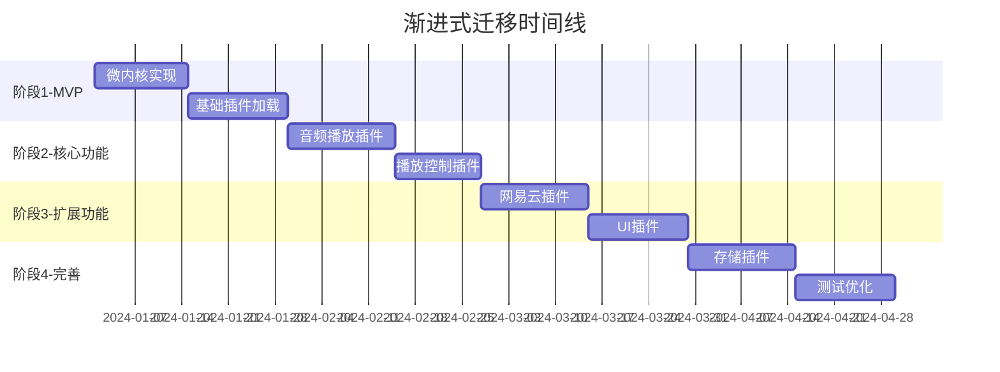

# go-musicfox 渐进式迁移方案技术文档

## 方案概述

渐进式迁移方案采用分阶段、风险可控的策略，将go-musicfox v1单体架构逐步迁移到v2微内核插件架构。该方案优先实现MVP版本，然后按功能模块逐步迁移，确保每个阶段都有可运行的系统版本。

## 核心优势

- **风险可控**：每个阶段都有可运行版本，便于及时发现和解决问题
- **学习成本分散**：团队可以逐步掌握新架构，降低学习曲线
- **灵活调整**：可以根据实际进展调整后续计划
- **质量保证**：每个阶段都有充分的测试时间
- **符合MVP原则**：满足需求文档中的渐进式开发要求

## 实施时间线

## 分阶段实施计划

### 阶段1：MVP实现（2周）
**目标**：实现最小可执行的微内核系统

**主要任务**：
- 实现基础微内核框架
- 插件加载和生命周期管理
- 简单示例插件验证架构
- 基础配置和日志系统

**交付物**：
- 可启动的微内核程序
- 基础插件管理器
- 示例插件
- 基础测试用例

### 阶段2：核心功能迁移（4周）
**目标**：迁移音频播放核心功能

**主要任务**：
- 音频播放引擎插件化
- 播放控制接口实现
- 播放列表管理基础功能
- 音频格式支持

**交付物**：
- 音频处理插件
- 播放控制插件
- 播放列表插件
- 音频播放测试

### 阶段3：扩展功能迁移（4周）
**目标**：迁移网易云音乐和UI功能

**主要任务**：
- 网易云音乐API插件化
- UI组件插件化改造
- 用户交互逻辑迁移
- 配置系统迁移

**交付物**：
- 网易云音乐插件
- UI插件框架
- 配置管理插件
- 集成测试用例

### 阶段4：完善和优化（4周）
**目标**：系统完善和性能优化

**主要任务**：
- 存储系统插件化
- 性能监控和优化
- 全面测试覆盖
- 文档完善

**交付物**：
- 存储插件
- 监控系统
- 完整测试套件
- 技术文档

## 风险控制措施

### 技术风险
- **架构兼容性**：每个阶段都保持向后兼容
- **性能回退**：持续性能监控和基准测试
- **功能缺失**：详细的功能对比和验证测试

### 项目风险
- **进度延期**：预留缓冲时间，关键路径监控
- **资源不足**：合理分配开发资源，优先级管理
- **质量问题**：严格的代码审查和测试流程

### 应对策略
- 每周进度评估和风险识别
- 建立回滚机制和应急预案
- 持续集成和自动化测试
- 定期技术评审和架构验证

## 成功标准

### 功能完整性
- 所有v1功能在v2中正常工作
- 用户体验保持一致
- 性能不低于v1版本

### 架构质量
- 插件系统稳定可靠
- 模块间松耦合
- 代码覆盖率达到80%以上

### 可维护性
- 清晰的模块边界
- 完善的文档和测试
- 便于后续扩展和维护

此方案为后续详细设计提供了清晰的实施路径和风险控制框架。