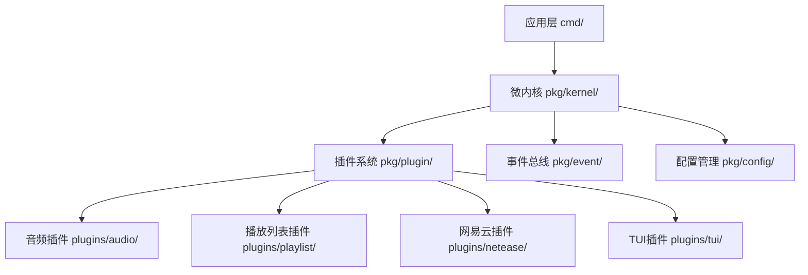
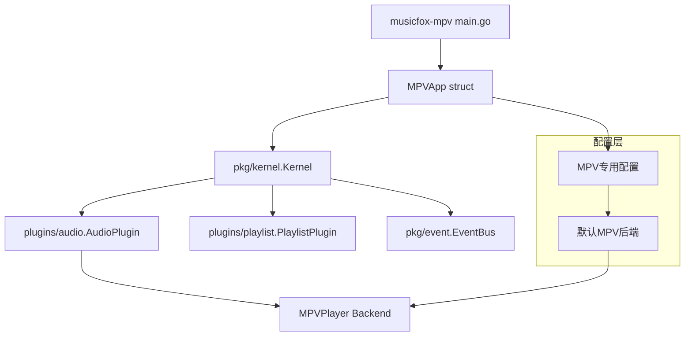

# go-musicfox v2 MPV应用架构分析与重构方案

## 1. 当前架构分析

### 1.1 现有v2架构概述

go-musicfox v2采用微内核插件架构，具有以下核心组件：



### 1.2 现有cmd实现分析

当前v2目录下有两个主要的cmd实现：

- **musicfox-core**: 核心功能版本，正确使用了微内核架构
- **musicfox-mvp**: MVP版本，使用插件管理器加载各种插件

两个实现都遵循了以下良好实践：
- 使用`pkg/kernel`微内核
- 通过`pkg/plugin/core`插件接口
- 复用`plugins/`目录下的插件实现
- 使用`pkg/event`事件总线进行组件通信

## 2. 问题识别

### 2.1 缺失的musicfox-mpv实现

用户提到的`v2/cmd/musicfox-mpv`实际上不存在于当前代码库中。这表明：

1. **缺少专门的MPV版本应用**：没有一个专门针对MPV播放器后端的应用实现
2. **架构一致性问题**：如果要实现musicfox-mpv，需要确保遵循现有的微内核架构
3. **代码复用问题**：避免在cmd中重复实现已有的插件功能

### 2.2 潜在架构问题

如果按照错误的方式实现musicfox-mpv，可能出现以下问题：

- **重复代码**：在cmd中重新实现音频播放逻辑
- **架构不一致**：不使用微内核和插件系统
- **难以维护**：独立的实现无法享受插件系统的优势
- **功能割裂**：无法与其他插件协同工作

## 3. 正确的实现方案

### 3.1 架构设计原则

基于v2微内核架构，musicfox-mpv应该：

1. **复用微内核**：使用`pkg/kernel`作为核心
2. **复用插件系统**：使用现有的插件接口和实现
3. **专注配置**：主要差异在于配置和插件选择
4. **保持一致性**：与musicfox-core和musicfox-mvp保持架构一致

### 3.2 推荐架构



### 3.3 实现策略

#### 3.3.1 应用结构

```go
// cmd/musicfox-mpv/main.go
package main

import (
    "github.com/go-musicfox/go-musicfox/v2/pkg/kernel"
    "github.com/go-musicfox/go-musicfox/v2/plugins/audio"
    "github.com/go-musicfox/go-musicfox/v2/plugins/playlist"
)

type MPVApp struct {
    kernel        kernel.Kernel
    audioPlugin   *audio.AudioPlugin
    playlistPlugin *playlist.PlaylistPlugin
    config        *MPVConfig
}
```

#### 3.3.2 配置管理

```go
type MPVConfig struct {
    Audio struct {
        Backend        string `yaml:"backend"`        // 强制使用"mpv"
        MPVPath        string `yaml:"mpv_path"`       // MPV可执行文件路径
        MPVArgs        []string `yaml:"mpv_args"`     // 额外的MPV参数
        BufferSize     int    `yaml:"buffer_size"`
    } `yaml:"audio"`
    
    Playlist struct {
        AutoSave       bool   `yaml:"auto_save"`
        DefaultFormat  string `yaml:"default_format"`
    } `yaml:"playlist"`
}
```

#### 3.3.3 插件初始化

```go
func (app *MPVApp) initializePlugins(ctx context.Context) error {
    // 创建音频插件，强制使用MPV后端
    audioConfig := map[string]interface{}{
        "backend": "mpv",
        "mpv_path": app.config.Audio.MPVPath,
        "mpv_args": app.config.Audio.MPVArgs,
    }
    
    app.audioPlugin = audio.NewAudioPlugin(app.kernel.GetEventBus())
    
    // 创建插件上下文
    pluginCtx := &PluginContextImpl{
        ctx:             ctx,
        eventBus:        app.kernel.GetEventBus(),
        serviceRegistry: app.kernel.GetServiceRegistry(),
        logger:          app.kernel.GetLogger(),
        config:          audioConfig,
    }
    
    // 初始化插件
    if err := app.audioPlugin.Initialize(pluginCtx); err != nil {
        return fmt.Errorf("failed to initialize audio plugin: %w", err)
    }
    
    // 强制切换到MPV后端
    if err := app.audioPlugin.SwitchBackend("mpv"); err != nil {
        return fmt.Errorf("failed to switch to MPV backend: %w", err)
    }
    
    return nil
}
```

## 4. 代码重构建议

### 4.1 创建musicfox-mpv应用

#### 4.1.1 目录结构

```
v2/cmd/musicfox-mpv/
├── main.go              # 主程序入口
├── app.go               # MPVApp实现
├── config.go            # MPV专用配置
├── commands.go          # 命令处理（复用core的实现）
└── README.md            # 说明文档
```

#### 4.1.2 核心差异化

musicfox-mpv与其他版本的主要差异：

1. **默认后端**：强制使用MPV播放器后端
2. **配置优化**：针对MPV的特殊配置选项
3. **依赖检查**：启动时检查MPV是否安装
4. **错误处理**：MPV特定的错误处理逻辑

### 4.2 复用现有组件

#### 4.2.1 复用插件系统

```go
// 不要重新实现，直接使用现有插件
import (
    "github.com/go-musicfox/go-musicfox/v2/plugins/audio"
    "github.com/go-musicfox/go-musicfox/v2/plugins/playlist"
    "github.com/go-musicfox/go-musicfox/v2/plugins/netease"
)
```

#### 4.2.2 复用命令处理

```go
// 复用musicfox-core的命令处理逻辑
type MPVCommandHandler struct {
    *core.CommandHandler  // 嵌入现有实现
    mpvSpecific *MPVCommands  // MPV特有命令
}
```

### 4.3 配置文件示例

```yaml
# config/musicfox-mpv.yaml
app:
  name: "musicfox-mpv"
  version: "2.0.0"
  
audio:
  backend: "mpv"  # 强制使用MPV
  mpv_path: "/usr/bin/mpv"  # MPV路径
  mpv_args:
    - "--no-video"
    - "--quiet"
    - "--really-quiet"
  buffer_size: 4096
  volume: 80

playlist:
  auto_save: true
  default_format: "m3u8"

netease:
  enabled: true
  cache_dir: "./cache/netease"
```

### 4.4 实现检查清单

- [ ] **使用微内核**：通过`pkg/kernel`初始化应用
- [ ] **复用插件**：使用`plugins/audio`等现有插件
- [ ] **配置驱动**：通过配置文件指定MPV后端
- [ ] **依赖检查**：启动时验证MPV可用性
- [ ] **错误处理**：适配MPV特定的错误情况
- [ ] **文档完善**：提供MPV版本的使用说明

## 5. 总结

正确的musicfox-mpv实现应该：

1. **遵循架构**：完全基于v2微内核插件架构
2. **复用组件**：最大化复用pkg和plugins包的功能
3. **专注差异**：仅在配置和MPV特定逻辑上有所不同
4. **保持一致**：与现有cmd实现保持架构一致性

这样的实现既能满足MPV用户的需求，又能保持代码的可维护性和架构的一致性。