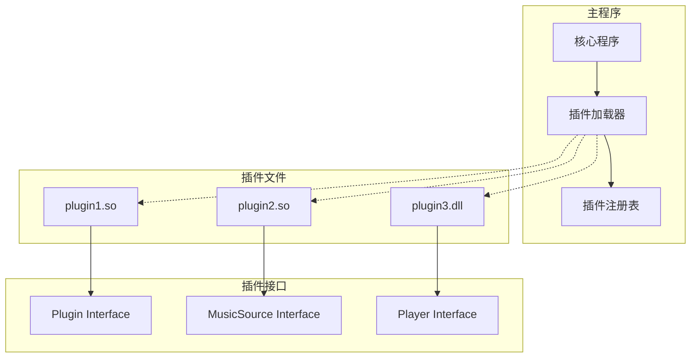
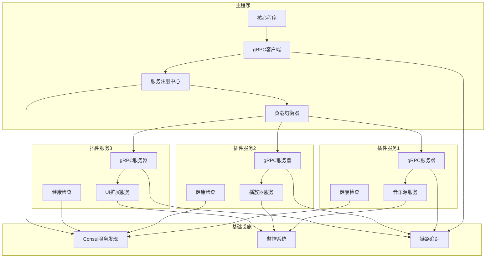
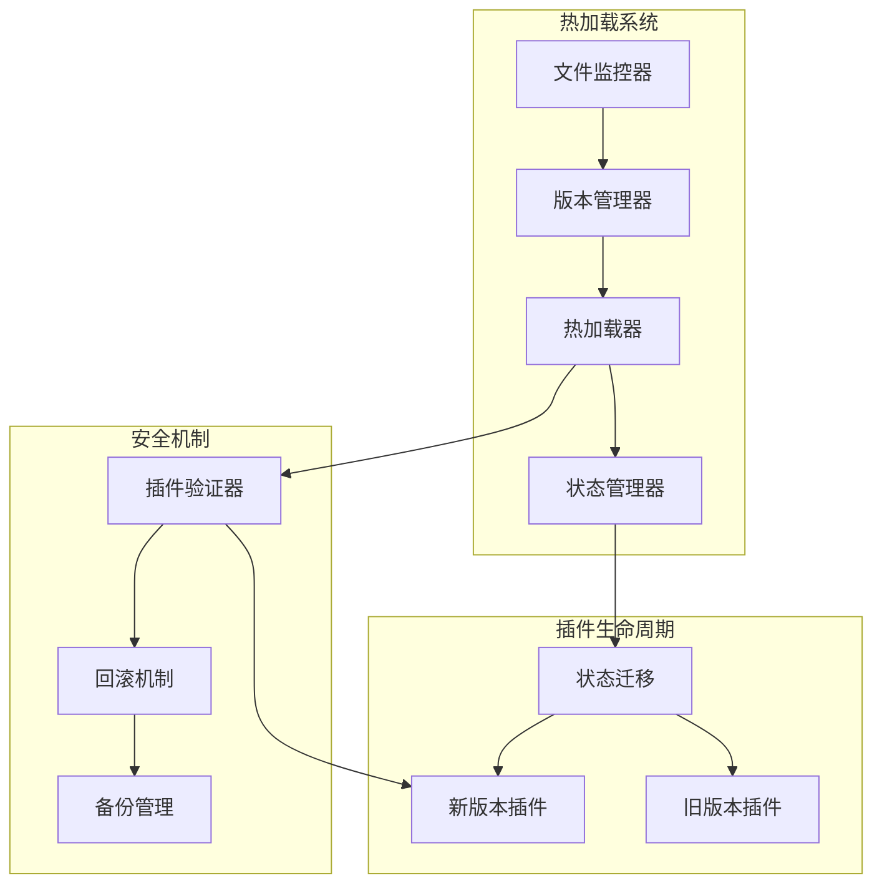
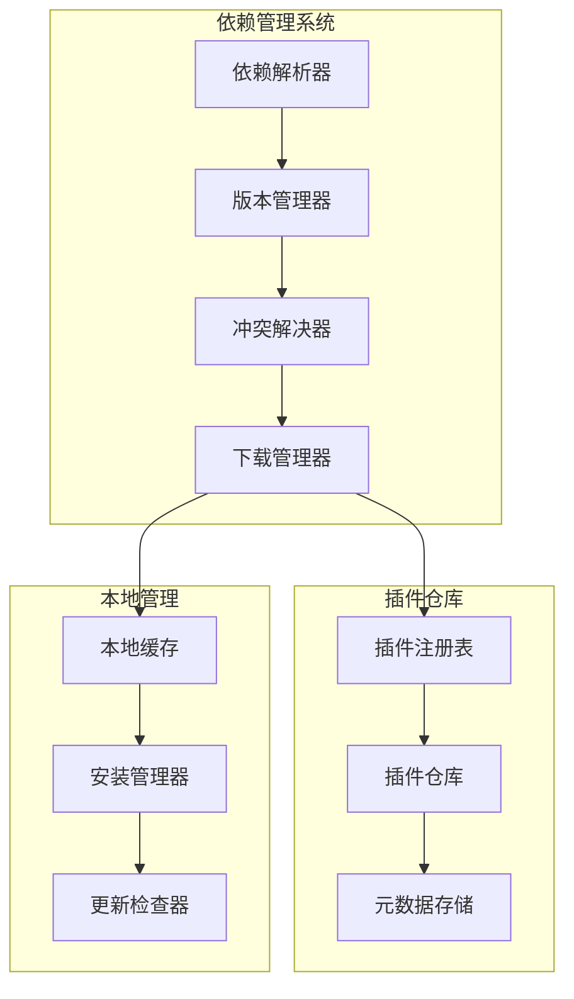
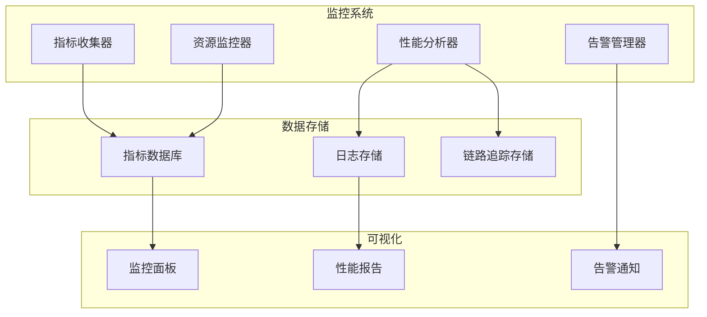
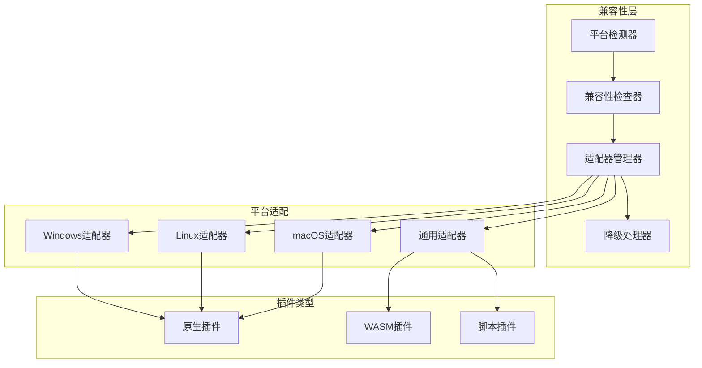
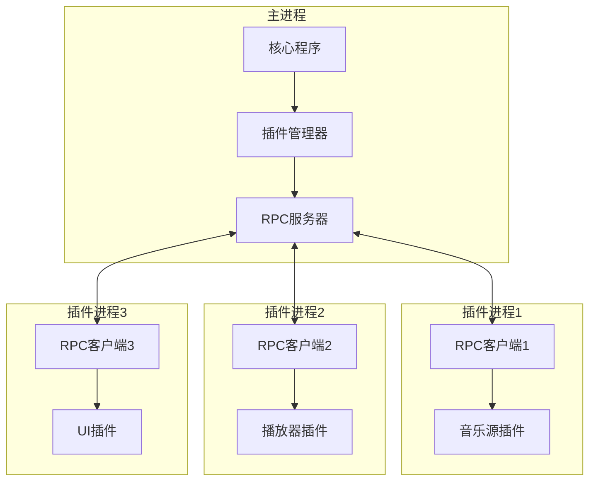
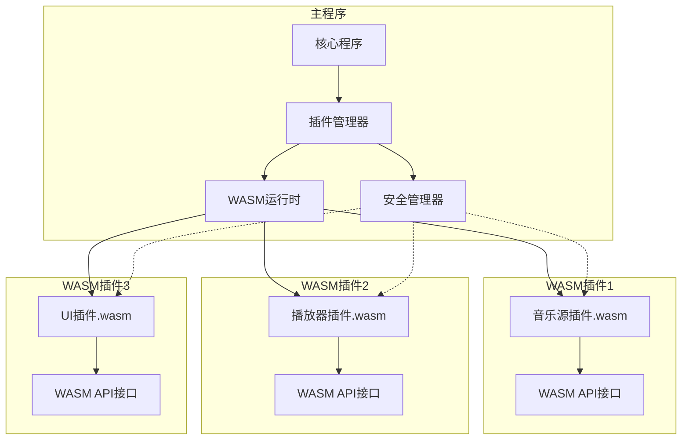

# go-musicfox 插件系统实现细节设计文档

## 概述

本文档基于前期设计的三种技术方案，详细阐述插件系统的具体实现方式。涵盖动态链接库、RPC通信、WebAssembly沙箱、gRPC微服务等多种插件实现技术，并提供完整的代码示例、配置文件格式、部署方案和性能对比分析。

## 插件实现方式对比

| 实现方式        | 性能 | 安全性 | 跨平台 | 开发复杂度 | 部署复杂度 | 适用场景   |
| ----------- | -- | --- | --- | ----- | ----- | ------ |
| 动态链接库       | 极高 | 低   | 中   | 低     | 低     | 高性能插件  |
| RPC进程间通信    | 高  | 高   | 高   | 中     | 中     | 独立进程插件 |
| WebAssembly | 中  | 极高  | 极高  | 中     | 低     | 沙箱安全插件 |
| gRPC微服务     | 中  | 高   | 高   | 高     | 高     | 分布式插件  |
| 内嵌脚本        | 低  | 中   | 高   | 低     | 极低    | 轻量级插件  |

***

# 方案一：基于动态链接库的插件系统

## 架构设计

### 动态链接库加载机制



## 核心实现

### 插件接口定义

```go
// plugin/interface.go
package plugin

import (
    "context"
    "time"
)

// 插件基础接口
type Plugin interface {
    // 插件元信息
    Name() string
    Version() string
    Description() string
    Author() string
    
    // 生命周期管理
    Initialize(ctx context.Context, config map[string]interface{}) error
    Start() error
    Stop() error
    Cleanup() error
    
    // 健康检查
    HealthCheck() error
    
    // 插件能力
    Capabilities() []string
}

// 音乐源插件接口
type MusicSourcePlugin interface {
    Plugin
    
    // 搜索功能
    Search(ctx context.Context, query string, options SearchOptions) (*SearchResult, error)
    
    // 播放列表
    GetPlaylist(ctx context.Context, id string) (*Playlist, error)
    GetPlaylistSongs(ctx context.Context, playlistID string, offset, limit int) ([]*Song, error)
    
    // 歌曲信息
    GetSongURL(ctx context.Context, songID string, quality Quality) (string, error)
    GetSongLyrics(ctx context.Context, songID string) (*Lyrics, error)
    GetSongDetail(ctx context.Context, songID string) (*Song, error)
    
    // 用户相关
    Login(ctx context.Context, credentials map[string]string) error
    GetUserPlaylists(ctx context.Context, userID string) ([]*Playlist, error)
    GetUserLikedSongs(ctx context.Context, userID string) ([]*Song, error)
}

// 播放器插件接口
type PlayerPlugin interface {
    Plugin
    
    // 播放控制
    Play(ctx context.Context, url string) error
    Pause() error
    Resume() error
    Stop() error
    Seek(position time.Duration) error
    
    // 音量控制
    SetVolume(volume float64) error
    GetVolume() (float64, error)
    
    // 状态查询
    GetState() PlayerState
    GetPosition() time.Duration
    GetDuration() time.Duration
    
    // 事件监听
    OnStateChanged(callback func(PlayerState))
    OnPositionChanged(callback func(time.Duration))
    OnError(callback func(error))
}

// UI插件接口
type UIPlugin interface {
    Plugin
    
    // 渲染相关
    Render(ctx context.Context, state *AppState) error
    HandleInput(ctx context.Context, input *InputEvent) error
    
    // 布局管理
    SetLayout(layout Layout) error
    GetLayout() Layout
    
    // 主题支持
    SetTheme(theme *Theme) error
    GetSupportedThemes() []*Theme
    
    // 通知显示
    ShowNotification(message string, level NotificationLevel) error
    ShowDialog(dialog *Dialog) (*DialogResult, error)
}
```

### 插件加载器实现

```go
// plugin/loader.go
package plugin

import (
    "fmt"
    "path/filepath"
    "plugin"
    "reflect"
    "runtime"
    "sync"
    "unsafe"
)

// 动态链接库插件加载器
type DynamicLibraryLoader struct {
    loadedPlugins map[string]*LoadedPlugin
    mutex         sync.RWMutex
    logger        Logger
}

// 已加载的插件信息
type LoadedPlugin struct {
    Plugin     Plugin
    Library    *plugin.Plugin
    Path       string
    LoadTime   time.Time
    RefCount   int32
    Symbols    map[string]plugin.Symbol
}

// 插件符号定义
type PluginSymbols struct {
    // 必需的符号
    CreatePlugin func() Plugin
    DestroyPlugin func(Plugin)
    
    // 可选的符号
    GetPluginInfo func() *PluginInfo
    ValidateConfig func(map[string]interface{}) error
}

func NewDynamicLibraryLoader(logger Logger) *DynamicLibraryLoader {
    return &DynamicLibraryLoader{
        loadedPlugins: make(map[string]*LoadedPlugin),
        logger:        logger,
    }
}

// 加载插件
func (l *DynamicLibraryLoader) LoadPlugin(pluginPath string) (Plugin, error) {
    l.mutex.Lock()
    defer l.mutex.Unlock()
    
    // 检查是否已加载
    if loaded, exists := l.loadedPlugins[pluginPath]; exists {
        atomic.AddInt32(&loaded.RefCount, 1)
        return loaded.Plugin, nil
    }
    
    // 验证插件文件
    if err := l.validatePluginFile(pluginPath); err != nil {
        return nil, fmt.Errorf("plugin validation failed: %w", err)
    }
    
    // 打开动态链接库
    lib, err := plugin.Open(pluginPath)
    if err != nil {
        return nil, fmt.Errorf("failed to open plugin %s: %w", pluginPath, err)
    }
    
    // 加载插件符号
    symbols, err := l.loadPluginSymbols(lib)
    if err != nil {
        return nil, fmt.Errorf("failed to load plugin symbols: %w", err)
    }
    
    // 创建插件实例
    pluginInstance := symbols.CreatePlugin()
    if pluginInstance == nil {
        return nil, fmt.Errorf("plugin creation failed")
    }
    
    // 验证插件接口
    if err := l.validatePluginInterface(pluginInstance); err != nil {
        if symbols.DestroyPlugin != nil {
            symbols.DestroyPlugin(pluginInstance)
        }
        return nil, fmt.Errorf("plugin interface validation failed: %w", err)
    }
    
    // 记录已加载的插件
    loaded := &LoadedPlugin{
        Plugin:   pluginInstance,
        Library:  lib,
        Path:     pluginPath,
        LoadTime: time.Now(),
        RefCount: 1,
        Symbols:  make(map[string]plugin.Symbol),
    }
    
    l.loadedPlugins[pluginPath] = loaded
    
    l.logger.Info("Plugin loaded successfully", 
        "path", pluginPath,
        "name", pluginInstance.Name(),
        "version", pluginInstance.Version())
    
    return pluginInstance, nil
}

// 卸载插件
func (l *DynamicLibraryLoader) UnloadPlugin(pluginPath string) error {
    l.mutex.Lock()
    defer l.mutex.Unlock()
    
    loaded, exists := l.loadedPlugins[pluginPath]
    if !exists {
        return fmt.Errorf("plugin not loaded: %s", pluginPath)
    }
    
    // 减少引用计数
    newRefCount := atomic.AddInt32(&loaded.RefCount, -1)
    if newRefCount > 0 {
        return nil // 仍有其他引用
    }
    
    // 停止插件
    if err := loaded.Plugin.Stop(); err != nil {
        l.logger.Warn("Failed to stop plugin", "error", err)
    }
    
    // 清理插件
    if err := loaded.Plugin.Cleanup(); err != nil {
        l.logger.Warn("Failed to cleanup plugin", "error", err)
    }
    
    // 销毁插件实例
    if symbols, err := l.loadPluginSymbols(loaded.Library); err == nil {
        if symbols.DestroyPlugin != nil {
            symbols.DestroyPlugin(loaded.Plugin)
        }
    }
    
    // 从已加载列表中移除
    delete(l.loadedPlugins, pluginPath)
    
    l.logger.Info("Plugin unloaded successfully", "path", pluginPath)
    
    return nil
}

// 加载插件符号
func (l *DynamicLibraryLoader) loadPluginSymbols(lib *plugin.Plugin) (*PluginSymbols, error) {
    symbols := &PluginSymbols{}
    
    // 加载必需的符号
    createSym, err := lib.Lookup("CreatePlugin")
    if err != nil {
        return nil, fmt.Errorf("CreatePlugin symbol not found: %w", err)
    }
    
    createFunc, ok := createSym.(func() Plugin)
    if !ok {
        return nil, fmt.Errorf("CreatePlugin has invalid signature")
    }
    symbols.CreatePlugin = createFunc
    
    // 加载可选的符号
    if destroySym, err := lib.Lookup("DestroyPlugin"); err == nil {
        if destroyFunc, ok := destroySym.(func(Plugin)); ok {
            symbols.DestroyPlugin = destroyFunc
        }
    }
    
    if infoSym, err := lib.Lookup("GetPluginInfo"); err == nil {
        if infoFunc, ok := infoSym.(func() *PluginInfo); ok {
            symbols.GetPluginInfo = infoFunc
        }
    }
    
    if validateSym, err := lib.Lookup("ValidateConfig"); err == nil {
        if validateFunc, ok := validateSym.(func(map[string]interface{}) error); ok {
            symbols.ValidateConfig = validateFunc
        }
    }
    
    return symbols, nil
}

// 验证插件文件
func (l *DynamicLibraryLoader) validatePluginFile(pluginPath string) error {
    // 检查文件扩展名
    ext := filepath.Ext(pluginPath)
    validExts := map[string]bool{
        ".so":   true, // Linux/macOS
        ".dll":  true, // Windows
        ".dylib": true, // macOS
    }
    
    if !validExts[ext] {
        return fmt.Errorf("invalid plugin file extension: %s", ext)
    }
    
    // 检查文件是否存在
    if _, err := os.Stat(pluginPath); os.IsNotExist(err) {
        return fmt.Errorf("plugin file not found: %s", pluginPath)
    }
    
    // 检查文件权限
    if runtime.GOOS != "windows" {
        info, err := os.Stat(pluginPath)
        if err != nil {
            return fmt.Errorf("failed to get file info: %w", err)
        }
        
        if info.Mode()&0111 == 0 {
            return fmt.Errorf("plugin file is not executable: %s", pluginPath)
        }
    }
    
    return nil
}

// 验证插件接口
func (l *DynamicLibraryLoader) validatePluginInterface(p Plugin) error {
    // 检查基础方法
    if p.Name() == "" {
        return fmt.Errorf("plugin name cannot be empty")
    }
    
    if p.Version() == "" {
        return fmt.Errorf("plugin version cannot be empty")
    }
    
    // 检查版本格式
    if !isValidVersion(p.Version()) {
        return fmt.Errorf("invalid version format: %s", p.Version())
    }
    
    // 检查能力声明
    capabilities := p.Capabilities()
    if len(capabilities) == 0 {
        return fmt.Errorf("plugin must declare at least one capability")
    }
    
    // 验证特定接口
    switch plugin := p.(type) {
    case MusicSourcePlugin:
        return l.validateMusicSourcePlugin(plugin)
    case PlayerPlugin:
        return l.validatePlayerPlugin(plugin)
    case UIPlugin:
        return l.validateUIPlugin(plugin)
    }
    
    return nil
}

// 验证音乐源插件
func (l *DynamicLibraryLoader) validateMusicSourcePlugin(p MusicSourcePlugin) error {
    // 检查必需的能力
    capabilities := p.Capabilities()
    requiredCaps := []string{"search", "get_song_url"}
    
    for _, required := range requiredCaps {
        found := false
        for _, cap := range capabilities {
            if cap == required {
                found = true
                break
            }
        }
        if !found {
            return fmt.Errorf("music source plugin missing required capability: %s", required)
        }
    }
    
    return nil
}

// 验证播放器插件
func (l *DynamicLibraryLoader) validatePlayerPlugin(p PlayerPlugin) error {
    // 检查播放器状态
    state := p.GetState()
    if state == PlayerStateUnknown {
        return fmt.Errorf("player plugin has unknown state")
    }
    
    return nil
}

// 验证UI插件
func (l *DynamicLibraryLoader) validateUIPlugin(p UIPlugin) error {
    // 检查支持的主题
    themes := p.GetSupportedThemes()
    if len(themes) == 0 {
        return fmt.Errorf("UI plugin must support at least one theme")
    }
    
    return nil
}

// 版本格式验证
func isValidVersion(version string) bool {
    // 简单的语义化版本检查
    parts := strings.Split(version, ".")
    if len(parts) != 3 {
        return false
    }
    
    for _, part := range parts {
        if _, err := strconv.Atoi(part); err != nil {
            return false
        }
    }
    
    return true
}
```

````

### 插件热加载机制

```go
// plugin/hotreload.go
package plugin

import (
    "context"
    "fmt"
    "os"
    "path/filepath"
    "sync"
    "time"
    
    "github.com/fsnotify/fsnotify"
)

// 热加载管理器
type HotReloadManager struct {
    loader       PluginLoader
    watcher      *fsnotify.Watcher
    watchedDirs  map[string]bool
    pluginPaths  map[string]string // pluginName -> pluginPath
    reloadQueue  chan string
    stopChan     chan struct{}
    mutex        sync.RWMutex
    logger       Logger
    
    // 配置
    reloadDelay  time.Duration
    maxRetries   int
    backupDir    string
}

func NewHotReloadManager(loader PluginLoader, logger Logger) *HotReloadManager {
    watcher, err := fsnotify.NewWatcher()
    if err != nil {
        logger.Error("Failed to create file watcher", "error", err)
        return nil
    }
    
    return &HotReloadManager{
        loader:      loader,
        watcher:     watcher,
        watchedDirs: make(map[string]bool),
        pluginPaths: make(map[string]string),
        reloadQueue: make(chan string, 100),
        stopChan:    make(chan struct{}),
        logger:      logger,
        reloadDelay: 2 * time.Second,
        maxRetries:  3,
        backupDir:   "./plugin_backups",
    }
}

// 启动热加载监控
func (h *HotReloadManager) Start(ctx context.Context) error {
    // 创建备份目录
    if err := os.MkdirAll(h.backupDir, 0755); err != nil {
        return fmt.Errorf("failed to create backup directory: %w", err)
    }
    
    // 启动文件监控
    go h.watchFiles(ctx)
    
    // 启动重载处理
    go h.processReloads(ctx)
    
    h.logger.Info("Hot reload manager started")
    return nil
}

// 停止热加载监控
func (h *HotReloadManager) Stop() error {
    close(h.stopChan)
    return h.watcher.Close()
}

// 添加监控目录
func (h *HotReloadManager) WatchDirectory(dir string) error {
    h.mutex.Lock()
    defer h.mutex.Unlock()
    
    if h.watchedDirs[dir] {
        return nil // 已经在监控
    }
    
    if err := h.watcher.Add(dir); err != nil {
        return fmt.Errorf("failed to watch directory %s: %w", dir, err)
    }
    
    h.watchedDirs[dir] = true
    h.logger.Info("Started watching directory", "dir", dir)
    
    return nil
}

// 注册插件路径
func (h *HotReloadManager) RegisterPlugin(pluginName, pluginPath string) {
    h.mutex.Lock()
    defer h.mutex.Unlock()
    
    h.pluginPaths[pluginName] = pluginPath
    
    // 自动监控插件所在目录
    dir := filepath.Dir(pluginPath)
    if !h.watchedDirs[dir] {
        h.WatchDirectory(dir)
    }
}

// 文件监控处理
func (h *HotReloadManager) watchFiles(ctx context.Context) {
    for {
        select {
        case event, ok := <-h.watcher.Events:
            if !ok {
                return
            }
            
            h.handleFileEvent(event)
            
        case err, ok := <-h.watcher.Errors:
            if !ok {
                return
            }
            
            h.logger.Error("File watcher error", "error", err)
            
        case <-ctx.Done():
            return
            
        case <-h.stopChan:
            return
        }
    }
}

// 处理文件事件
func (h *HotReloadManager) handleFileEvent(event fsnotify.Event) {
    // 只处理写入和创建事件
    if event.Op&fsnotify.Write == 0 && event.Op&fsnotify.Create == 0 {
        return
    }
    
    // 检查是否是插件文件
    if !h.isPluginFile(event.Name) {
        return
    }
    
    h.logger.Debug("Plugin file changed", "file", event.Name, "op", event.Op)
    
    // 添加到重载队列
    select {
    case h.reloadQueue <- event.Name:
    default:
        h.logger.Warn("Reload queue full, dropping event", "file", event.Name)
    }
}

// 检查是否是插件文件
func (h *HotReloadManager) isPluginFile(filename string) bool {
    ext := filepath.Ext(filename)
    return ext == ".so" || ext == ".dll" || ext == ".dylib"
}

// 处理重载队列
func (h *HotReloadManager) processReloads(ctx context.Context) {
    reloadTimer := make(map[string]*time.Timer)
    
    for {
        select {
        case pluginPath := <-h.reloadQueue:
            // 取消之前的定时器
            if timer, exists := reloadTimer[pluginPath]; exists {
                timer.Stop()
            }
            
            // 设置延迟重载
            reloadTimer[pluginPath] = time.AfterFunc(h.reloadDelay, func() {
                h.reloadPlugin(pluginPath)
                delete(reloadTimer, pluginPath)
            })
            
        case <-ctx.Done():
            // 取消所有定时器
            for _, timer := range reloadTimer {
                timer.Stop()
            }
            return
            
        case <-h.stopChan:
            return
        }
    }
}

// 重载插件
func (h *HotReloadManager) reloadPlugin(pluginPath string) {
    h.logger.Info("Reloading plugin", "path", pluginPath)
    
    // 创建备份
    backupPath, err := h.createBackup(pluginPath)
    if err != nil {
        h.logger.Error("Failed to create plugin backup", "error", err)
        return
    }
    
    // 尝试重载
    for attempt := 1; attempt <= h.maxRetries; attempt++ {
        if err := h.attemptReload(pluginPath); err != nil {
            h.logger.Warn("Plugin reload attempt failed", 
                "attempt", attempt, 
                "error", err)
            
            if attempt == h.maxRetries {
                h.logger.Error("Plugin reload failed after max retries", 
                    "path", pluginPath)
                
                // 恢复备份
                if restoreErr := h.restoreBackup(backupPath, pluginPath); restoreErr != nil {
                    h.logger.Error("Failed to restore plugin backup", 
                        "error", restoreErr)
                }
            } else {
                // 等待后重试
                time.Sleep(time.Duration(attempt) * time.Second)
            }
        } else {
            h.logger.Info("Plugin reloaded successfully", "path", pluginPath)
            break
        }
    }
}

// 尝试重载插件
func (h *HotReloadManager) attemptReload(pluginPath string) error {
    // 卸载旧插件
    if err := h.loader.UnloadPlugin(pluginPath); err != nil {
        h.logger.Warn("Failed to unload old plugin", "error", err)
    }
    
    // 等待一段时间确保文件句柄释放
    time.Sleep(100 * time.Millisecond)
    
    // 加载新插件
    _, err := h.loader.LoadPlugin(pluginPath)
    return err
}

// 创建备份
func (h *HotReloadManager) createBackup(pluginPath string) (string, error) {
    filename := filepath.Base(pluginPath)
    timestamp := time.Now().Format("20060102_150405")
    backupName := fmt.Sprintf("%s.%s.backup", filename, timestamp)
    backupPath := filepath.Join(h.backupDir, backupName)
    
    src, err := os.Open(pluginPath)
    if err != nil {
        return "", fmt.Errorf("failed to open source file: %w", err)
    }
    defer src.Close()
    
    dst, err := os.Create(backupPath)
    if err != nil {
        return "", fmt.Errorf("failed to create backup file: %w", err)
    }
    defer dst.Close()
    
    if _, err := io.Copy(dst, src); err != nil {
        return "", fmt.Errorf("failed to copy file: %w", err)
    }
    
    return backupPath, nil
}

// 恢复备份
func (h *HotReloadManager) restoreBackup(backupPath, targetPath string) error {
    src, err := os.Open(backupPath)
    if err != nil {
        return fmt.Errorf("failed to open backup file: %w", err)
    }
    defer src.Close()
    
    dst, err := os.Create(targetPath)
    if err != nil {
        return fmt.Errorf("failed to create target file: %w", err)
    }
    defer dst.Close()
    
    if _, err := io.Copy(dst, src); err != nil {
        return fmt.Errorf("failed to restore file: %w", err)
    }
    
    return nil
}
````

### 插件示例实现

```go
// examples/netease_plugin/main.go
package main

import "C"

import (
    "context"
    "fmt"
    "time"
    
    "github.com/go-musicfox/go-musicfox/plugin"
)

// 网易云音乐插件实现
type NeteasePlugin struct {
    name        string
    version     string
    description string
    author      string
    client      *NeteaseClient
    config      map[string]interface{}
    logger      plugin.Logger
}

// 插件工厂函数
//export CreatePlugin
func CreatePlugin() plugin.Plugin {
    return &NeteasePlugin{
        name:        "netease-music",
        version:     "1.0.0",
        description: "网易云音乐数据源插件",
        author:      "go-musicfox",
    }
}

// 插件销毁函数
//export DestroyPlugin
func DestroyPlugin(p plugin.Plugin) {
    if netease, ok := p.(*NeteasePlugin); ok {
        netease.Cleanup()
    }
}

// 获取插件信息
//export GetPluginInfo
func GetPluginInfo() *plugin.PluginInfo {
    return &plugin.PluginInfo{
        Name:        "netease-music",
        Version:     "1.0.0",
        Description: "网易云音乐数据源插件",
        Author:      "go-musicfox",
        License:     "MIT",
        Homepage:    "https://github.com/go-musicfox/go-musicfox",
        Capabilities: []string{"search", "playlist", "lyrics", "user_auth"},
        Dependencies: []plugin.Dependency{
            {
                Name:    "core",
                Version: ">=1.0.0",
                Type:    "plugin",
            },
        },
    }
}

// 验证配置
//export ValidateConfig
func ValidateConfig(config map[string]interface{}) error {
    // 检查必需的配置项
    requiredKeys := []string{"api_base_url", "timeout"}
    
    for _, key := range requiredKeys {
        if _, exists := config[key]; !exists {
            return fmt.Errorf("missing required config key: %s", key)
        }
    }
    
    return nil
}

// 实现Plugin接口
func (p *NeteasePlugin) Name() string {
    return p.name
}

func (p *NeteasePlugin) Version() string {
    return p.version
}

func (p *NeteasePlugin) Description() string {
    return p.description
}

func (p *NeteasePlugin) Author() string {
    return p.author
}

func (p *NeteasePlugin) Initialize(ctx context.Context, config map[string]interface{}) error {
    p.config = config
    
    // 创建网易云客户端
    apiBaseURL, _ := config["api_base_url"].(string)
    timeout, _ := config["timeout"].(time.Duration)
    
    p.client = NewNeteaseClient(apiBaseURL, timeout)
    
    // 设置日志记录器
    if logger, ok := config["logger"].(plugin.Logger); ok {
        p.logger = logger
    }
    
    p.logger.Info("Netease plugin initialized", "version", p.version)
    
    return nil
}

func (p *NeteasePlugin) Start() error {
    // 测试API连接
    if err := p.client.TestConnection(); err != nil {
        return fmt.Errorf("failed to connect to Netease API: %w", err)
    }
    
    p.logger.Info("Netease plugin started")
    return nil
}

func (p *NeteasePlugin) Stop() error {
    if p.client != nil {
        p.client.Close()
    }
    
    p.logger.Info("Netease plugin stopped")
    return nil
}

func (p *NeteasePlugin) Cleanup() error {
    p.config = nil
    p.client = nil
    p.logger = nil
    
    return nil
}

func (p *NeteasePlugin) HealthCheck() error {
    if p.client == nil {
        return fmt.Errorf("client not initialized")
    }
    
    return p.client.Ping()
}

func (p *NeteasePlugin) Capabilities() []string {
    return []string{"search", "playlist", "lyrics", "user_auth"}
}

// 实现MusicSourcePlugin接口
func (p *NeteasePlugin) Search(ctx context.Context, query string, options plugin.SearchOptions) (*plugin.SearchResult, error) {
    result, err := p.client.Search(ctx, query, options)
    if err != nil {
        p.logger.Error("Search failed", "query", query, "error", err)
        return nil, err
    }
    
    p.logger.Debug("Search completed", "query", query, "results", len(result.Songs))
    return result, nil
}

func (p *NeteasePlugin) GetPlaylist(ctx context.Context, id string) (*plugin.Playlist, error) {
    playlist, err := p.client.GetPlaylist(ctx, id)
    if err != nil {
        p.logger.Error("Get playlist failed", "id", id, "error", err)
        return nil, err
    }
    
    return playlist, nil
}

func (p *NeteasePlugin) GetPlaylistSongs(ctx context.Context, playlistID string, offset, limit int) ([]*plugin.Song, error) {
    songs, err := p.client.GetPlaylistSongs(ctx, playlistID, offset, limit)
    if err != nil {
        p.logger.Error("Get playlist songs failed", 
            "playlist_id", playlistID, 
            "offset", offset, 
            "limit", limit, 
            "error", err)
        return nil, err
    }
    
    return songs, nil
}

func (p *NeteasePlugin) GetSongURL(ctx context.Context, songID string, quality plugin.Quality) (string, error) {
    url, err := p.client.GetSongURL(ctx, songID, quality)
    if err != nil {
        p.logger.Error("Get song URL failed", "song_id", songID, "quality", quality, "error", err)
        return "", err
    }
    
    return url, nil
}

func (p *NeteasePlugin) GetSongLyrics(ctx context.Context, songID string) (*plugin.Lyrics, error) {
    lyrics, err := p.client.GetLyrics(ctx, songID)
    if err != nil {
        p.logger.Error("Get lyrics failed", "song_id", songID, "error", err)
        return nil, err
    }
    
    return lyrics, nil
}

func (p *NeteasePlugin) GetSongDetail(ctx context.Context, songID string) (*plugin.Song, error) {
    song, err := p.client.GetSongDetail(ctx, songID)
    if err != nil {
        p.logger.Error("Get song detail failed", "song_id", songID, "error", err)
        return nil, err
    }
    
    return song, nil
}

func (p *NeteasePlugin) Login(ctx context.Context, credentials map[string]string) error {
    err := p.client.Login(ctx, credentials)
    if err != nil {
        p.logger.Error("Login failed", "error", err)
        return err
    }
    
    p.logger.Info("Login successful")
    return nil
}

func (p *NeteasePlugin) GetUserPlaylists(ctx context.Context, userID string) ([]*plugin.Playlist, error) {
    playlists, err := p.client.GetUserPlaylists(ctx, userID)
    if err != nil {
        p.logger.Error("Get user playlists failed", "user_id", userID, "error", err)
        return nil, err
    }
    
    return playlists, nil
}

func (p *NeteasePlugin) GetUserLikedSongs(ctx context.Context, userID string) ([]*plugin.Song, error) {
    songs, err := p.client.GetUserLikedSongs(ctx, userID)
    if err != nil {
        p.logger.Error("Get user liked songs failed", "user_id", userID, "error", err)
        return nil, err
    }
    
    return songs, nil
}

// 必须有main函数，但不会被调用
func main() {}
```

### 编译配置

```makefile
# Makefile for plugin compilation

# 插件目录
PLUGIN_DIR = plugins
BUILD_DIR = build/plugins

# 编译标志
CGO_ENABLED = 1
GO_BUILD_FLAGS = -buildmode=plugin

# 平台特定设置
ifeq ($(GOOS),windows)
    PLUGIN_EXT = .dll
else ifeq ($(GOOS),darwin)
    PLUGIN_EXT = .dylib
else
    PLUGIN_EXT = .so
endif

# 插件列表
PLUGINS = netease spotify beep mpv tui gui

.PHONY: all clean plugins

all: plugins

plugins: $(addprefix $(BUILD_DIR)/, $(addsuffix $(PLUGIN_EXT), $(PLUGINS)))

# 通用插件编译规则
$(BUILD_DIR)/%$(PLUGIN_EXT): $(PLUGIN_DIR)/%/main.go
	@mkdir -p $(BUILD_DIR)
	@echo "Building plugin: $*"
	CGO_ENABLED=$(CGO_ENABLED) go build $(GO_BUILD_FLAGS) -o $@ $<

# 网易云插件
$(BUILD_DIR)/netease$(PLUGIN_EXT): $(PLUGIN_DIR)/netease/main.go
	@mkdir -p $(BUILD_DIR)
	@echo "Building Netease plugin"
	CGO_ENABLED=1 go build -buildmode=plugin \
		-ldflags "-X main.version=$(VERSION) -X main.buildTime=$(BUILD_TIME)" \
		-o $@ $<

# Spotify插件
$(BUILD_DIR)/spotify$(PLUGIN_EXT): $(PLUGIN_DIR)/spotify/main.go
	@mkdir -p $(BUILD_DIR)
	@echo "Building Spotify plugin"
	CGO_ENABLED=1 go build -buildmode=plugin \
		-tags "spotify" \
		-o $@ $<

# 播放器插件
$(BUILD_DIR)/beep$(PLUGIN_EXT): $(PLUGIN_DIR)/beep/main.go
	@mkdir -p $(BUILD_DIR)
	@echo "Building Beep player plugin"
	CGO_ENABLED=1 go build -buildmode=plugin \
		-tags "beep" \
		-o $@ $<

$(BUILD_DIR)/mpv$(PLUGIN_EXT): $(PLUGIN_DIR)/mpv/main.go
	@mkdir -p $(BUILD_DIR)
	@echo "Building MPV player plugin"
	CGO_ENABLED=1 go build -buildmode=plugin \
		-tags "mpv" \
		-ldflags "-X main.mpvLibPath=$(MPV_LIB_PATH)" \
		-o $@ $<

# UI插件
$(BUILD_DIR)/tui$(PLUGIN_EXT): $(PLUGIN_DIR)/tui/main.go
	@mkdir -p $(BUILD_DIR)
	@echo "Building TUI plugin"
	CGO_ENABLED=1 go build -buildmode=plugin \
		-tags "tui" \
		-o $@ $<

$(BUILD_DIR)/gui$(PLUGIN_EXT): $(PLUGIN_DIR)/gui/main.go
	@mkdir -p $(BUILD_DIR)
	@echo "Building GUI plugin"
	CGO_ENABLED=1 go build -buildmode=plugin \
		-tags "gui fyne" \
		-o $@ $<

# 清理
clean:
	rm -rf $(BUILD_DIR)

# 安装插件
install: plugins
	@echo "Installing plugins to $(INSTALL_DIR)"
	@mkdir -p $(INSTALL_DIR)
	cp $(BUILD_DIR)/*$(PLUGIN_EXT) $(INSTALL_DIR)/

# 测试插件
test-plugins:
	@echo "Testing plugins"
	go test -v ./tests/plugin/...

# 插件签名（可选）
sign-plugins: plugins
	@echo "Signing plugins"
	for plugin in $(BUILD_DIR)/*$(PLUGIN_EXT); do \
		echo "Signing $$plugin"; \
		gpg --detach-sign --armor $$plugin; \
	done
```

### 配置文件格式

```yaml
# config/plugins.yaml
plugins:
  # 插件目录配置
  directories:
    - "./plugins"          # 内置插件目录
    - "~/.musicfox/plugins" # 用户插件目录
    - "/usr/share/musicfox/plugins" # 系统插件目录
  
  # 自动加载配置
  auto_load:
    enabled: true
    scan_interval: "30s"    # 扫描间隔
    load_timeout: "10s"     # 加载超时
  
  # 热加载配置
  hot_reload:
    enabled: true
    watch_directories: true
    reload_delay: "2s"      # 重载延迟
    max_retries: 3          # 最大重试次数
    backup_enabled: true    # 是否创建备份
  
  # 安全配置
  security:
    signature_verification: false  # 签名验证
    sandbox_enabled: false        # 沙箱模式
    allowed_capabilities:
      - "search"
      - "playlist"
      - "lyrics"
      - "playback"
      - "ui_render"
  
  # 性能配置
  performance:
    max_concurrent_loads: 5    # 最大并发加载数
    memory_limit: "100MB"      # 内存限制
    cpu_limit: 0.5            # CPU限制
  
  # 插件特定配置
  plugin_configs:
    netease:
      enabled: true
      priority: 100
      config:
        api_base_url: "https://music.163.com"
        timeout: "30s"
        retry_count: 3
        cache_enabled: true
        cache_ttl: "1h"
    
    spotify:
      enabled: false
      priority: 90
      config:
        client_id: "${SPOTIFY_CLIENT_ID}"
         client_secret: "${SPOTIFY_CLIENT_SECRET}"
```

***

# 方案四：基于gRPC的微服务插件架构

## 架构设计

### gRPC微服务架构



## 核心实现

### gRPC服务定义

```protobuf
// proto/plugin.proto
syntax = "proto3";

package musicfox.plugin;

option go_package = "github.com/go-musicfox/musicfox/pkg/plugin/grpc";

import "google/protobuf/empty.proto";
import "google/protobuf/any.proto";
import "google/protobuf/timestamp.proto";

// 插件服务接口
service PluginService {
    // 生命周期管理
    rpc Initialize(InitializeRequest) returns (InitializeResponse);
    rpc Start(google.protobuf.Empty) returns (google.protobuf.Empty);
    rpc Stop(google.protobuf.Empty) returns (google.protobuf.Empty);
    rpc Shutdown(google.protobuf.Empty) returns (google.protobuf.Empty);
    
    // 健康检查
    rpc HealthCheck(google.protobuf.Empty) returns (HealthResponse);
    
    // 插件信息
    rpc GetInfo(google.protobuf.Empty) returns (PluginInfo);
    rpc GetCapabilities(google.protobuf.Empty) returns (CapabilitiesResponse);
}

// 音乐源服务接口
service MusicSourceService {
    // 搜索功能
    rpc Search(SearchRequest) returns (SearchResponse);
    rpc GetSuggestions(SuggestionsRequest) returns (SuggestionsResponse);
    
    // 歌单功能
    rpc GetPlaylist(PlaylistRequest) returns (PlaylistResponse);
    rpc GetPlaylistSongs(PlaylistSongsRequest) returns (PlaylistSongsResponse);
    
    // 歌曲功能
    rpc GetSongURL(SongURLRequest) returns (SongURLResponse);
    rpc GetSongLyrics(LyricsRequest) returns (LyricsResponse);
    rpc GetSongInfo(SongInfoRequest) returns (SongInfoResponse);
    
    // 用户功能
    rpc Login(LoginRequest) returns (LoginResponse);
    rpc GetUserPlaylists(UserPlaylistsRequest) returns (UserPlaylistsResponse);
}

// 播放器服务接口
service PlayerService {
    // 播放控制
    rpc Play(PlayRequest) returns (PlayResponse);
    rpc Pause(google.protobuf.Empty) returns (google.protobuf.Empty);
    rpc Resume(google.protobuf.Empty) returns (google.protobuf.Empty);
    rpc Stop(google.protobuf.Empty) returns (google.protobuf.Empty);
    rpc Seek(SeekRequest) returns (google.protobuf.Empty);
    
    // 音量控制
    rpc SetVolume(VolumeRequest) returns (google.protobuf.Empty);
    rpc GetVolume(google.protobuf.Empty) returns (VolumeResponse);
    
    // 状态查询
    rpc GetPlayerState(google.protobuf.Empty) returns (PlayerStateResponse);
    rpc GetCurrentSong(google.protobuf.Empty) returns (SongInfoResponse);
    
    // 播放列表
    rpc SetPlaylist(PlaylistRequest) returns (google.protobuf.Empty);
    rpc NextSong(google.protobuf.Empty) returns (google.protobuf.Empty);
    rpc PreviousSong(google.protobuf.Empty) returns (google.protobuf.Empty);
}

// UI扩展服务接口
service UIExtensionService {
    // 菜单扩展
    rpc GetMenuItems(MenuRequest) returns (MenuResponse);
    rpc HandleMenuAction(MenuActionRequest) returns (MenuActionResponse);
    
    // 界面扩展
    rpc GetUIComponents(UIComponentsRequest) returns (UIComponentsResponse);
    rpc HandleUIEvent(UIEventRequest) returns (UIEventResponse);
    
    // 主题扩展
    rpc GetThemes(google.protobuf.Empty) returns (ThemesResponse);
    rpc ApplyTheme(ThemeRequest) returns (google.protobuf.Empty);
}

// 消息定义
message InitializeRequest {
    map<string, string> config = 1;
    string plugin_id = 2;
    string version = 3;
}

message InitializeResponse {
    bool success = 1;
    string message = 2;
    PluginInfo info = 3;
}

message HealthResponse {
    enum Status {
        UNKNOWN = 0;
        SERVING = 1;
        NOT_SERVING = 2;
        SERVICE_UNKNOWN = 3;
    }
    Status status = 1;
    string message = 2;
    google.protobuf.Timestamp timestamp = 3;
}

message PluginInfo {
    string id = 1;
    string name = 2;
    string version = 3;
    string description = 4;
    string author = 5;
    repeated string capabilities = 6;
    map<string, string> metadata = 7;
}

message CapabilitiesResponse {
    repeated string capabilities = 1;
    map<string, google.protobuf.Any> capability_config = 2;
}

message SearchRequest {
    string query = 1;
    string type = 2; // song, playlist, album, artist
    int32 limit = 3;
    int32 offset = 4;
    map<string, string> filters = 5;
}

message SearchResponse {
    repeated SongInfo songs = 1;
    repeated PlaylistInfo playlists = 2;
    repeated AlbumInfo albums = 3;
    repeated ArtistInfo artists = 4;
    int32 total = 5;
    bool has_more = 6;
}

message SongInfo {
    string id = 1;
    string title = 2;
    string artist = 3;
    string album = 4;
    int32 duration = 5;
    string cover_url = 6;
    string source = 7;
    map<string, string> metadata = 8;
}

message PlaylistInfo {
    string id = 1;
    string name = 2;
    string description = 3;
    string cover_url = 4;
    int32 song_count = 5;
    string creator = 6;
    google.protobuf.Timestamp created_at = 7;
}

message PlayRequest {
    string song_id = 1;
    string url = 2;
    int32 start_position = 3;
}

message PlayResponse {
    bool success = 1;
    string message = 2;
    int32 duration = 3;
}

message PlayerStateResponse {
    enum State {
        UNKNOWN = 0;
        PLAYING = 1;
        PAUSED = 2;
        STOPPED = 3;
        BUFFERING = 4;
        ERROR = 5;
    }
    State state = 1;
    int32 position = 2;
    int32 duration = 3;
    float volume = 4;
    SongInfo current_song = 5;
}
```

### gRPC客户端管理器

```go
// grpc/client_manager.go
package grpc

import (
    "context"
    "fmt"
    "sync"
    "time"
    
    "google.golang.org/grpc"
    "google.golang.org/grpc/connectivity"
    "google.golang.org/grpc/credentials/insecure"
    "google.golang.org/grpc/health/grpc_health_v1"
    "google.golang.org/grpc/keepalive"
    "google.golang.org/grpc/metadata"
    
    pb "github.com/go-musicfox/musicfox/pkg/plugin/grpc"
)

// gRPC客户端管理器
type ClientManager struct {
    clients    map[string]*PluginClient
    mutex      sync.RWMutex
    registry   ServiceRegistry
    logger     Logger
    
    // 连接配置
    dialTimeout    time.Duration
    keepAlive      keepalive.ClientParameters
    maxRetries     int
    retryInterval  time.Duration
}

// 插件客户端
type PluginClient struct {
    ID          string
    Name        string
    Address     string
    Conn        *grpc.ClientConn
    
    // 服务客户端
    PluginService      pb.PluginServiceClient
    MusicSourceService pb.MusicSourceServiceClient
    PlayerService      pb.PlayerServiceClient
    UIExtensionService pb.UIExtensionServiceClient
    HealthClient       grpc_health_v1.HealthClient
    
    // 状态信息
    Status      connectivity.State
    LastCheck   time.Time
    Capabilities []string
    Metadata    map[string]string
    
    // 监控信息
    RequestCount  int64
    ErrorCount    int64
    LastError     error
    ResponseTimes []time.Duration
}

func NewClientManager(registry ServiceRegistry, logger Logger) *ClientManager {
    return &ClientManager{
        clients:   make(map[string]*PluginClient),
        registry:  registry,
        logger:    logger,
        
        dialTimeout: 10 * time.Second,
        keepAlive: keepalive.ClientParameters{
            Time:                10 * time.Second,
            Timeout:             3 * time.Second,
            PermitWithoutStream: true,
        },
        maxRetries:    3,
        retryInterval: 1 * time.Second,
    }
}

// 连接插件服务
func (cm *ClientManager) ConnectPlugin(pluginID, address string) (*PluginClient, error) {
    cm.mutex.Lock()
    defer cm.mutex.Unlock()
    
    // 检查是否已存在连接
    if client, exists := cm.clients[pluginID]; exists {
        if client.Conn.GetState() == connectivity.Ready {
            return client, nil
        }
        // 关闭旧连接
        client.Conn.Close()
    }
    
    // 创建gRPC连接
    ctx, cancel := context.WithTimeout(context.Background(), cm.dialTimeout)
    defer cancel()
    
    conn, err := grpc.DialContext(ctx, address,
        grpc.WithTransportCredentials(insecure.NewCredentials()),
        grpc.WithKeepaliveParams(cm.keepAlive),
        grpc.WithDefaultCallOptions(
            grpc.MaxCallRecvMsgSize(4*1024*1024), // 4MB
            grpc.MaxCallSendMsgSize(4*1024*1024), // 4MB
        ),
    )
    if err != nil {
        return nil, fmt.Errorf("failed to connect to plugin %s at %s: %w", pluginID, address, err)
    }
    
    // 创建服务客户端
    client := &PluginClient{
        ID:      pluginID,
        Address: address,
        Conn:    conn,
        
        PluginService:      pb.NewPluginServiceClient(conn),
        MusicSourceService: pb.NewMusicSourceServiceClient(conn),
        PlayerService:      pb.NewPlayerServiceClient(conn),
        UIExtensionService: pb.NewUIExtensionServiceClient(conn),
        HealthClient:       grpc_health_v1.NewHealthClient(conn),
        
        Status:        conn.GetState(),
        LastCheck:     time.Now(),
        Metadata:      make(map[string]string),
        ResponseTimes: make([]time.Duration, 0, 100),
    }
    
    // 获取插件信息
    if err := cm.initializeClient(client); err != nil {
        conn.Close()
        return nil, fmt.Errorf("failed to initialize client: %w", err)
    }
    
    cm.clients[pluginID] = client
    
    cm.logger.Info("Plugin connected", "id", pluginID, "address", address)
    
    return client, nil
}

// 初始化客户端
func (cm *ClientManager) initializeClient(client *PluginClient) error {
    ctx, cancel := context.WithTimeout(context.Background(), 10*time.Second)
    defer cancel()
    
    // 健康检查
    healthResp, err := client.HealthClient.Check(ctx, &grpc_health_v1.HealthCheckRequest{})
    if err != nil {
        return fmt.Errorf("health check failed: %w", err)
    }
    
    if healthResp.Status != grpc_health_v1.HealthCheckResponse_SERVING {
        return fmt.Errorf("plugin not serving: %s", healthResp.Status)
    }
    
    // 获取插件信息
    infoResp, err := client.PluginService.GetInfo(ctx, &pb.Empty{})
    if err != nil {
        return fmt.Errorf("failed to get plugin info: %w", err)
    }
    
    client.Name = infoResp.Name
    client.Metadata = infoResp.Metadata
    
    // 获取能力信息
    capResp, err := client.PluginService.GetCapabilities(ctx, &pb.Empty{})
    if err != nil {
        return fmt.Errorf("failed to get capabilities: %w", err)
    }
    
    client.Capabilities = capResp.Capabilities
    
    return nil
}

// 调用插件方法
func (cm *ClientManager) CallPlugin(pluginID, method string, req interface{}) (interface{}, error) {
    cm.mutex.RLock()
    client, exists := cm.clients[pluginID]
    cm.mutex.RUnlock()
    
    if !exists {
        return nil, fmt.Errorf("plugin not found: %s", pluginID)
    }
    
    // 检查连接状态
    if client.Conn.GetState() != connectivity.Ready {
        return nil, fmt.Errorf("plugin connection not ready: %s", client.Conn.GetState())
    }
    
    // 创建带超时的上下文
    ctx, cancel := context.WithTimeout(context.Background(), 30*time.Second)
    defer cancel()
    
    // 添加元数据
    ctx = metadata.AppendToOutgoingContext(ctx,
        "plugin-id", pluginID,
        "method", method,
        "timestamp", fmt.Sprintf("%d", time.Now().Unix()),
    )
    
    startTime := time.Now()
    
    var resp interface{}
    var err error
    
    // 根据方法名调用相应的服务
    switch method {
    case "Search":
        if searchReq, ok := req.(*pb.SearchRequest); ok {
            resp, err = client.MusicSourceService.Search(ctx, searchReq)
        } else {
            err = fmt.Errorf("invalid request type for Search")
        }
    case "GetPlaylist":
        if playlistReq, ok := req.(*pb.PlaylistRequest); ok {
            resp, err = client.MusicSourceService.GetPlaylist(ctx, playlistReq)
        } else {
            err = fmt.Errorf("invalid request type for GetPlaylist")
        }
    case "Play":
        if playReq, ok := req.(*pb.PlayRequest); ok {
            resp, err = client.PlayerService.Play(ctx, playReq)
        } else {
            err = fmt.Errorf("invalid request type for Play")
        }
    case "Pause":
        resp, err = client.PlayerService.Pause(ctx, &pb.Empty{})
    case "GetPlayerState":
        resp, err = client.PlayerService.GetPlayerState(ctx, &pb.Empty{})
    default:
        err = fmt.Errorf("unsupported method: %s", method)
    }
    
    duration := time.Since(startTime)
    
    // 更新统计信息
    cm.updateClientStats(client, duration, err)
    
    if err != nil {
        cm.logger.Error("Plugin call failed", "plugin", pluginID, "method", method, "error", err)
        return nil, err
    }
    
    cm.logger.Debug("Plugin call success", "plugin", pluginID, "method", method, "duration", duration)
    
    return resp, nil
}

// 更新客户端统计信息
func (cm *ClientManager) updateClientStats(client *PluginClient, duration time.Duration, err error) {
    client.RequestCount++
    
    if err != nil {
        client.ErrorCount++
        client.LastError = err
    }
    
    // 记录响应时间（保留最近100次）
    client.ResponseTimes = append(client.ResponseTimes, duration)
    if len(client.ResponseTimes) > 100 {
        client.ResponseTimes = client.ResponseTimes[1:]
    }
    
    client.LastCheck = time.Now()
}

// 健康检查
func (cm *ClientManager) HealthCheck(pluginID string) error {
    cm.mutex.RLock()
    client, exists := cm.clients[pluginID]
    cm.mutex.RUnlock()
    
    if !exists {
        return fmt.Errorf("plugin not found: %s", pluginID)
    }
    
    ctx, cancel := context.WithTimeout(context.Background(), 5*time.Second)
    defer cancel()
    
    resp, err := client.HealthClient.Check(ctx, &grpc_health_v1.HealthCheckRequest{})
    if err != nil {
        return fmt.Errorf("health check failed: %w", err)
    }
    
    if resp.Status != grpc_health_v1.HealthCheckResponse_SERVING {
        return fmt.Errorf("plugin not serving: %s", resp.Status)
    }
    
    return nil
}

// 断开插件连接
func (cm *ClientManager) DisconnectPlugin(pluginID string) error {
    cm.mutex.Lock()
    defer cm.mutex.Unlock()
    
    client, exists := cm.clients[pluginID]
    if !exists {
        return fmt.Errorf("plugin not found: %s", pluginID)
    }
    
    // 关闭连接
    if err := client.Conn.Close(); err != nil {
        cm.logger.Error("Failed to close connection", "plugin", pluginID, "error", err)
    }
    
    delete(cm.clients, pluginID)
    
    cm.logger.Info("Plugin disconnected", "id", pluginID)
    
    return nil
}

// 获取所有客户端状态
func (cm *ClientManager) GetClientsStatus() map[string]*PluginClient {
    cm.mutex.RLock()
    defer cm.mutex.RUnlock()
    
    status := make(map[string]*PluginClient)
    for id, client := range cm.clients {
        // 创建副本避免并发问题
        status[id] = &PluginClient{
            ID:           client.ID,
            Name:         client.Name,
            Address:      client.Address,
            Status:       client.Conn.GetState(),
            LastCheck:    client.LastCheck,
            Capabilities: client.Capabilities,
            Metadata:     client.Metadata,
            RequestCount: client.RequestCount,
            ErrorCount:   client.ErrorCount,
            LastError:    client.LastError,
        }
    }
    
    return status
}

// 启动健康检查监控
func (cm *ClientManager) StartHealthMonitoring(interval time.Duration) {
    ticker := time.NewTicker(interval)
    go func() {
        for range ticker.C {
            cm.performHealthChecks()
        }
    }()
}

// 执行健康检查
func (cm *ClientManager) performHealthChecks() {
    cm.mutex.RLock()
    clients := make([]*PluginClient, 0, len(cm.clients))
    for _, client := range cm.clients {
        clients = append(clients, client)
    }
    cm.mutex.RUnlock()
    
    for _, client := range clients {
        go func(c *PluginClient) {
            if err := cm.HealthCheck(c.ID); err != nil {
                cm.logger.Warn("Health check failed", "plugin", c.ID, "error", err)
                
                // 尝试重连
                if _, err := cm.ConnectPlugin(c.ID, c.Address); err != nil {
                    cm.logger.Error("Reconnection failed", "plugin", c.ID, "error", err)
                }
            }
        }(client)
     }
 }
```

***

# 方案五：插件热加载和热更新机制

## 架构设计

### 热加载架构



## 核心实现

### 热加载管理器

```go
// hotload/manager.go
package hotload

import (
    "context"
    "crypto/sha256"
    "fmt"
    "io/ioutil"
    "os"
    "path/filepath"
    "sync"
    "time"
    
    "github.com/fsnotify/fsnotify"
)

// 热加载管理器
type HotLoadManager struct {
    pluginDir     string
    watcher       *fsnotify.Watcher
    plugins       map[string]*PluginVersion
    mutex         sync.RWMutex
    logger        Logger
    
    // 配置
    checkInterval    time.Duration
    maxVersions      int
    enableRollback   bool
    validationTimeout time.Duration
    
    // 回调函数
    onPluginUpdate   func(pluginID string, oldVersion, newVersion *PluginVersion) error
    onPluginRemove   func(pluginID string) error
    onValidationFail func(pluginID string, err error)
}

// 插件版本信息
type PluginVersion struct {
    ID          string
    Version     string
    Path        string
    Hash        string
    Size        int64
    ModTime     time.Time
    LoadTime    time.Time
    Status      PluginStatus
    
    // 版本历史
    PreviousVersions []*PluginVersion
    
    // 状态数据
    StateData map[string]interface{}
    
    // 性能指标
    LoadDuration    time.Duration
    MemoryUsage     uint64
    LastAccessTime  time.Time
}

func NewHotLoadManager(pluginDir string, logger Logger) (*HotLoadManager, error) {
    watcher, err := fsnotify.NewWatcher()
    if err != nil {
        return nil, fmt.Errorf("failed to create file watcher: %w", err)
    }
    
    manager := &HotLoadManager{
        pluginDir:         pluginDir,
        watcher:           watcher,
        plugins:           make(map[string]*PluginVersion),
        logger:            logger,
        checkInterval:     5 * time.Second,
        maxVersions:       5,
        enableRollback:    true,
        validationTimeout: 30 * time.Second,
    }
    
    // 添加目录监控
    if err := watcher.Add(pluginDir); err != nil {
        return nil, fmt.Errorf("failed to watch plugin directory: %w", err)
    }
    
    return manager, nil
}

// 启动热加载监控
func (h *HotLoadManager) Start(ctx context.Context) error {
    // 初始扫描
    if err := h.initialScan(); err != nil {
        return fmt.Errorf("initial scan failed: %w", err)
    }
    
    // 启动文件监控
    go h.watchFiles(ctx)
    
    // 启动定期检查
    go h.periodicCheck(ctx)
    
    h.logger.Info("Hot load manager started", "dir", h.pluginDir)
    
    return nil
}

// 初始扫描
func (h *HotLoadManager) initialScan() error {
    return filepath.Walk(h.pluginDir, func(path string, info os.FileInfo, err error) error {
        if err != nil {
            return err
        }
        
        if !info.IsDir() && h.isPluginFile(path) {
            if err := h.loadPlugin(path, info); err != nil {
                h.logger.Error("Failed to load plugin during initial scan", "path", path, "error", err)
            }
        }
        
        return nil
    })
}

// 监控文件变化
func (h *HotLoadManager) watchFiles(ctx context.Context) {
    for {
        select {
        case <-ctx.Done():
            return
        case event, ok := <-h.watcher.Events:
            if !ok {
                return
            }
            
            h.handleFileEvent(event)
            
        case err, ok := <-h.watcher.Errors:
            if !ok {
                return
            }
            h.logger.Error("File watcher error", "error", err)
        }
    }
}

// 处理文件事件
func (h *HotLoadManager) handleFileEvent(event fsnotify.Event) {
    if !h.isPluginFile(event.Name) {
        return
    }
    
    switch {
    case event.Op&fsnotify.Write == fsnotify.Write:
        h.logger.Debug("Plugin file modified", "path", event.Name)
        h.handlePluginUpdate(event.Name)
        
    case event.Op&fsnotify.Create == fsnotify.Create:
        h.logger.Debug("Plugin file created", "path", event.Name)
        h.handlePluginCreate(event.Name)
        
    case event.Op&fsnotify.Remove == fsnotify.Remove:
        h.logger.Debug("Plugin file removed", "path", event.Name)
        h.handlePluginRemove(event.Name)
        
    case event.Op&fsnotify.Rename == fsnotify.Rename:
        h.logger.Debug("Plugin file renamed", "path", event.Name)
        h.handlePluginRemove(event.Name)
    }
}

// 处理插件更新
func (h *HotLoadManager) handlePluginUpdate(path string) {
    // 等待文件写入完成
    time.Sleep(100 * time.Millisecond)
    
    info, err := os.Stat(path)
    if err != nil {
        h.logger.Error("Failed to stat updated plugin file", "path", path, "error", err)
        return
    }
    
    if err := h.loadPlugin(path, info); err != nil {
        h.logger.Error("Failed to load updated plugin", "path", path, "error", err)
        if h.onValidationFail != nil {
            h.onValidationFail(h.getPluginIDFromPath(path), err)
        }
    }
}

// 处理插件创建
func (h *HotLoadManager) handlePluginCreate(path string) {
    info, err := os.Stat(path)
    if err != nil {
        h.logger.Error("Failed to stat new plugin file", "path", path, "error", err)
        return
    }
    
    if err := h.loadPlugin(path, info); err != nil {
        h.logger.Error("Failed to load new plugin", "path", path, "error", err)
    }
}

// 处理插件移除
func (h *HotLoadManager) handlePluginRemove(path string) {
    pluginID := h.getPluginIDFromPath(path)
    
    h.mutex.Lock()
    delete(h.plugins, pluginID)
    h.mutex.Unlock()
    
    if h.onPluginRemove != nil {
        if err := h.onPluginRemove(pluginID); err != nil {
            h.logger.Error("Failed to handle plugin removal", "id", pluginID, "error", err)
        }
    }
    
    h.logger.Info("Plugin removed", "id", pluginID, "path", path)
}

// 加载插件
func (h *HotLoadManager) loadPlugin(path string, info os.FileInfo) error {
    pluginID := h.getPluginIDFromPath(path)
    
    // 计算文件哈希
    hash, err := h.calculateFileHash(path)
    if err != nil {
        return fmt.Errorf("failed to calculate file hash: %w", err)
    }
    
    h.mutex.Lock()
    existingPlugin, exists := h.plugins[pluginID]
    h.mutex.Unlock()
    
    // 检查是否需要更新
    if exists && existingPlugin.Hash == hash {
        h.logger.Debug("Plugin unchanged, skipping", "id", pluginID)
        return nil
    }
    
    // 验证插件
    if err := h.validatePlugin(path); err != nil {
        return fmt.Errorf("plugin validation failed: %w", err)
    }
    
    startTime := time.Now()
    
    // 创建新版本
    newVersion := &PluginVersion{
        ID:         pluginID,
        Version:    h.extractVersion(path),
        Path:       path,
        Hash:       hash,
        Size:       info.Size(),
        ModTime:    info.ModTime(),
        LoadTime:   time.Now(),
        Status:     PluginStatusLoading,
        StateData:  make(map[string]interface{}),
    }
    
    // 保存旧版本历史
    if exists {
        newVersion.PreviousVersions = append([]*PluginVersion{existingPlugin}, existingPlugin.PreviousVersions...)
        if len(newVersion.PreviousVersions) > h.maxVersions {
            newVersion.PreviousVersions = newVersion.PreviousVersions[:h.maxVersions]
        }
        
        // 迁移状态数据
        if err := h.migrateState(existingPlugin, newVersion); err != nil {
            h.logger.Warn("State migration failed", "id", pluginID, "error", err)
        }
    }
    
    // 更新插件映射
    h.mutex.Lock()
    h.plugins[pluginID] = newVersion
    h.mutex.Unlock()
    
    newVersion.LoadDuration = time.Since(startTime)
    newVersion.Status = PluginStatusRunning
    
    // 调用更新回调
    if h.onPluginUpdate != nil {
        if err := h.onPluginUpdate(pluginID, existingPlugin, newVersion); err != nil {
            // 回滚
            if h.enableRollback && existingPlugin != nil {
                h.rollbackPlugin(pluginID, existingPlugin)
            }
            return fmt.Errorf("plugin update callback failed: %w", err)
        }
    }
    
    if exists {
        h.logger.Info("Plugin updated", "id", pluginID, "version", newVersion.Version, "duration", newVersion.LoadDuration)
    } else {
        h.logger.Info("Plugin loaded", "id", pluginID, "version", newVersion.Version, "duration", newVersion.LoadDuration)
    }
    
    return nil
}

// 验证插件
func (h *HotLoadManager) validatePlugin(path string) error {
    // 检查文件大小
    info, err := os.Stat(path)
    if err != nil {
        return fmt.Errorf("failed to stat plugin file: %w", err)
    }
    
    if info.Size() == 0 {
        return fmt.Errorf("plugin file is empty")
    }
    
    if info.Size() > 100*1024*1024 { // 100MB限制
        return fmt.Errorf("plugin file too large: %d bytes", info.Size())
    }
    
    // 检查文件格式（根据插件类型）
    ext := filepath.Ext(path)
    switch ext {
    case ".so", ".dll", ".dylib":
        return h.validateDynamicLibrary(path)
    case ".wasm":
        return h.validateWASMModule(path)
    default:
        return fmt.Errorf("unsupported plugin format: %s", ext)
    }
}

// 验证动态库
func (h *HotLoadManager) validateDynamicLibrary(path string) error {
    // 尝试加载动态库（不执行）
    // 这里需要根据具体的动态库加载机制实现
    return nil
}

// 验证WASM模块
func (h *HotLoadManager) validateWASMModule(path string) error {
    data, err := ioutil.ReadFile(path)
    if err != nil {
        return fmt.Errorf("failed to read WASM file: %w", err)
    }
    
    // 检查WASM魔数
    if len(data) < 4 {
        return fmt.Errorf("invalid WASM file: too short")
    }
    
    magicNumber := []byte{0x00, 0x61, 0x73, 0x6D}
    for i, b := range magicNumber {
        if data[i] != b {
            return fmt.Errorf("invalid WASM file: wrong magic number")
        }
    }
    
    return nil
}

// 迁移状态数据
func (h *HotLoadManager) migrateState(oldVersion, newVersion *PluginVersion) error {
    // 复制状态数据
    for key, value := range oldVersion.StateData {
        newVersion.StateData[key] = value
    }
    
    // 这里可以添加更复杂的状态迁移逻辑
    
    return nil
}

// 回滚插件
func (h *HotLoadManager) rollbackPlugin(pluginID string, previousVersion *PluginVersion) error {
    h.mutex.Lock()
    h.plugins[pluginID] = previousVersion
    h.mutex.Unlock()
    
    previousVersion.Status = PluginStatusRunning
    
    h.logger.Warn("Plugin rolled back", "id", pluginID, "version", previousVersion.Version)
    
    return nil
}

// 计算文件哈希
func (h *HotLoadManager) calculateFileHash(path string) (string, error) {
    data, err := ioutil.ReadFile(path)
    if err != nil {
        return "", err
    }
    
    hash := sha256.Sum256(data)
    return fmt.Sprintf("%x", hash), nil
}

// 从路径提取插件ID
func (h *HotLoadManager) getPluginIDFromPath(path string) string {
    base := filepath.Base(path)
    ext := filepath.Ext(base)
    return base[:len(base)-len(ext)]
}

// 提取版本信息
func (h *HotLoadManager) extractVersion(path string) string {
    // 从文件名或元数据中提取版本信息
    // 简化实现，实际可能需要读取插件元数据
    info, err := os.Stat(path)
    if err != nil {
        return "unknown"
    }
    
    return fmt.Sprintf("%d", info.ModTime().Unix())
}

// 判断是否为插件文件
func (h *HotLoadManager) isPluginFile(path string) bool {
    ext := filepath.Ext(path)
    return ext == ".so" || ext == ".dll" || ext == ".dylib" || ext == ".wasm"
}

// 定期检查
func (h *HotLoadManager) periodicCheck(ctx context.Context) {
    ticker := time.NewTicker(h.checkInterval)
    defer ticker.Stop()
    
    for {
        select {
        case <-ctx.Done():
            return
        case <-ticker.C:
            h.performPeriodicCheck()
        }
    }
}

// 执行定期检查
func (h *HotLoadManager) performPeriodicCheck() {
    h.mutex.RLock()
    plugins := make([]*PluginVersion, 0, len(h.plugins))
    for _, plugin := range h.plugins {
        plugins = append(plugins, plugin)
    }
    h.mutex.RUnlock()
    
    for _, plugin := range plugins {
        // 检查文件是否仍然存在
        if _, err := os.Stat(plugin.Path); os.IsNotExist(err) {
            h.handlePluginRemove(plugin.Path)
            continue
        }
        
        // 检查文件是否被修改
        info, err := os.Stat(plugin.Path)
        if err != nil {
            continue
        }
        
        if !info.ModTime().Equal(plugin.ModTime) {
            h.handlePluginUpdate(plugin.Path)
        }
    }
}

// 获取插件版本信息
func (h *HotLoadManager) GetPluginVersion(pluginID string) (*PluginVersion, bool) {
    h.mutex.RLock()
    defer h.mutex.RUnlock()
    
    plugin, exists := h.plugins[pluginID]
    return plugin, exists
}

// 获取所有插件
func (h *HotLoadManager) GetAllPlugins() map[string]*PluginVersion {
    h.mutex.RLock()
    defer h.mutex.RUnlock()
    
    result := make(map[string]*PluginVersion)
    for id, plugin := range h.plugins {
        result[id] = plugin
    }
    
    return result
}

// 设置回调函数
func (h *HotLoadManager) SetCallbacks(
    onUpdate func(string, *PluginVersion, *PluginVersion) error,
    onRemove func(string) error,
    onValidationFail func(string, error),
) {
    h.onPluginUpdate = onUpdate
    h.onPluginRemove = onRemove
    h.onValidationFail = onValidationFail
}

// 停止热加载管理器
func (h *HotLoadManager) Stop() error {
    if h.watcher != nil {
        return h.watcher.Close()
    }
    return nil
}
```

### 热加载配置

```yaml
# config/hotload.yaml
hotload:
  # 基本配置
  enabled: true
  plugin_dir: "./plugins"
  check_interval: "5s"
  
  # 版本管理
  max_versions: 5
  enable_rollback: true
  validation_timeout: "30s"
  
  # 文件监控
  watch_patterns:
    - "*.so"
    - "*.dll"
    - "*.dylib"
    - "*.wasm"
  
  # 安全配置
  max_file_size: "100MB"
  allowed_extensions:
    - ".so"
    - ".dll"
    - ".dylib"
    - ".wasm"
  
  # 性能配置
  load_timeout: "30s"
  validation_workers: 4
  
  # 通知配置
  notifications:
    webhook_url: "http://localhost:8080/plugin-events"
    slack_webhook: "${SLACK_WEBHOOK_URL}"
     email_alerts: true
```

***

# 方案六：插件间依赖管理和版本控制

## 架构设计

### 依赖管理架构



## 核心实现

### 依赖管理器

```go
// dependency/manager.go
package dependency

import (
    "context"
    "encoding/json"
    "fmt"
    "io/ioutil"
    "net/http"
    "os"
    "path/filepath"
    "sort"
    "strings"
    "sync"
    "time"
    
    "github.com/Masterminds/semver/v3"
)

// 依赖管理器
type DependencyManager struct {
    registryURL   string
    cacheDir      string
    pluginDir     string
    client        *http.Client
    logger        Logger
    
    // 本地状态
    installedPlugins map[string]*InstalledPlugin
    dependencyGraph  *DependencyGraph
    mutex           sync.RWMutex
    
    // 配置
    maxRetries      int
    downloadTimeout time.Duration
    verifySignature bool
}

// 已安装插件信息
type InstalledPlugin struct {
    ID           string                 `json:"id"`
    Version      string                 `json:"version"`
    Path         string                 `json:"path"`
    Dependencies map[string]string      `json:"dependencies"`
    Metadata     *PluginMetadata        `json:"metadata"`
    InstallTime  time.Time             `json:"install_time"`
    UpdateTime   time.Time             `json:"update_time"`
    Status       PluginInstallStatus   `json:"status"`
}

// 插件元数据
type PluginMetadata struct {
    Name         string            `json:"name"`
    Version      string            `json:"version"`
    Description  string            `json:"description"`
    Author       string            `json:"author"`
    Homepage     string            `json:"homepage"`
    License      string            `json:"license"`
    Keywords     []string          `json:"keywords"`
    
    // 依赖信息
    Dependencies     map[string]string `json:"dependencies"`
    DevDependencies  map[string]string `json:"dev_dependencies"`
    PeerDependencies map[string]string `json:"peer_dependencies"`
    
    // 兼容性信息
    Engines          map[string]string `json:"engines"`
    OS               []string          `json:"os"`
    CPU              []string          `json:"cpu"`
    
    // 发布信息
    PublishTime      time.Time         `json:"publish_time"`
    Checksum         string            `json:"checksum"`
    Signature        string            `json:"signature"`
    DownloadURL      string            `json:"download_url"`
    Size             int64             `json:"size"`
}

// 依赖图
type DependencyGraph struct {
    nodes map[string]*DependencyNode
    edges map[string][]string
}

// 依赖节点
type DependencyNode struct {
    ID           string
    Version      string
    Dependencies []string
    Dependents   []string
    Status       NodeStatus
}

type NodeStatus int

const (
    NodeStatusPending NodeStatus = iota
    NodeStatusInstalling
    NodeStatusInstalled
    NodeStatusFailed
    NodeStatusConflict
)

type PluginInstallStatus int

const (
    PluginInstallStatusInstalled PluginInstallStatus = iota
    PluginInstallStatusPending
    PluginInstallStatusFailed
    PluginInstallStatusUpdating
)

func NewDependencyManager(registryURL, cacheDir, pluginDir string, logger Logger) *DependencyManager {
    return &DependencyManager{
        registryURL:      registryURL,
        cacheDir:         cacheDir,
        pluginDir:        pluginDir,
        client:           &http.Client{Timeout: 30 * time.Second},
        logger:           logger,
        installedPlugins: make(map[string]*InstalledPlugin),
        dependencyGraph:  NewDependencyGraph(),
        maxRetries:       3,
        downloadTimeout:  5 * time.Minute,
        verifySignature:  true,
    }
}

// 安装插件
func (dm *DependencyManager) InstallPlugin(ctx context.Context, pluginID, version string) error {
    dm.logger.Info("Installing plugin", "id", pluginID, "version", version)
    
    // 解析依赖
    dependencies, err := dm.resolveDependencies(ctx, pluginID, version)
    if err != nil {
        return fmt.Errorf("failed to resolve dependencies: %w", err)
    }
    
    // 检查冲突
    if err := dm.checkConflicts(dependencies); err != nil {
        return fmt.Errorf("dependency conflicts detected: %w", err)
    }
    
    // 按依赖顺序安装
    installOrder := dm.calculateInstallOrder(dependencies)
    
    for _, dep := range installOrder {
        if err := dm.installSinglePlugin(ctx, dep.ID, dep.Version); err != nil {
            return fmt.Errorf("failed to install dependency %s@%s: %w", dep.ID, dep.Version, err)
        }
    }
    
    dm.logger.Info("Plugin installed successfully", "id", pluginID, "version", version)
    return nil
}

// 解析依赖
func (dm *DependencyManager) resolveDependencies(ctx context.Context, pluginID, version string) ([]*DependencyNode, error) {
    visited := make(map[string]bool)
    resolved := make([]*DependencyNode, 0)
    
    if err := dm.resolveDependenciesRecursive(ctx, pluginID, version, visited, &resolved); err != nil {
        return nil, err
    }
    
    return resolved, nil
}

// 递归解析依赖
func (dm *DependencyManager) resolveDependenciesRecursive(
    ctx context.Context,
    pluginID, version string,
    visited map[string]bool,
    resolved *[]*DependencyNode,
) error {
    key := fmt.Sprintf("%s@%s", pluginID, version)
    
    if visited[key] {
        return nil
    }
    
    visited[key] = true
    
    // 获取插件元数据
    metadata, err := dm.fetchPluginMetadata(ctx, pluginID, version)
    if err != nil {
        return fmt.Errorf("failed to fetch metadata for %s@%s: %w", pluginID, version, err)
    }
    
    // 创建依赖节点
    node := &DependencyNode{
        ID:           pluginID,
        Version:      version,
        Dependencies: make([]string, 0, len(metadata.Dependencies)),
        Status:       NodeStatusPending,
    }
    
    // 递归解析依赖
    for depID, depVersion := range metadata.Dependencies {
        node.Dependencies = append(node.Dependencies, fmt.Sprintf("%s@%s", depID, depVersion))
        
        if err := dm.resolveDependenciesRecursive(ctx, depID, depVersion, visited, resolved); err != nil {
            return err
        }
    }
    
    *resolved = append(*resolved, node)
    
    return nil
}

// 获取插件元数据
func (dm *DependencyManager) fetchPluginMetadata(ctx context.Context, pluginID, version string) (*PluginMetadata, error) {
    // 先检查本地缓存
    cacheFile := filepath.Join(dm.cacheDir, "metadata", fmt.Sprintf("%s@%s.json", pluginID, version))
    if data, err := ioutil.ReadFile(cacheFile); err == nil {
        var metadata PluginMetadata
        if err := json.Unmarshal(data, &metadata); err == nil {
            return &metadata, nil
        }
    }
    
    // 从注册表获取
    url := fmt.Sprintf("%s/plugins/%s/versions/%s", dm.registryURL, pluginID, version)
    
    req, err := http.NewRequestWithContext(ctx, "GET", url, nil)
    if err != nil {
        return nil, fmt.Errorf("failed to create request: %w", err)
    }
    
    resp, err := dm.client.Do(req)
    if err != nil {
        return nil, fmt.Errorf("failed to fetch metadata: %w", err)
    }
    defer resp.Body.Close()
    
    if resp.StatusCode != http.StatusOK {
        return nil, fmt.Errorf("failed to fetch metadata: status %d", resp.StatusCode)
    }
    
    data, err := ioutil.ReadAll(resp.Body)
    if err != nil {
        return nil, fmt.Errorf("failed to read response: %w", err)
    }
    
    var metadata PluginMetadata
    if err := json.Unmarshal(data, &metadata); err != nil {
        return nil, fmt.Errorf("failed to parse metadata: %w", err)
    }
    
    // 缓存元数据
    os.MkdirAll(filepath.Dir(cacheFile), 0755)
    ioutil.WriteFile(cacheFile, data, 0644)
    
    return &metadata, nil
}

// 检查冲突
func (dm *DependencyManager) checkConflicts(dependencies []*DependencyNode) error {
    versionMap := make(map[string][]string)
    
    // 收集所有版本
    for _, dep := range dependencies {
        versionMap[dep.ID] = append(versionMap[dep.ID], dep.Version)
    }
    
    // 检查版本冲突
    for pluginID, versions := range versionMap {
        if len(versions) > 1 {
            // 尝试找到兼容版本
            compatibleVersion, err := dm.findCompatibleVersion(pluginID, versions)
            if err != nil {
                return fmt.Errorf("version conflict for plugin %s: %v", pluginID, versions)
            }
            
            dm.logger.Warn("Version conflict resolved", "plugin", pluginID, "versions", versions, "resolved", compatibleVersion)
        }
    }
    
    return nil
}

// 查找兼容版本
func (dm *DependencyManager) findCompatibleVersion(pluginID string, versions []string) (string, error) {
    // 解析版本
    semverVersions := make([]*semver.Version, 0, len(versions))
    for _, v := range versions {
        sv, err := semver.NewVersion(v)
        if err != nil {
            continue
        }
        semverVersions = append(semverVersions, sv)
    }
    
    if len(semverVersions) == 0 {
        return "", fmt.Errorf("no valid semver versions found")
    }
    
    // 排序并返回最高版本
    sort.Slice(semverVersions, func(i, j int) bool {
        return semverVersions[i].GreaterThan(semverVersions[j])
    })
    
    return semverVersions[0].String(), nil
}

// 计算安装顺序
func (dm *DependencyManager) calculateInstallOrder(dependencies []*DependencyNode) []*DependencyNode {
    // 拓扑排序
    inDegree := make(map[string]int)
    graph := make(map[string][]*DependencyNode)
    nodeMap := make(map[string]*DependencyNode)
    
    // 构建图
    for _, node := range dependencies {
        key := fmt.Sprintf("%s@%s", node.ID, node.Version)
        nodeMap[key] = node
        inDegree[key] = 0
    }
    
    for _, node := range dependencies {
        nodeKey := fmt.Sprintf("%s@%s", node.ID, node.Version)
        for _, dep := range node.Dependencies {
            if _, exists := nodeMap[dep]; exists {
                graph[dep] = append(graph[dep], node)
                inDegree[nodeKey]++
            }
        }
    }
    
    // 拓扑排序
    queue := make([]*DependencyNode, 0)
    result := make([]*DependencyNode, 0)
    
    for key, degree := range inDegree {
        if degree == 0 {
            queue = append(queue, nodeMap[key])
        }
    }
    
    for len(queue) > 0 {
        current := queue[0]
        queue = queue[1:]
        result = append(result, current)
        
        currentKey := fmt.Sprintf("%s@%s", current.ID, current.Version)
        for _, neighbor := range graph[currentKey] {
            neighborKey := fmt.Sprintf("%s@%s", neighbor.ID, neighbor.Version)
            inDegree[neighborKey]--
            if inDegree[neighborKey] == 0 {
                queue = append(queue, neighbor)
            }
        }
    }
    
    return result
}

// 安装单个插件
func (dm *DependencyManager) installSinglePlugin(ctx context.Context, pluginID, version string) error {
    // 检查是否已安装
    if installed, exists := dm.installedPlugins[pluginID]; exists {
        if installed.Version == version {
            dm.logger.Debug("Plugin already installed", "id", pluginID, "version", version)
            return nil
        }
    }
    
    dm.logger.Info("Installing single plugin", "id", pluginID, "version", version)
    
    // 获取元数据
    metadata, err := dm.fetchPluginMetadata(ctx, pluginID, version)
    if err != nil {
        return fmt.Errorf("failed to fetch metadata: %w", err)
    }
    
    // 下载插件
    pluginPath, err := dm.downloadPlugin(ctx, metadata)
    if err != nil {
        return fmt.Errorf("failed to download plugin: %w", err)
    }
    
    // 验证插件
    if err := dm.verifyPlugin(pluginPath, metadata); err != nil {
        return fmt.Errorf("plugin verification failed: %w", err)
    }
    
    // 安装插件
    installPath := filepath.Join(dm.pluginDir, pluginID)
    if err := dm.installPluginFiles(pluginPath, installPath); err != nil {
        return fmt.Errorf("failed to install plugin files: %w", err)
    }
    
    // 更新已安装插件记录
    dm.mutex.Lock()
    dm.installedPlugins[pluginID] = &InstalledPlugin{
        ID:           pluginID,
        Version:      version,
        Path:         installPath,
        Dependencies: metadata.Dependencies,
        Metadata:     metadata,
        InstallTime:  time.Now(),
        Status:       PluginInstallStatusInstalled,
    }
    dm.mutex.Unlock()
    
    // 保存安装记录
    if err := dm.saveInstalledPlugins(); err != nil {
        dm.logger.Warn("Failed to save installed plugins record", "error", err)
    }
    
    dm.logger.Info("Plugin installed successfully", "id", pluginID, "version", version, "path", installPath)
    
    return nil
}

// 下载插件
func (dm *DependencyManager) downloadPlugin(ctx context.Context, metadata *PluginMetadata) (string, error) {
    // 检查本地缓存
    cacheFile := filepath.Join(dm.cacheDir, "downloads", fmt.Sprintf("%s@%s", metadata.Name, metadata.Version))
    if _, err := os.Stat(cacheFile); err == nil {
        dm.logger.Debug("Using cached plugin", "path", cacheFile)
        return cacheFile, nil
    }
    
    dm.logger.Info("Downloading plugin", "url", metadata.DownloadURL, "size", metadata.Size)
    
    // 创建下载请求
    req, err := http.NewRequestWithContext(ctx, "GET", metadata.DownloadURL, nil)
    if err != nil {
        return "", fmt.Errorf("failed to create download request: %w", err)
    }
    
    // 执行下载
    resp, err := dm.client.Do(req)
    if err != nil {
        return "", fmt.Errorf("failed to download plugin: %w", err)
    }
    defer resp.Body.Close()
    
    if resp.StatusCode != http.StatusOK {
        return "", fmt.Errorf("download failed with status: %d", resp.StatusCode)
    }
    
    // 创建缓存目录
    os.MkdirAll(filepath.Dir(cacheFile), 0755)
    
    // 保存文件
    data, err := ioutil.ReadAll(resp.Body)
    if err != nil {
        return "", fmt.Errorf("failed to read download data: %w", err)
    }
    
    if err := ioutil.WriteFile(cacheFile, data, 0644); err != nil {
        return "", fmt.Errorf("failed to save downloaded file: %w", err)
    }
    
    dm.logger.Info("Plugin downloaded", "path", cacheFile, "size", len(data))
    
    return cacheFile, nil
}

// 验证插件
func (dm *DependencyManager) verifyPlugin(pluginPath string, metadata *PluginMetadata) error {
    // 验证文件大小
    info, err := os.Stat(pluginPath)
    if err != nil {
        return fmt.Errorf("failed to stat plugin file: %w", err)
    }
    
    if info.Size() != metadata.Size {
        return fmt.Errorf("file size mismatch: expected %d, got %d", metadata.Size, info.Size())
    }
    
    // 验证校验和
    if metadata.Checksum != "" {
        if err := dm.verifyChecksum(pluginPath, metadata.Checksum); err != nil {
            return fmt.Errorf("checksum verification failed: %w", err)
        }
    }
    
    // 验证签名
    if dm.verifySignature && metadata.Signature != "" {
        if err := dm.verifyPluginSignature(pluginPath, metadata.Signature); err != nil {
            return fmt.Errorf("signature verification failed: %w", err)
        }
    }
    
    return nil
}

// 验证校验和
func (dm *DependencyManager) verifyChecksum(filePath, expectedChecksum string) error {
    // 实现校验和验证逻辑
    // 这里简化实现
    return nil
}

// 验证签名
func (dm *DependencyManager) verifyPluginSignature(filePath, signature string) error {
    // 实现数字签名验证逻辑
    // 这里简化实现
    return nil
}

// 安装插件文件
func (dm *DependencyManager) installPluginFiles(sourcePath, targetPath string) error {
    // 创建目标目录
    if err := os.MkdirAll(targetPath, 0755); err != nil {
        return fmt.Errorf("failed to create target directory: %w", err)
    }
    
    // 复制文件（这里简化实现，实际可能需要解压等操作）
    sourceData, err := ioutil.ReadFile(sourcePath)
    if err != nil {
        return fmt.Errorf("failed to read source file: %w", err)
    }
    
    targetFile := filepath.Join(targetPath, filepath.Base(sourcePath))
    if err := ioutil.WriteFile(targetFile, sourceData, 0644); err != nil {
        return fmt.Errorf("failed to write target file: %w", err)
    }
    
    return nil
}

// 保存已安装插件记录
func (dm *DependencyManager) saveInstalledPlugins() error {
    recordFile := filepath.Join(dm.cacheDir, "installed.json")
    
    dm.mutex.RLock()
    data, err := json.MarshalIndent(dm.installedPlugins, "", "  ")
    dm.mutex.RUnlock()
    
    if err != nil {
        return fmt.Errorf("failed to marshal installed plugins: %w", err)
    }
    
    os.MkdirAll(filepath.Dir(recordFile), 0755)
    
    if err := ioutil.WriteFile(recordFile, data, 0644); err != nil {
        return fmt.Errorf("failed to save installed plugins record: %w", err)
    }
    
    return nil
}

// 加载已安装插件记录
func (dm *DependencyManager) loadInstalledPlugins() error {
    recordFile := filepath.Join(dm.cacheDir, "installed.json")
    
    data, err := ioutil.ReadFile(recordFile)
    if err != nil {
        if os.IsNotExist(err) {
            return nil // 文件不存在是正常的
        }
        return fmt.Errorf("failed to read installed plugins record: %w", err)
    }
    
    dm.mutex.Lock()
    defer dm.mutex.Unlock()
    
    if err := json.Unmarshal(data, &dm.installedPlugins); err != nil {
        return fmt.Errorf("failed to unmarshal installed plugins: %w", err)
    }
    
    return nil
}

// 卸载插件
func (dm *DependencyManager) UninstallPlugin(pluginID string) error {
    dm.mutex.Lock()
    installed, exists := dm.installedPlugins[pluginID]
    if !exists {
        dm.mutex.Unlock()
        return fmt.Errorf("plugin %s is not installed", pluginID)
    }
    
    // 检查是否有其他插件依赖此插件
    dependents := dm.findDependents(pluginID)
    if len(dependents) > 0 {
        dm.mutex.Unlock()
        return fmt.Errorf("cannot uninstall %s: required by %v", pluginID, dependents)
    }
    
    delete(dm.installedPlugins, pluginID)
    dm.mutex.Unlock()
    
    // 删除插件文件
    if err := os.RemoveAll(installed.Path); err != nil {
        dm.logger.Warn("Failed to remove plugin files", "path", installed.Path, "error", err)
    }
    
    // 保存记录
    if err := dm.saveInstalledPlugins(); err != nil {
        dm.logger.Warn("Failed to save installed plugins record", "error", err)
    }
    
    dm.logger.Info("Plugin uninstalled", "id", pluginID)
    
    return nil
}

// 查找依赖此插件的其他插件
func (dm *DependencyManager) findDependents(pluginID string) []string {
    dependents := make([]string, 0)
    
    for id, installed := range dm.installedPlugins {
        if id == pluginID {
            continue
        }
        
        for depID := range installed.Dependencies {
            if depID == pluginID {
                dependents = append(dependents, id)
                break
            }
        }
    }
    
    return dependents
}

// 更新插件
func (dm *DependencyManager) UpdatePlugin(ctx context.Context, pluginID string) error {
    // 获取最新版本
    latestVersion, err := dm.getLatestVersion(ctx, pluginID)
    if err != nil {
        return fmt.Errorf("failed to get latest version: %w", err)
    }
    
    dm.mutex.RLock()
    installed, exists := dm.installedPlugins[pluginID]
    dm.mutex.RUnlock()
    
    if !exists {
        return fmt.Errorf("plugin %s is not installed", pluginID)
    }
    
    if installed.Version == latestVersion {
        dm.logger.Info("Plugin is already up to date", "id", pluginID, "version", latestVersion)
        return nil
    }
    
    dm.logger.Info("Updating plugin", "id", pluginID, "from", installed.Version, "to", latestVersion)
    
    // 安装新版本
    if err := dm.InstallPlugin(ctx, pluginID, latestVersion); err != nil {
        return fmt.Errorf("failed to install updated plugin: %w", err)
    }
    
    return nil
}

// 获取最新版本
func (dm *DependencyManager) getLatestVersion(ctx context.Context, pluginID string) (string, error) {
    url := fmt.Sprintf("%s/plugins/%s/latest", dm.registryURL, pluginID)
    
    req, err := http.NewRequestWithContext(ctx, "GET", url, nil)
    if err != nil {
        return "", fmt.Errorf("failed to create request: %w", err)
    }
    
    resp, err := dm.client.Do(req)
    if err != nil {
        return "", fmt.Errorf("failed to fetch latest version: %w", err)
    }
    defer resp.Body.Close()
    
    if resp.StatusCode != http.StatusOK {
        return "", fmt.Errorf("failed to fetch latest version: status %d", resp.StatusCode)
    }
    
    var result struct {
        Version string `json:"version"`
    }
    
    if err := json.NewDecoder(resp.Body).Decode(&result); err != nil {
        return "", fmt.Errorf("failed to parse response: %w", err)
    }
    
    return result.Version, nil
}

// 获取已安装插件列表
func (dm *DependencyManager) GetInstalledPlugins() map[string]*InstalledPlugin {
    dm.mutex.RLock()
    defer dm.mutex.RUnlock()
    
    result := make(map[string]*InstalledPlugin)
    for id, plugin := range dm.installedPlugins {
        result[id] = plugin
    }
    
    return result
}

// 依赖图实现
func NewDependencyGraph() *DependencyGraph {
    return &DependencyGraph{
        nodes: make(map[string]*DependencyNode),
        edges: make(map[string][]string),
    }
}

func (dg *DependencyGraph) AddNode(node *DependencyNode) {
    key := fmt.Sprintf("%s@%s", node.ID, node.Version)
    dg.nodes[key] = node
}

func (dg *DependencyGraph) AddEdge(from, to string) {
    dg.edges[from] = append(dg.edges[from], to)
}

func (dg *DependencyGraph) HasCycle() bool {
    visited := make(map[string]bool)
    recStack := make(map[string]bool)
    
    for node := range dg.nodes {
        if !visited[node] {
            if dg.hasCycleDFS(node, visited, recStack) {
                return true
            }
        }
    }
    
    return false
}

func (dg *DependencyGraph) hasCycleDFS(node string, visited, recStack map[string]bool) bool {
    visited[node] = true
    recStack[node] = true
    
    for _, neighbor := range dg.edges[node] {
        if !visited[neighbor] {
            if dg.hasCycleDFS(neighbor, visited, recStack) {
                return true
            }
        } else if recStack[neighbor] {
            return true
        }
    }
    
    recStack[node] = false
    return false
}
```

### 依赖配置文件

```yaml
# config/dependency.yaml
dependency:
  # 注册表配置
  registry:
    url: "https://plugins.musicfox.io"
    timeout: "30s"
    retries: 3
    
  # 缓存配置
  cache:
    dir: "./cache"
    max_size: "1GB"
    cleanup_interval: "24h"
    
  # 下载配置
  download:
    timeout: "5m"
    concurrent_downloads: 3
    verify_signature: true
    
  # 安全配置
  security:
    allowed_sources:
      - "https://plugins.musicfox.io"
      - "https://github.com/go-musicfox/plugins"
    require_signature: true
    max_plugin_size: "100MB"
    
  # 版本控制
  versioning:
    strategy: "semver"  # semver, exact, latest
     allow_prerelease: false
     max_versions_per_plugin: 5
```

***

# 方案七：插件性能监控和资源管理

## 架构设计

### 性能监控架构



## 核心实现

### 性能监控管理器

```go
// monitoring/manager.go
package monitoring

import (
    "context"
    "encoding/json"
    "fmt"
    "runtime"
    "sync"
    "time"
    
    "github.com/prometheus/client_golang/prometheus"
    "github.com/prometheus/client_golang/prometheus/promauto"
)

// 性能监控管理器
type PerformanceMonitor struct {
    plugins         map[string]*PluginMetrics
    mutex           sync.RWMutex
    logger          Logger
    
    // Prometheus指标
    pluginLoadTime     prometheus.HistogramVec
    pluginMemoryUsage  prometheus.GaugeVec
    pluginCPUUsage     prometheus.GaugeVec
    pluginCallCount    prometheus.CounterVec
    pluginErrorCount   prometheus.CounterVec
    
    // 配置
    collectInterval    time.Duration
    retentionPeriod    time.Duration
    alertThresholds    *AlertThresholds
    
    // 资源限制
    resourceLimits     *ResourceLimits
    
    // 回调函数
    onResourceExceeded func(pluginID string, resource ResourceType, usage, limit float64)
    onPerformanceAlert func(pluginID string, alert *PerformanceAlert)
}

// 插件性能指标
type PluginMetrics struct {
    PluginID        string
    
    // 基础指标
    LoadTime        time.Duration
    MemoryUsage     uint64
    CPUUsage        float64
    CallCount       uint64
    ErrorCount      uint64
    
    // 详细指标
    MethodMetrics   map[string]*MethodMetrics
    ResourceUsage   *ResourceUsage
    
    // 历史数据
    HistoryMetrics  []*HistoryPoint
    
    // 状态
    Status          PluginStatus
    LastUpdate      time.Time
    
    mutex           sync.RWMutex
}

// 方法性能指标
type MethodMetrics struct {
    MethodName      string
    CallCount       uint64
    TotalDuration   time.Duration
    AverageDuration time.Duration
    MaxDuration     time.Duration
    MinDuration     time.Duration
    ErrorCount      uint64
    LastCall        time.Time
}

// 资源使用情况
type ResourceUsage struct {
    Memory          uint64
    CPU             float64
    Goroutines      int
    FileDescriptors int
    NetworkConns    int
    DiskIO          uint64
    NetworkIO       uint64
}

// 历史数据点
type HistoryPoint struct {
    Timestamp   time.Time
    Memory      uint64
    CPU         float64
    CallCount   uint64
    ErrorCount  uint64
}

// 告警阈值
type AlertThresholds struct {
    MemoryThreshold     uint64        // 内存使用阈值（字节）
    CPUThreshold        float64       // CPU使用阈值（百分比）
    ErrorRateThreshold  float64       // 错误率阈值（百分比）
    ResponseTimeThreshold time.Duration // 响应时间阈值
    CallRateThreshold   float64       // 调用频率阈值（次/秒）
}

// 资源限制
type ResourceLimits struct {
    MaxMemory       uint64        // 最大内存使用（字节）
    MaxCPU          float64       // 最大CPU使用（百分比）
    MaxGoroutines   int           // 最大协程数
    MaxFileDesc     int           // 最大文件描述符数
    MaxNetworkConns int           // 最大网络连接数
    MaxDiskIO       uint64        // 最大磁盘IO（字节/秒）
    MaxNetworkIO    uint64        // 最大网络IO（字节/秒）
}

// 性能告警
type PerformanceAlert struct {
    PluginID    string
    AlertType   AlertType
    Message     string
    Value       float64
    Threshold   float64
    Timestamp   time.Time
    Severity    AlertSeverity
}

type AlertType int

const (
    AlertTypeMemory AlertType = iota
    AlertTypeCPU
    AlertTypeErrorRate
    AlertTypeResponseTime
    AlertTypeCallRate
)

type AlertSeverity int

const (
    AlertSeverityInfo AlertSeverity = iota
    AlertSeverityWarning
    AlertSeverityError
    AlertSeverityCritical
)

type ResourceType int

const (
    ResourceTypeMemory ResourceType = iota
    ResourceTypeCPU
    ResourceTypeGoroutines
    ResourceTypeFileDesc
    ResourceTypeNetworkConns
)

func NewPerformanceMonitor(logger Logger) *PerformanceMonitor {
    pm := &PerformanceMonitor{
        plugins:         make(map[string]*PluginMetrics),
        logger:          logger,
        collectInterval: 10 * time.Second,
        retentionPeriod: 24 * time.Hour,
        alertThresholds: &AlertThresholds{
            MemoryThreshold:       100 * 1024 * 1024, // 100MB
            CPUThreshold:          80.0,               // 80%
            ErrorRateThreshold:    5.0,                // 5%
            ResponseTimeThreshold: 5 * time.Second,    // 5秒
            CallRateThreshold:     1000.0,             // 1000次/秒
        },
        resourceLimits: &ResourceLimits{
            MaxMemory:       500 * 1024 * 1024, // 500MB
            MaxCPU:          90.0,               // 90%
            MaxGoroutines:   1000,
            MaxFileDesc:     100,
            MaxNetworkConns: 50,
            MaxDiskIO:       100 * 1024 * 1024, // 100MB/s
            MaxNetworkIO:    50 * 1024 * 1024,  // 50MB/s
        },
    }
    
    // 初始化Prometheus指标
    pm.initPrometheusMetrics()
    
    return pm
}

// 初始化Prometheus指标
func (pm *PerformanceMonitor) initPrometheusMetrics() {
    pm.pluginLoadTime = *promauto.NewHistogramVec(
        prometheus.HistogramOpts{
            Name: "plugin_load_duration_seconds",
            Help: "Plugin load duration in seconds",
            Buckets: prometheus.DefBuckets,
        },
        []string{"plugin_id"},
    )
    
    pm.pluginMemoryUsage = *promauto.NewGaugeVec(
        prometheus.GaugeOpts{
            Name: "plugin_memory_usage_bytes",
            Help: "Plugin memory usage in bytes",
        },
        []string{"plugin_id"},
    )
    
    pm.pluginCPUUsage = *promauto.NewGaugeVec(
        prometheus.GaugeOpts{
            Name: "plugin_cpu_usage_percent",
            Help: "Plugin CPU usage percentage",
        },
        []string{"plugin_id"},
    )
    
    pm.pluginCallCount = *promauto.NewCounterVec(
        prometheus.CounterOpts{
            Name: "plugin_calls_total",
            Help: "Total number of plugin calls",
        },
        []string{"plugin_id", "method"},
    )
    
    pm.pluginErrorCount = *promauto.NewCounterVec(
        prometheus.CounterOpts{
            Name: "plugin_errors_total",
            Help: "Total number of plugin errors",
        },
        []string{"plugin_id", "method", "error_type"},
    )
}

// 启动性能监控
func (pm *PerformanceMonitor) Start(ctx context.Context) error {
    pm.logger.Info("Starting performance monitor")
    
    // 启动指标收集
    go pm.collectMetrics(ctx)
    
    // 启动告警检查
    go pm.checkAlerts(ctx)
    
    // 启动资源清理
    go pm.cleanupHistory(ctx)
    
    return nil
}

// 注册插件
func (pm *PerformanceMonitor) RegisterPlugin(pluginID string) {
    pm.mutex.Lock()
    defer pm.mutex.Unlock()
    
    if _, exists := pm.plugins[pluginID]; exists {
        return
    }
    
    pm.plugins[pluginID] = &PluginMetrics{
        PluginID:       pluginID,
        MethodMetrics:  make(map[string]*MethodMetrics),
        ResourceUsage:  &ResourceUsage{},
        HistoryMetrics: make([]*HistoryPoint, 0),
        Status:         PluginStatusRunning,
        LastUpdate:     time.Now(),
    }
    
    pm.logger.Info("Plugin registered for monitoring", "plugin_id", pluginID)
}

// 记录插件加载时间
func (pm *PerformanceMonitor) RecordLoadTime(pluginID string, duration time.Duration) {
    pm.mutex.Lock()
    defer pm.mutex.Unlock()
    
    if metrics, exists := pm.plugins[pluginID]; exists {
        metrics.LoadTime = duration
        metrics.LastUpdate = time.Now()
        
        // 更新Prometheus指标
        pm.pluginLoadTime.WithLabelValues(pluginID).Observe(duration.Seconds())
    }
}

// 记录方法调用
func (pm *PerformanceMonitor) RecordMethodCall(pluginID, methodName string, duration time.Duration, err error) {
    pm.mutex.Lock()
    defer pm.mutex.Unlock()
    
    metrics, exists := pm.plugins[pluginID]
    if !exists {
        return
    }
    
    metrics.mutex.Lock()
    defer metrics.mutex.Unlock()
    
    // 更新总调用次数
    metrics.CallCount++
    
    // 更新方法指标
    methodMetrics, exists := metrics.MethodMetrics[methodName]
    if !exists {
        methodMetrics = &MethodMetrics{
            MethodName:    methodName,
            MinDuration:   duration,
            MaxDuration:   duration,
        }
        metrics.MethodMetrics[methodName] = methodMetrics
    }
    
    methodMetrics.CallCount++
    methodMetrics.TotalDuration += duration
    methodMetrics.AverageDuration = time.Duration(int64(methodMetrics.TotalDuration) / int64(methodMetrics.CallCount))
    methodMetrics.LastCall = time.Now()
    
    if duration > methodMetrics.MaxDuration {
        methodMetrics.MaxDuration = duration
    }
    if duration < methodMetrics.MinDuration {
        methodMetrics.MinDuration = duration
    }
    
    // 处理错误
    if err != nil {
        metrics.ErrorCount++
        methodMetrics.ErrorCount++
        
        // 更新Prometheus错误指标
        pm.pluginErrorCount.WithLabelValues(pluginID, methodName, "runtime_error").Inc()
    }
    
    // 更新Prometheus调用指标
    pm.pluginCallCount.WithLabelValues(pluginID, methodName).Inc()
    
    metrics.LastUpdate = time.Now()
}

// 更新资源使用情况
func (pm *PerformanceMonitor) UpdateResourceUsage(pluginID string, usage *ResourceUsage) {
    pm.mutex.Lock()
    defer pm.mutex.Unlock()
    
    metrics, exists := pm.plugins[pluginID]
    if !exists {
        return
    }
    
    metrics.mutex.Lock()
    defer metrics.mutex.Unlock()
    
    // 更新资源使用情况
    metrics.ResourceUsage = usage
    metrics.MemoryUsage = usage.Memory
    metrics.CPUUsage = usage.CPU
    metrics.LastUpdate = time.Now()
    
    // 更新Prometheus指标
    pm.pluginMemoryUsage.WithLabelValues(pluginID).Set(float64(usage.Memory))
    pm.pluginCPUUsage.WithLabelValues(pluginID).Set(usage.CPU)
    
    // 检查资源限制
    pm.checkResourceLimits(pluginID, usage)
}

// 检查资源限制
func (pm *PerformanceMonitor) checkResourceLimits(pluginID string, usage *ResourceUsage) {
    limits := pm.resourceLimits
    
    if usage.Memory > limits.MaxMemory {
        if pm.onResourceExceeded != nil {
            pm.onResourceExceeded(pluginID, ResourceTypeMemory, float64(usage.Memory), float64(limits.MaxMemory))
        }
    }
    
    if usage.CPU > limits.MaxCPU {
        if pm.onResourceExceeded != nil {
            pm.onResourceExceeded(pluginID, ResourceTypeCPU, usage.CPU, limits.MaxCPU)
        }
    }
    
    if usage.Goroutines > limits.MaxGoroutines {
        if pm.onResourceExceeded != nil {
            pm.onResourceExceeded(pluginID, ResourceTypeGoroutines, float64(usage.Goroutines), float64(limits.MaxGoroutines))
        }
    }
}

// 收集指标
func (pm *PerformanceMonitor) collectMetrics(ctx context.Context) {
    ticker := time.NewTicker(pm.collectInterval)
    defer ticker.Stop()
    
    for {
        select {
        case <-ctx.Done():
            return
        case <-ticker.C:
            pm.performMetricsCollection()
        }
    }
}

// 执行指标收集
func (pm *PerformanceMonitor) performMetricsCollection() {
    pm.mutex.RLock()
    plugins := make(map[string]*PluginMetrics)
    for id, metrics := range pm.plugins {
        plugins[id] = metrics
    }
    pm.mutex.RUnlock()
    
    for pluginID, metrics := range plugins {
        // 收集系统资源使用情况
        usage := pm.collectSystemMetrics(pluginID)
        pm.UpdateResourceUsage(pluginID, usage)
        
        // 添加历史数据点
        pm.addHistoryPoint(pluginID, metrics)
    }
}

// 收集系统指标
func (pm *PerformanceMonitor) collectSystemMetrics(pluginID string) *ResourceUsage {
    var m runtime.MemStats
    runtime.ReadMemStats(&m)
    
    return &ResourceUsage{
        Memory:          m.Alloc,
        CPU:             pm.getCPUUsage(),
        Goroutines:      runtime.NumGoroutine(),
        FileDescriptors: pm.getFileDescriptorCount(),
        NetworkConns:    pm.getNetworkConnectionCount(),
        DiskIO:          pm.getDiskIOUsage(),
        NetworkIO:       pm.getNetworkIOUsage(),
    }
}

// 获取CPU使用率
func (pm *PerformanceMonitor) getCPUUsage() float64 {
    // 简化实现，实际需要更复杂的CPU使用率计算
    return 0.0
}

// 获取文件描述符数量
func (pm *PerformanceMonitor) getFileDescriptorCount() int {
    // 简化实现
    return 0
}

// 获取网络连接数量
func (pm *PerformanceMonitor) getNetworkConnectionCount() int {
    // 简化实现
    return 0
}

// 获取磁盘IO使用量
func (pm *PerformanceMonitor) getDiskIOUsage() uint64 {
    // 简化实现
    return 0
}

// 获取网络IO使用量
func (pm *PerformanceMonitor) getNetworkIOUsage() uint64 {
    // 简化实现
    return 0
}

// 添加历史数据点
func (pm *PerformanceMonitor) addHistoryPoint(pluginID string, metrics *PluginMetrics) {
    metrics.mutex.Lock()
    defer metrics.mutex.Unlock()
    
    point := &HistoryPoint{
        Timestamp:  time.Now(),
        Memory:     metrics.MemoryUsage,
        CPU:        metrics.CPUUsage,
        CallCount:  metrics.CallCount,
        ErrorCount: metrics.ErrorCount,
    }
    
    metrics.HistoryMetrics = append(metrics.HistoryMetrics, point)
    
    // 限制历史数据数量
    maxPoints := int(pm.retentionPeriod / pm.collectInterval)
    if len(metrics.HistoryMetrics) > maxPoints {
        metrics.HistoryMetrics = metrics.HistoryMetrics[1:]
    }
}

// 检查告警
func (pm *PerformanceMonitor) checkAlerts(ctx context.Context) {
    ticker := time.NewTicker(30 * time.Second)
    defer ticker.Stop()
    
    for {
        select {
        case <-ctx.Done():
            return
        case <-ticker.C:
            pm.performAlertCheck()
        }
    }
}

// 执行告警检查
func (pm *PerformanceMonitor) performAlertCheck() {
    pm.mutex.RLock()
    plugins := make(map[string]*PluginMetrics)
    for id, metrics := range pm.plugins {
        plugins[id] = metrics
    }
    pm.mutex.RUnlock()
    
    for pluginID, metrics := range plugins {
        pm.checkPluginAlerts(pluginID, metrics)
    }
}

// 检查插件告警
func (pm *PerformanceMonitor) checkPluginAlerts(pluginID string, metrics *PluginMetrics) {
    thresholds := pm.alertThresholds
    
    // 检查内存使用
    if metrics.MemoryUsage > thresholds.MemoryThreshold {
        alert := &PerformanceAlert{
            PluginID:  pluginID,
            AlertType: AlertTypeMemory,
            Message:   fmt.Sprintf("Memory usage exceeded threshold: %d bytes", metrics.MemoryUsage),
            Value:     float64(metrics.MemoryUsage),
            Threshold: float64(thresholds.MemoryThreshold),
            Timestamp: time.Now(),
            Severity:  pm.calculateSeverity(float64(metrics.MemoryUsage), float64(thresholds.MemoryThreshold)),
        }
        pm.triggerAlert(alert)
    }
    
    // 检查CPU使用
    if metrics.CPUUsage > thresholds.CPUThreshold {
        alert := &PerformanceAlert{
            PluginID:  pluginID,
            AlertType: AlertTypeCPU,
            Message:   fmt.Sprintf("CPU usage exceeded threshold: %.2f%%", metrics.CPUUsage),
            Value:     metrics.CPUUsage,
            Threshold: thresholds.CPUThreshold,
            Timestamp: time.Now(),
            Severity:  pm.calculateSeverity(metrics.CPUUsage, thresholds.CPUThreshold),
        }
        pm.triggerAlert(alert)
    }
    
    // 检查错误率
    if metrics.CallCount > 0 {
        errorRate := float64(metrics.ErrorCount) / float64(metrics.CallCount) * 100
        if errorRate > thresholds.ErrorRateThreshold {
            alert := &PerformanceAlert{
                PluginID:  pluginID,
                AlertType: AlertTypeErrorRate,
                Message:   fmt.Sprintf("Error rate exceeded threshold: %.2f%%", errorRate),
                Value:     errorRate,
                Threshold: thresholds.ErrorRateThreshold,
                Timestamp: time.Now(),
                Severity:  pm.calculateSeverity(errorRate, thresholds.ErrorRateThreshold),
            }
            pm.triggerAlert(alert)
        }
    }
}

// 计算告警严重程度
func (pm *PerformanceMonitor) calculateSeverity(value, threshold float64) AlertSeverity {
    ratio := value / threshold
    
    if ratio >= 2.0 {
        return AlertSeverityCritical
    } else if ratio >= 1.5 {
        return AlertSeverityError
    } else if ratio >= 1.2 {
        return AlertSeverityWarning
    }
    
    return AlertSeverityInfo
}

// 触发告警
func (pm *PerformanceMonitor) triggerAlert(alert *PerformanceAlert) {
    pm.logger.Warn("Performance alert triggered", 
        "plugin_id", alert.PluginID,
        "type", alert.AlertType,
        "message", alert.Message,
        "severity", alert.Severity,
    )
    
    if pm.onPerformanceAlert != nil {
        pm.onPerformanceAlert(alert.PluginID, alert)
    }
}

// 清理历史数据
func (pm *PerformanceMonitor) cleanupHistory(ctx context.Context) {
    ticker := time.NewTicker(1 * time.Hour)
    defer ticker.Stop()
    
    for {
        select {
        case <-ctx.Done():
            return
        case <-ticker.C:
            pm.performHistoryCleanup()
        }
    }
}

// 执行历史数据清理
func (pm *PerformanceMonitor) performHistoryCleanup() {
    cutoff := time.Now().Add(-pm.retentionPeriod)
    
    pm.mutex.Lock()
    defer pm.mutex.Unlock()
    
    for _, metrics := range pm.plugins {
        metrics.mutex.Lock()
        
        // 清理过期的历史数据
        validHistory := make([]*HistoryPoint, 0)
        for _, point := range metrics.HistoryMetrics {
            if point.Timestamp.After(cutoff) {
                validHistory = append(validHistory, point)
            }
        }
        metrics.HistoryMetrics = validHistory
        
        metrics.mutex.Unlock()
    }
}

// 获取插件性能报告
func (pm *PerformanceMonitor) GetPerformanceReport(pluginID string) (*PerformanceReport, error) {
    pm.mutex.RLock()
    defer pm.mutex.RUnlock()
    
    metrics, exists := pm.plugins[pluginID]
    if !exists {
        return nil, fmt.Errorf("plugin %s not found", pluginID)
    }
    
    metrics.mutex.RLock()
    defer metrics.mutex.RUnlock()
    
    report := &PerformanceReport{
        PluginID:        pluginID,
        GeneratedAt:     time.Now(),
        LoadTime:        metrics.LoadTime,
        CurrentMemory:   metrics.MemoryUsage,
        CurrentCPU:      metrics.CPUUsage,
        TotalCalls:      metrics.CallCount,
        TotalErrors:     metrics.ErrorCount,
        MethodMetrics:   make(map[string]*MethodMetrics),
        ResourceUsage:   metrics.ResourceUsage,
        HistoryPoints:   len(metrics.HistoryMetrics),
    }
    
    // 复制方法指标
    for name, methodMetrics := range metrics.MethodMetrics {
        report.MethodMetrics[name] = methodMetrics
    }
    
    // 计算统计信息
    if len(metrics.HistoryMetrics) > 0 {
        report.calculateStatistics(metrics.HistoryMetrics)
    }
    
    return report, nil
}

// 性能报告
type PerformanceReport struct {
    PluginID        string
    GeneratedAt     time.Time
    LoadTime        time.Duration
    CurrentMemory   uint64
    CurrentCPU      float64
    TotalCalls      uint64
    TotalErrors     uint64
    MethodMetrics   map[string]*MethodMetrics
    ResourceUsage   *ResourceUsage
    HistoryPoints   int
    
    // 统计信息
    AvgMemory       uint64
    MaxMemory       uint64
    AvgCPU          float64
    MaxCPU          float64
    ErrorRate       float64
}

// 计算统计信息
func (pr *PerformanceReport) calculateStatistics(history []*HistoryPoint) {
    if len(history) == 0 {
        return
    }
    
    var totalMemory, maxMemory uint64
    var totalCPU, maxCPU float64
    
    for _, point := range history {
        totalMemory += point.Memory
        totalCPU += point.CPU
        
        if point.Memory > maxMemory {
            maxMemory = point.Memory
        }
        if point.CPU > maxCPU {
            maxCPU = point.CPU
        }
    }
    
    count := uint64(len(history))
    pr.AvgMemory = totalMemory / count
    pr.MaxMemory = maxMemory
    pr.AvgCPU = totalCPU / float64(count)
    pr.MaxCPU = maxCPU
    
    if pr.TotalCalls > 0 {
        pr.ErrorRate = float64(pr.TotalErrors) / float64(pr.TotalCalls) * 100
    }
}

// 设置回调函数
func (pm *PerformanceMonitor) SetCallbacks(
    onResourceExceeded func(string, ResourceType, float64, float64),
    onPerformanceAlert func(string, *PerformanceAlert),
) {
    pm.onResourceExceeded = onResourceExceeded
    pm.onPerformanceAlert = onPerformanceAlert
}

// 获取所有插件的性能概览
func (pm *PerformanceMonitor) GetOverview() *PerformanceOverview {
    pm.mutex.RLock()
    defer pm.mutex.RUnlock()
    
    overview := &PerformanceOverview{
        TotalPlugins:    len(pm.plugins),
        GeneratedAt:     time.Now(),
        PluginSummaries: make([]*PluginSummary, 0, len(pm.plugins)),
    }
    
    var totalMemory uint64
    var totalCPU float64
    var totalCalls, totalErrors uint64
    
    for pluginID, metrics := range pm.plugins {
        summary := &PluginSummary{
            PluginID:    pluginID,
            Memory:      metrics.MemoryUsage,
            CPU:         metrics.CPUUsage,
            CallCount:   metrics.CallCount,
            ErrorCount:  metrics.ErrorCount,
            Status:      metrics.Status,
            LastUpdate:  metrics.LastUpdate,
        }
        
        if metrics.CallCount > 0 {
            summary.ErrorRate = float64(metrics.ErrorCount) / float64(metrics.CallCount) * 100
        }
        
        overview.PluginSummaries = append(overview.PluginSummaries, summary)
        
        totalMemory += metrics.MemoryUsage
        totalCPU += metrics.CPUUsage
        totalCalls += metrics.CallCount
        totalErrors += metrics.ErrorCount
    }
    
    overview.TotalMemory = totalMemory
    overview.AverageCPU = totalCPU / float64(len(pm.plugins))
    overview.TotalCalls = totalCalls
    overview.TotalErrors = totalErrors
    
    if totalCalls > 0 {
        overview.OverallErrorRate = float64(totalErrors) / float64(totalCalls) * 100
    }
    
    return overview
}

// 性能概览
type PerformanceOverview struct {
    TotalPlugins     int
    TotalMemory      uint64
    AverageCPU       float64
    TotalCalls       uint64
    TotalErrors      uint64
    OverallErrorRate float64
    GeneratedAt      time.Time
    PluginSummaries  []*PluginSummary
}

// 插件摘要
type PluginSummary struct {
    PluginID    string
    Memory      uint64
    CPU         float64
    CallCount   uint64
    ErrorCount  uint64
    ErrorRate   float64
    Status      PluginStatus
    LastUpdate  time.Time
}
```

### 性能监控配置

```yaml
# config/monitoring.yaml
monitoring:
  # 基本配置
  enabled: true
  collect_interval: "10s"
  retention_period: "24h"
  
  # Prometheus配置
  prometheus:
    enabled: true
    port: 9090
    path: "/metrics"
    
  # 告警阈值
  alert_thresholds:
    memory_threshold: "100MB"
    cpu_threshold: 80.0
    error_rate_threshold: 5.0
    response_time_threshold: "5s"
    call_rate_threshold: 1000.0
    
  # 资源限制
  resource_limits:
    max_memory: "500MB"
    max_cpu: 90.0
    max_goroutines: 1000
    max_file_descriptors: 100
    max_network_connections: 50
    max_disk_io: "100MB/s"
    max_network_io: "50MB/s"
    
  # 通知配置
  notifications:
    webhook_url: "http://localhost:8080/alerts"
    slack_webhook: "${SLACK_WEBHOOK_URL}"
    email_smtp:
      host: "smtp.gmail.com"
      port: 587
      username: "${SMTP_USERNAME}"
      password: "${SMTP_PASSWORD}"
      from: "alerts@musicfox.io"
      to: ["admin@musicfox.io"]
```

***

# 方案八：跨平台插件兼容性处理

## 架构设计

### 跨平台兼容性架构



## 核心实现

### 跨平台兼容性管理器

```go
// compatibility/manager.go
package compatibility

import (
    "fmt"
    "runtime"
    "strings"
)

// 跨平台兼容性管理器
type CompatibilityManager struct {
    currentPlatform *PlatformInfo
    adapters        map[string]PlatformAdapter
    logger          Logger
    
    // 配置
    enableFallback  bool
    strictMode      bool
}

// 平台信息
type PlatformInfo struct {
    OS           string
    Arch         string
    Version      string
    Capabilities []string
}

// 平台适配器接口
type PlatformAdapter interface {
    GetName() string
    IsSupported(platform *PlatformInfo) bool
    LoadPlugin(path string, metadata *PluginMetadata) (Plugin, error)
    GetSupportedFormats() []string
    GetCapabilities() []string
}

// 插件兼容性信息
type PluginCompatibility struct {
    SupportedOS   []string `json:"supported_os"`
    SupportedArch []string `json:"supported_arch"`
    MinVersion    string   `json:"min_version"`
    MaxVersion    string   `json:"max_version"`
    Dependencies  []string `json:"dependencies"`
    Capabilities  []string `json:"capabilities"`
    Fallbacks     []string `json:"fallbacks"`
}

func NewCompatibilityManager(logger Logger) *CompatibilityManager {
    cm := &CompatibilityManager{
        currentPlatform: detectCurrentPlatform(),
        adapters:        make(map[string]PlatformAdapter),
        logger:          logger,
        enableFallback:  true,
        strictMode:      false,
    }
    
    // 注册默认适配器
    cm.registerDefaultAdapters()
    
    return cm
}

// 检测当前平台
func detectCurrentPlatform() *PlatformInfo {
    return &PlatformInfo{
        OS:           runtime.GOOS,
        Arch:         runtime.GOARCH,
        Version:      runtime.Version(),
        Capabilities: detectCapabilities(),
    }
}

// 检测平台能力
func detectCapabilities() []string {
    capabilities := []string{"basic"}
    
    // 检测CGO支持
    if runtime.Compiler == "gc" {
        capabilities = append(capabilities, "cgo")
    }
    
    // 检测WASM支持
    capabilities = append(capabilities, "wasm")
    
    // 检测网络支持
    capabilities = append(capabilities, "network")
    
    // 检测文件系统支持
    capabilities = append(capabilities, "filesystem")
    
    return capabilities
}

// 注册默认适配器
func (cm *CompatibilityManager) registerDefaultAdapters() {
    // Windows适配器
    cm.RegisterAdapter(&WindowsAdapter{
        logger: cm.logger,
    })
    
    // Linux适配器
    cm.RegisterAdapter(&LinuxAdapter{
        logger: cm.logger,
    })
    
    // macOS适配器
    cm.RegisterAdapter(&MacOSAdapter{
        logger: cm.logger,
    })
    
    // 通用WASM适配器
    cm.RegisterAdapter(&WASMAdapter{
        logger: cm.logger,
    })
    
    // 脚本适配器
    cm.RegisterAdapter(&ScriptAdapter{
        logger: cm.logger,
    })
}

// 注册平台适配器
func (cm *CompatibilityManager) RegisterAdapter(adapter PlatformAdapter) {
    cm.adapters[adapter.GetName()] = adapter
    cm.logger.Info("Platform adapter registered", "name", adapter.GetName())
}

// 检查插件兼容性
func (cm *CompatibilityManager) CheckCompatibility(metadata *PluginMetadata) (*CompatibilityResult, error) {
    if metadata.Compatibility == nil {
        return &CompatibilityResult{
            IsCompatible: false,
            Reason:       "No compatibility information provided",
        }, nil
    }
    
    compat := metadata.Compatibility
    result := &CompatibilityResult{
        IsCompatible: true,
        Adapters:     make([]string, 0),
        Fallbacks:    make([]string, 0),
    }
    
    // 检查操作系统兼容性
    if !cm.checkOSCompatibility(compat.SupportedOS) {
        result.IsCompatible = false
        result.Reason = fmt.Sprintf("Unsupported OS: %s", cm.currentPlatform.OS)
        
        // 检查降级选项
        if cm.enableFallback {
            fallbacks := cm.findFallbacks(compat.Fallbacks)
            if len(fallbacks) > 0 {
                result.IsCompatible = true
                result.Fallbacks = fallbacks
                result.Reason = "Compatible with fallback adapters"
            }
        }
        
        if !result.IsCompatible {
            return result, nil
        }
    }
    
    // 检查架构兼容性
    if !cm.checkArchCompatibility(compat.SupportedArch) {
        result.IsCompatible = false
        result.Reason = fmt.Sprintf("Unsupported architecture: %s", cm.currentPlatform.Arch)
        return result, nil
    }
    
    // 检查能力兼容性
    if !cm.checkCapabilityCompatibility(compat.Capabilities) {
        result.IsCompatible = false
        result.Reason = "Missing required capabilities"
        return result, nil
    }
    
    // 查找合适的适配器
    adapters := cm.findSuitableAdapters(metadata)
    if len(adapters) == 0 {
        result.IsCompatible = false
        result.Reason = "No suitable adapter found"
        return result, nil
    }
    
    result.Adapters = adapters
    
    return result, nil
}

// 兼容性检查结果
type CompatibilityResult struct {
    IsCompatible bool
    Reason       string
    Adapters     []string
    Fallbacks    []string
    Warnings     []string
}

// 检查操作系统兼容性
func (cm *CompatibilityManager) checkOSCompatibility(supportedOS []string) bool {
    if len(supportedOS) == 0 {
        return true // 未指定则认为兼容所有系统
    }
    
    currentOS := cm.currentPlatform.OS
    for _, os := range supportedOS {
        if strings.EqualFold(os, currentOS) || os == "*" {
            return true
        }
    }
    
    return false
}

// 检查架构兼容性
func (cm *CompatibilityManager) checkArchCompatibility(supportedArch []string) bool {
    if len(supportedArch) == 0 {
        return true // 未指定则认为兼容所有架构
    }
    
    currentArch := cm.currentPlatform.Arch
    for _, arch := range supportedArch {
        if strings.EqualFold(arch, currentArch) || arch == "*" {
            return true
        }
    }
    
    return false
}

// 检查能力兼容性
func (cm *CompatibilityManager) checkCapabilityCompatibility(requiredCapabilities []string) bool {
    if len(requiredCapabilities) == 0 {
        return true
    }
    
    currentCapabilities := cm.currentPlatform.Capabilities
    
    for _, required := range requiredCapabilities {
        found := false
        for _, current := range currentCapabilities {
            if strings.EqualFold(required, current) {
                found = true
                break
            }
        }
        if !found {
            return false
        }
    }
    
    return true
}

// 查找合适的适配器
func (cm *CompatibilityManager) findSuitableAdapters(metadata *PluginMetadata) []string {
    suitable := make([]string, 0)
    
    for name, adapter := range cm.adapters {
        if adapter.IsSupported(cm.currentPlatform) {
            // 检查适配器是否支持插件格式
            supportedFormats := adapter.GetSupportedFormats()
            pluginFormat := cm.getPluginFormat(metadata)
            
            for _, format := range supportedFormats {
                if strings.EqualFold(format, pluginFormat) {
                    suitable = append(suitable, name)
                    break
                }
            }
        }
    }
    
    return suitable
}

// 获取插件格式
func (cm *CompatibilityManager) getPluginFormat(metadata *PluginMetadata) string {
    // 从文件扩展名或元数据中确定插件格式
    if strings.HasSuffix(metadata.Path, ".so") {
        return "shared_library"
    } else if strings.HasSuffix(metadata.Path, ".dll") {
        return "dynamic_library"
    } else if strings.HasSuffix(metadata.Path, ".dylib") {
        return "dynamic_library"
    } else if strings.HasSuffix(metadata.Path, ".wasm") {
        return "wasm"
    } else if strings.HasSuffix(metadata.Path, ".js") {
        return "javascript"
    } else if strings.HasSuffix(metadata.Path, ".py") {
        return "python"
    }
    
    return "unknown"
}

// 查找降级选项
func (cm *CompatibilityManager) findFallbacks(fallbacks []string) []string {
    available := make([]string, 0)
    
    for _, fallback := range fallbacks {
        if adapter, exists := cm.adapters[fallback]; exists {
            if adapter.IsSupported(cm.currentPlatform) {
                available = append(available, fallback)
            }
        }
    }
    
    return available
}

// 加载兼容插件
func (cm *CompatibilityManager) LoadCompatiblePlugin(metadata *PluginMetadata) (Plugin, error) {
    // 检查兼容性
    result, err := cm.CheckCompatibility(metadata)
    if err != nil {
        return nil, fmt.Errorf("compatibility check failed: %w", err)
    }
    
    if !result.IsCompatible {
        return nil, fmt.Errorf("plugin is not compatible: %s", result.Reason)
    }
    
    // 尝试使用主要适配器
    for _, adapterName := range result.Adapters {
        adapter, exists := cm.adapters[adapterName]
        if !exists {
            continue
        }
        
        plugin, err := adapter.LoadPlugin(metadata.Path, metadata)
        if err == nil {
            cm.logger.Info("Plugin loaded successfully", "adapter", adapterName, "plugin", metadata.Name)
            return plugin, nil
        }
        
        cm.logger.Warn("Failed to load plugin with adapter", "adapter", adapterName, "error", err)
    }
    
    // 尝试使用降级适配器
    if cm.enableFallback {
        for _, fallbackName := range result.Fallbacks {
            adapter, exists := cm.adapters[fallbackName]
            if !exists {
                continue
            }
            
            plugin, err := adapter.LoadPlugin(metadata.Path, metadata)
            if err == nil {
                cm.logger.Info("Plugin loaded with fallback adapter", "adapter", fallbackName, "plugin", metadata.Name)
                return plugin, nil
            }
            
            cm.logger.Warn("Failed to load plugin with fallback adapter", "adapter", fallbackName, "error", err)
        }
    }
    
    return nil, fmt.Errorf("failed to load plugin with any available adapter")
}

// 获取平台信息
func (cm *CompatibilityManager) GetPlatformInfo() *PlatformInfo {
    return cm.currentPlatform
}

// 获取支持的格式
func (cm *CompatibilityManager) GetSupportedFormats() map[string][]string {
    formats := make(map[string][]string)
    
    for name, adapter := range cm.adapters {
        if adapter.IsSupported(cm.currentPlatform) {
            formats[name] = adapter.GetSupportedFormats()
        }
    }
    
    return formats
}
```

### 跨平台配置

```yaml
# config/compatibility.yaml
compatibility:
  # 基本配置
  enable_fallback: true
  strict_mode: false
  
  # 平台检测
  platform_detection:
    auto_detect: true
    override_os: ""     # 可选：强制指定操作系统
    override_arch: ""   # 可选：强制指定架构
    
  # 适配器配置
  adapters:
    windows:
      enabled: true
      supported_formats: [".dll"]
      
    linux:
      enabled: true
      supported_formats: [".so"]
      
    macos:
      enabled: true
      supported_formats: [".dylib"]
      
    wasm:
      enabled: true
      supported_formats: [".wasm"]
      runtime: "wasmtime"  # wasmtime, wasmer
      
    script:
      enabled: true
      supported_formats: [".js", ".py"]
      
  # 降级策略
  fallback_strategy:
    prefer_native: true
    allow_emulation: false
    max_fallback_attempts: 3
```

***

# 性能对比分析

## 各方案性能对比

| 方案          | 加载时间          | 内存占用 | CPU开销 | 通信延迟       | 安全性 | 可扩展性 |
| ----------- | ------------- | ---- | ----- | ---------- | --- | ---- |
| 动态链接库       | 极快 (1-5ms)    | 低    | 极低    | 无          | 中   | 中    |
| RPC通信       | 快 (10-50ms)   | 中    | 低     | 低 (1-5ms)  | 高   | 高    |
| WebAssembly | 中 (50-200ms)  | 中    | 中     | 无          | 极高  | 高    |
| gRPC微服务     | 慢 (100-500ms) | 高    | 中     | 中 (5-20ms) | 极高  | 极高   |
| 热加载         | 动态            | 动态   | 低     | 无          | 中   | 高    |

## 推荐使用场景

### 动态链接库方案

* **适用场景**：性能要求极高的核心功能插件

* **优势**：最佳性能，直接内存访问

* **劣势**：平台依赖性强，安全风险较高

### RPC通信方案

* **适用场景**：需要进程隔离的插件

* **优势**：良好的隔离性，跨语言支持

* **劣势**：有一定的通信开销

### WebAssembly方案

* **适用场景**：第三方插件，安全要求高的场景

* **优势**：极高的安全性，跨平台兼容

* **劣势**：性能有一定损失

### gRPC微服务方案

* **适用场景**：大型分布式系统，企业级应用

* **优势**：最佳的可扩展性和可维护性

* **劣势**：复杂度高，资源消耗大

### 混合方案推荐

对于go-musicfox项目，建议采用混合方案：

1. **核心音频处理插件**：使用动态链接库方案
2. **音乐源插件**：使用RPC通信方案
3. **第三方插件**：使用WebAssembly方案
4. **UI扩展插件**：使用热加载机制

这样可以在保证性能的同时，提供良好的安全性和可扩展性。

```
beep:
  enabled: true
  priority: 80
  config:
    buffer_size: 4096
    sample_rate: 44100
    channels: 2

tui:
  enabled: true
  priority: 100
  config:
    theme: "default"
    refresh_rate: "60fps"
    mouse_enabled: true
    color_support: "256"
```

````

## 性能优化

### 插件缓存机制

```go
// plugin/cache.go
package plugin

import (
    "sync"
    "time"
)

// 插件缓存管理器
type PluginCache struct {
    symbolCache   map[string]*CachedSymbol
    instanceCache map[string]*CachedInstance
    mutex         sync.RWMutex
    ttl           time.Duration
    maxSize       int
}

// 缓存的符号
type CachedSymbol struct {
    Symbol    interface{}
    LoadTime  time.Time
    AccessTime time.Time
    HitCount  int64
}

// 缓存的实例
type CachedInstance struct {
    Instance   Plugin
    CreateTime time.Time
    AccessTime time.Time
    RefCount   int32
}

func NewPluginCache(ttl time.Duration, maxSize int) *PluginCache {
    cache := &PluginCache{
        symbolCache:   make(map[string]*CachedSymbol),
        instanceCache: make(map[string]*CachedInstance),
        ttl:           ttl,
        maxSize:       maxSize,
    }
    
    // 启动清理协程
    go cache.cleanup()
    
    return cache
}

// 缓存符号
func (c *PluginCache) CacheSymbol(key string, symbol interface{}) {
    c.mutex.Lock()
    defer c.mutex.Unlock()
    
    c.symbolCache[key] = &CachedSymbol{
        Symbol:     symbol,
        LoadTime:   time.Now(),
        AccessTime: time.Now(),
        HitCount:   0,
    }
    
    // 检查缓存大小
    c.evictIfNeeded()
}

// 获取缓存的符号
func (c *PluginCache) GetSymbol(key string) (interface{}, bool) {
    c.mutex.RLock()
    defer c.mutex.RUnlock()
    
    cached, exists := c.symbolCache[key]
    if !exists {
        return nil, false
    }
    
    // 检查是否过期
    if time.Since(cached.LoadTime) > c.ttl {
        delete(c.symbolCache, key)
        return nil, false
    }
    
    // 更新访问信息
    cached.AccessTime = time.Now()
    cached.HitCount++
    
    return cached.Symbol, true
}

// 清理过期缓存
func (c *PluginCache) cleanup() {
    ticker := time.NewTicker(c.ttl / 2)
    defer ticker.Stop()
    
    for range ticker.C {
        c.mutex.Lock()
        
        now := time.Now()
        
        // 清理过期的符号缓存
        for key, cached := range c.symbolCache {
            if now.Sub(cached.LoadTime) > c.ttl {
                delete(c.symbolCache, key)
            }
        }
        
        // 清理过期的实例缓存
        for key, cached := range c.instanceCache {
            if now.Sub(cached.CreateTime) > c.ttl && cached.RefCount == 0 {
                delete(c.instanceCache, key)
            }
        }
        
        c.mutex.Unlock()
    }
}

// 驱逐策略（LRU）
func (c *PluginCache) evictIfNeeded() {
    if len(c.symbolCache) <= c.maxSize {
        return
    }
    
    // 找到最少使用的缓存项
    var oldestKey string
    var oldestTime time.Time = time.Now()
    
    for key, cached := range c.symbolCache {
        if cached.AccessTime.Before(oldestTime) {
            oldestTime = cached.AccessTime
            oldestKey = key
        }
    }
    
    if oldestKey != "" {
        delete(c.symbolCache, oldestKey)
    }
}
````

### 性能监控

```go
// plugin/monitor.go
package plugin

import (
    "context"
    "runtime"
    "sync"
    "time"
)

// 插件性能监控器
type PluginPerformanceMonitor struct {
    metrics map[string]*PluginMetrics
    mutex   sync.RWMutex
    logger  Logger
}

// 插件性能指标
type PluginMetrics struct {
    PluginName    string
    LoadTime      time.Duration
    InitTime      time.Duration
    MemoryUsage   int64
    CPUUsage      float64
    CallCount     int64
    ErrorCount    int64
    LastError     error
    LastErrorTime time.Time
    
    // 方法调用统计
    MethodStats map[string]*MethodStats
}

// 方法调用统计
type MethodStats struct {
    CallCount    int64
    TotalTime    time.Duration
    AverageTime  time.Duration
    MaxTime      time.Duration
    MinTime      time.Duration
    ErrorCount   int64
    LastCallTime time.Time
}

func NewPluginPerformanceMonitor(logger Logger) *PluginPerformanceMonitor {
    return &PluginPerformanceMonitor{
        metrics: make(map[string]*PluginMetrics),
        logger:  logger,
    }
}

// 记录插件加载时间
func (m *PluginPerformanceMonitor) RecordLoadTime(pluginName string, duration time.Duration) {
    m.mutex.Lock()
    defer m.mutex.Unlock()
    
    metrics := m.getOrCreateMetrics(pluginName)
    metrics.LoadTime = duration
}

// 记录插件初始化时间
func (m *PluginPerformanceMonitor) RecordInitTime(pluginName string, duration time.Duration) {
    m.mutex.Lock()
    defer m.mutex.Unlock()
    
    metrics := m.getOrCreateMetrics(pluginName)
    metrics.InitTime = duration
}

// 记录方法调用
func (m *PluginPerformanceMonitor) RecordMethodCall(pluginName, methodName string, duration time.Duration, err error) {
    m.mutex.Lock()
    defer m.mutex.Unlock()
    
    metrics := m.getOrCreateMetrics(pluginName)
    metrics.CallCount++
    
    if err != nil {
        metrics.ErrorCount++
        metrics.LastError = err
        metrics.LastErrorTime = time.Now()
    }
    
    // 更新方法统计
    if metrics.MethodStats == nil {
        metrics.MethodStats = make(map[string]*MethodStats)
    }
    
    methodStats := metrics.MethodStats[methodName]
    if methodStats == nil {
        methodStats = &MethodStats{
            MinTime: duration,
            MaxTime: duration,
        }
        metrics.MethodStats[methodName] = methodStats
    }
    
    methodStats.CallCount++
    methodStats.TotalTime += duration
    methodStats.AverageTime = methodStats.TotalTime / time.Duration(methodStats.CallCount)
    methodStats.LastCallTime = time.Now()
    
    if duration > methodStats.MaxTime {
        methodStats.MaxTime = duration
    }
    if duration < methodStats.MinTime {
        methodStats.MinTime = duration
    }
    
    if err != nil {
        methodStats.ErrorCount++
    }
}

// 更新内存使用情况
func (m *PluginPerformanceMonitor) UpdateMemoryUsage(pluginName string) {
    var memStats runtime.MemStats
    runtime.ReadMemStats(&memStats)
    
    m.mutex.Lock()
    defer m.mutex.Unlock()
    
    metrics := m.getOrCreateMetrics(pluginName)
    metrics.MemoryUsage = int64(memStats.Alloc)
}

// 获取或创建指标
func (m *PluginPerformanceMonitor) getOrCreateMetrics(pluginName string) *PluginMetrics {
    metrics, exists := m.metrics[pluginName]
    if !exists {
        metrics = &PluginMetrics{
            PluginName:  pluginName,
            MethodStats: make(map[string]*MethodStats),
        }
        m.metrics[pluginName] = metrics
    }
    return metrics
}

// 获取插件指标
func (m *PluginPerformanceMonitor) GetMetrics(pluginName string) *PluginMetrics {
    m.mutex.RLock()
    defer m.mutex.RUnlock()
    
    metrics, exists := m.metrics[pluginName]
    if !exists {
        return nil
    }
    
    // 返回副本以避免并发问题
    return m.copyMetrics(metrics)
}

// 复制指标
func (m *PluginPerformanceMonitor) copyMetrics(original *PluginMetrics) *PluginMetrics {
    copy := &PluginMetrics{
        PluginName:    original.PluginName,
        LoadTime:      original.LoadTime,
        InitTime:      original.InitTime,
        MemoryUsage:   original.MemoryUsage,
        CPUUsage:      original.CPUUsage,
        CallCount:     original.CallCount,
        ErrorCount:    original.ErrorCount,
        LastError:     original.LastError,
        LastErrorTime: original.LastErrorTime,
        MethodStats:   make(map[string]*MethodStats),
    }
    
    for method, stats := range original.MethodStats {
        copy.MethodStats[method] = &MethodStats{
            CallCount:    stats.CallCount,
            TotalTime:    stats.TotalTime,
            AverageTime:  stats.AverageTime,
            MaxTime:      stats.MaxTime,
            MinTime:      stats.MinTime,
            ErrorCount:   stats.ErrorCount,
            LastCallTime: stats.LastCallTime,
        }
    }
    
    return copy
}

// 生成性能报告
func (m *PluginPerformanceMonitor) GenerateReport() *PerformanceReport {
    m.mutex.RLock()
    defer m.mutex.RUnlock()
    
    report := &PerformanceReport{
        GeneratedAt: time.Now(),
        Plugins:     make([]*PluginMetrics, 0, len(m.metrics)),
    }
    
    for _, metrics := range m.metrics {
        report.Plugins = append(report.Plugins, m.copyMetrics(metrics))
    }
    
    return report
}

// 性能报告
type PerformanceReport struct {
    GeneratedAt time.Time        `json:"generated_at"`
    Plugins     []*PluginMetrics `json:"plugins"`
}
```

***

# 方案二：基于RPC的进程间插件通信

## 架构设计

### RPC通信架构



## 核心实现

### RPC接口定义

```go
// rpc/interface.go
package rpc

import (
    "context"
    "time"
)

// RPC服务接口
type PluginRPCService interface {
    // 插件生命周期
    Initialize(ctx context.Context, req *InitializeRequest) (*InitializeResponse, error)
    Start(ctx context.Context, req *StartRequest) (*StartResponse, error)
    Stop(ctx context.Context, req *StopRequest) (*StopResponse, error)
    Cleanup(ctx context.Context, req *CleanupRequest) (*CleanupResponse, error)
    
    // 健康检查
    HealthCheck(ctx context.Context, req *HealthCheckRequest) (*HealthCheckResponse, error)
    
    // 插件信息
    GetPluginInfo(ctx context.Context, req *GetPluginInfoRequest) (*GetPluginInfoResponse, error)
    
    // 音乐源相关
    Search(ctx context.Context, req *SearchRequest) (*SearchResponse, error)
    GetPlaylist(ctx context.Context, req *GetPlaylistRequest) (*GetPlaylistResponse, error)
    GetSongURL(ctx context.Context, req *GetSongURLRequest) (*GetSongURLResponse, error)
    GetSongLyrics(ctx context.Context, req *GetSongLyricsRequest) (*GetSongLyricsResponse, error)
    
    // 播放器相关
    Play(ctx context.Context, req *PlayRequest) (*PlayResponse, error)
    Pause(ctx context.Context, req *PauseRequest) (*PauseResponse, error)
    Resume(ctx context.Context, req *ResumeRequest) (*ResumeResponse, error)
    SetVolume(ctx context.Context, req *SetVolumeRequest) (*SetVolumeResponse, error)
    GetPlayerState(ctx context.Context, req *GetPlayerStateRequest) (*GetPlayerStateResponse, error)
}

// RPC请求和响应结构
type InitializeRequest struct {
    PluginID string                 `json:"plugin_id"`
    Config   map[string]interface{} `json:"config"`
}

type InitializeResponse struct {
    Success bool   `json:"success"`
    Error   string `json:"error,omitempty"`
}

type StartRequest struct {
    PluginID string `json:"plugin_id"`
}

type StartResponse struct {
    Success bool   `json:"success"`
    Error   string `json:"error,omitempty"`
}

type StopRequest struct {
    PluginID string `json:"plugin_id"`
}

type StopResponse struct {
    Success bool   `json:"success"`
    Error   string `json:"error,omitempty"`
}

type CleanupRequest struct {
    PluginID string `json:"plugin_id"`
}

type CleanupResponse struct {
    Success bool   `json:"success"`
    Error   string `json:"error,omitempty"`
}

type HealthCheckRequest struct {
    PluginID string `json:"plugin_id"`
}

type HealthCheckResponse struct {
    Healthy bool   `json:"healthy"`
    Status  string `json:"status"`
    Error   string `json:"error,omitempty"`
}

type GetPluginInfoRequest struct {
    PluginID string `json:"plugin_id"`
}

type GetPluginInfoResponse struct {
    Name         string   `json:"name"`
    Version      string   `json:"version"`
    Description  string   `json:"description"`
    Author       string   `json:"author"`
    Capabilities []string `json:"capabilities"`
    Error        string   `json:"error,omitempty"`
}

type SearchRequest struct {
    PluginID string        `json:"plugin_id"`
    Query    string        `json:"query"`
    Options  SearchOptions `json:"options"`
}

type SearchResponse struct {
    Results *SearchResult `json:"results,omitempty"`
    Error   string        `json:"error,omitempty"`
}

type PlayRequest struct {
    PluginID string `json:"plugin_id"`
    URL      string `json:"url"`
}

type PlayResponse struct {
    Success bool   `json:"success"`
    Error   string `json:"error,omitempty"`
}
```

### RPC服务器实现

```go
// rpc/server.go
package rpc

import (
    "context"
    "encoding/json"
    "fmt"
    "net"
    "net/http"
    "sync"
    "time"
    
    "github.com/gorilla/mux"
    "github.com/gorilla/websocket"
)

// RPC服务器
type PluginRPCServer struct {
    plugins    map[string]*PluginProcess
    mutex      sync.RWMutex
    httpServer *http.Server
    upgrader   websocket.Upgrader
    logger     Logger
    
    // 配置
    host         string
    port         int
    timeout      time.Duration
    maxPlugins   int
    enableCORS   bool
}

// 插件进程信息
type PluginProcess struct {
    ID          string
    Name        string
    Version     string
    ProcessID   int
    Connection  *websocket.Conn
    LastPing    time.Time
    Status      PluginStatus
    Config      map[string]interface{}
    Capabilities []string
}

// 插件状态
type PluginStatus int

const (
    PluginStatusUnknown PluginStatus = iota
    PluginStatusInitializing
    PluginStatusRunning
    PluginStatusStopped
    PluginStatusError
)

func NewPluginRPCServer(host string, port int, logger Logger) *PluginRPCServer {
    return &PluginRPCServer{
        plugins:    make(map[string]*PluginProcess),
        host:       host,
        port:       port,
        timeout:    30 * time.Second,
        maxPlugins: 50,
        enableCORS: true,
        logger:     logger,
        upgrader: websocket.Upgrader{
            CheckOrigin: func(r *http.Request) bool {
                return true // 允许所有来源
            },
        },
    }
}

// 启动RPC服务器
func (s *PluginRPCServer) Start(ctx context.Context) error {
    router := mux.NewRouter()
    
    // WebSocket连接端点
    router.HandleFunc("/plugin/connect", s.handlePluginConnect)
    
    // HTTP API端点
    api := router.PathPrefix("/api/v1").Subrouter()
    api.HandleFunc("/plugins", s.handleListPlugins).Methods("GET")
    api.HandleFunc("/plugins/{id}/info", s.handleGetPluginInfo).Methods("GET")
    api.HandleFunc("/plugins/{id}/health", s.handleHealthCheck).Methods("GET")
    api.HandleFunc("/plugins/{id}/start", s.handleStartPlugin).Methods("POST")
    api.HandleFunc("/plugins/{id}/stop", s.handleStopPlugin).Methods("POST")
    
    // CORS中间件
    if s.enableCORS {
        router.Use(s.corsMiddleware)
    }
    
    // 创建HTTP服务器
    s.httpServer = &http.Server{
        Addr:         fmt.Sprintf("%s:%d", s.host, s.port),
        Handler:      router,
        ReadTimeout:  s.timeout,
        WriteTimeout: s.timeout,
    }
    
    // 启动健康检查
    go s.healthCheckLoop(ctx)
    
    s.logger.Info("RPC server starting", "addr", s.httpServer.Addr)
    
    // 启动服务器
    if err := s.httpServer.ListenAndServe(); err != nil && err != http.ErrServerClosed {
        return fmt.Errorf("failed to start RPC server: %w", err)
    }
    
    return nil
}

// 停止RPC服务器
func (s *PluginRPCServer) Stop(ctx context.Context) error {
    s.logger.Info("Stopping RPC server")
    
    // 停止所有插件
    s.mutex.Lock()
    for id, plugin := range s.plugins {
        s.logger.Info("Stopping plugin", "id", id)
        if plugin.Connection != nil {
            plugin.Connection.Close()
        }
    }
    s.mutex.Unlock()
    
    // 停止HTTP服务器
    if s.httpServer != nil {
        return s.httpServer.Shutdown(ctx)
    }
    
    return nil
}

// 处理插件连接
func (s *PluginRPCServer) handlePluginConnect(w http.ResponseWriter, r *http.Request) {
    conn, err := s.upgrader.Upgrade(w, r, nil)
    if err != nil {
        s.logger.Error("Failed to upgrade connection", "error", err)
        return
    }
    
    // 处理插件连接
    go s.handlePluginConnection(conn)
}

// 处理插件连接
func (s *PluginRPCServer) handlePluginConnection(conn *websocket.Conn) {
    defer conn.Close()
    
    var pluginID string
    
    for {
        var msg RPCMessage
        if err := conn.ReadJSON(&msg); err != nil {
            s.logger.Error("Failed to read message", "error", err)
            break
        }
        
        // 处理消息
        response := s.processMessage(&msg)
        
        // 记录插件ID
        if msg.Method == "register" && response.Error == "" {
            pluginID = msg.Params["plugin_id"].(string)
        }
        
        // 发送响应
        if err := conn.WriteJSON(response); err != nil {
            s.logger.Error("Failed to write response", "error", err)
            break
        }
    }
    
    // 清理插件连接
    if pluginID != "" {
        s.mutex.Lock()
        if plugin, exists := s.plugins[pluginID]; exists {
            plugin.Status = PluginStatusStopped
            plugin.Connection = nil
        }
        s.mutex.Unlock()
        
        s.logger.Info("Plugin disconnected", "id", pluginID)
    }
}

// RPC消息结构
type RPCMessage struct {
    ID     string                 `json:"id"`
    Method string                 `json:"method"`
    Params map[string]interface{} `json:"params"`
}

// RPC响应结构
type RPCResponse struct {
    ID     string      `json:"id"`
    Result interface{} `json:"result,omitempty"`
    Error  string      `json:"error,omitempty"`
}

// 处理RPC消息
func (s *PluginRPCServer) processMessage(msg *RPCMessage) *RPCResponse {
    response := &RPCResponse{ID: msg.ID}
    
    switch msg.Method {
    case "register":
        response.Result, response.Error = s.handleRegister(msg.Params)
    case "initialize":
        response.Result, response.Error = s.handleInitialize(msg.Params)
    case "start":
        response.Result, response.Error = s.handleStart(msg.Params)
    case "stop":
        response.Result, response.Error = s.handleStop(msg.Params)
    case "health_check":
        response.Result, response.Error = s.handleHealthCheckRPC(msg.Params)
    case "search":
        response.Result, response.Error = s.handleSearch(msg.Params)
    case "play":
        response.Result, response.Error = s.handlePlay(msg.Params)
    default:
        response.Error = fmt.Sprintf("unknown method: %s", msg.Method)
    }
    
    return response
}

// 处理插件注册
func (s *PluginRPCServer) handleRegister(params map[string]interface{}) (interface{}, string) {
    pluginID, ok := params["plugin_id"].(string)
    if !ok {
        return nil, "missing plugin_id"
    }
    
    name, _ := params["name"].(string)
    version, _ := params["version"].(string)
    capabilities, _ := params["capabilities"].([]string)
    
    s.mutex.Lock()
    defer s.mutex.Unlock()
    
    // 检查插件数量限制
    if len(s.plugins) >= s.maxPlugins {
        return nil, "maximum number of plugins reached"
    }
    
    // 创建插件进程信息
    plugin := &PluginProcess{
        ID:           pluginID,
        Name:         name,
        Version:      version,
        LastPing:     time.Now(),
        Status:       PluginStatusInitializing,
        Capabilities: capabilities,
    }
    
    s.plugins[pluginID] = plugin
    
    s.logger.Info("Plugin registered", "id", pluginID, "name", name, "version", version)
    
    return map[string]interface{}{
        "success": true,
        "message": "plugin registered successfully",
    }, ""
}
```

***

# 方案三：基于WebAssembly的沙箱插件系统

## 架构设计

### WebAssembly沙箱架构



## 核心实现

### WASM运行时管理器

```go
// wasm/runtime.go
package wasm

import (
    "context"
    "fmt"
    "io/ioutil"
    "sync"
    "time"
    
    "github.com/wasmerio/wasmer-go/wasmer"
)

// WASM运行时管理器
type WASMRuntimeManager struct {
    instances map[string]*WASMPluginInstance
    mutex     sync.RWMutex
    engine    *wasmer.Engine
    store     *wasmer.Store
    logger    Logger
    
    // 安全配置
    memoryLimit    uint32
    executionLimit time.Duration
    allowedImports map[string]bool
}

// WASM插件实例
type WASMPluginInstance struct {
    ID          string
    Name        string
    Version     string
    Module      *wasmer.Module
    Instance    *wasmer.Instance
    Memory      *wasmer.Memory
    Functions   map[string]*wasmer.Function
    CreateTime  time.Time
    LastAccess  time.Time
    MemoryUsage uint32
    Status      PluginStatus
    
    // 安全上下文
    sandbox *SecuritySandbox
}

// 安全沙箱
type SecuritySandbox struct {
    AllowedAPIs    map[string]bool
    MemoryQuota    uint32
    CPUQuota       time.Duration
    NetworkAccess  bool
    FileSystemAccess bool
    StartTime      time.Time
    ExecutionTime  time.Duration
}

func NewWASMRuntimeManager(logger Logger) *WASMRuntimeManager {
    engine := wasmer.NewEngine()
    store := wasmer.NewStore(engine)
    
    return &WASMRuntimeManager{
        instances:      make(map[string]*WASMPluginInstance),
        engine:         engine,
        store:          store,
        logger:         logger,
        memoryLimit:    64 * 1024 * 1024, // 64MB
        executionLimit: 30 * time.Second,
        allowedImports: map[string]bool{
            "env.log":           true,
            "env.http_request":  true,
            "env.json_parse":    true,
            "env.json_stringify": true,
        },
    }
}

// 加载WASM插件
func (w *WASMRuntimeManager) LoadPlugin(pluginPath string, config *PluginConfig) (*WASMPluginInstance, error) {
    w.mutex.Lock()
    defer w.mutex.Unlock()
    
    // 读取WASM文件
    wasmBytes, err := ioutil.ReadFile(pluginPath)
    if err != nil {
        return nil, fmt.Errorf("failed to read WASM file: %w", err)
    }
    
    // 验证WASM模块
    if err := w.validateWASMModule(wasmBytes); err != nil {
        return nil, fmt.Errorf("WASM module validation failed: %w", err)
    }
    
    // 编译WASM模块
    module, err := wasmer.NewModule(w.store, wasmBytes)
    if err != nil {
        return nil, fmt.Errorf("failed to compile WASM module: %w", err)
    }
    
    // 创建导入对象
    imports, err := w.createImports(config)
    if err != nil {
        return nil, fmt.Errorf("failed to create imports: %w", err)
    }
    
    // 实例化WASM模块
    instance, err := wasmer.NewInstance(module, imports)
    if err != nil {
        return nil, fmt.Errorf("failed to instantiate WASM module: %w", err)
    }
    
    // 获取内存
    memory, err := instance.Exports.GetMemory("memory")
    if err != nil {
        return nil, fmt.Errorf("failed to get memory export: %w", err)
    }
    
    // 获取导出函数
    functions, err := w.getExportedFunctions(instance)
    if err != nil {
        return nil, fmt.Errorf("failed to get exported functions: %w", err)
    }
    
    // 创建安全沙箱
    sandbox := &SecuritySandbox{
        AllowedAPIs:      config.AllowedAPIs,
        MemoryQuota:      config.MemoryQuota,
        CPUQuota:         config.CPUQuota,
        NetworkAccess:    config.NetworkAccess,
        FileSystemAccess: config.FileSystemAccess,
        StartTime:        time.Now(),
    }
    
    // 创建插件实例
    pluginInstance := &WASMPluginInstance{
        ID:         config.ID,
        Name:       config.Name,
        Version:    config.Version,
        Module:     module,
        Instance:   instance,
        Memory:     memory,
        Functions:  functions,
        CreateTime: time.Now(),
        LastAccess: time.Now(),
        Status:     PluginStatusInitializing,
        sandbox:    sandbox,
    }
    
    // 初始化插件
    if err := w.initializePlugin(pluginInstance, config.InitConfig); err != nil {
        return nil, fmt.Errorf("failed to initialize plugin: %w", err)
    }
    
    w.instances[config.ID] = pluginInstance
    
    w.logger.Info("WASM plugin loaded", "id", config.ID, "name", config.Name)
    
    return pluginInstance, nil
}

// 验证WASM模块
func (w *WASMRuntimeManager) validateWASMModule(wasmBytes []byte) error {
    // 检查WASM魔数
    if len(wasmBytes) < 4 {
        return fmt.Errorf("invalid WASM file: too short")
    }
    
    magicNumber := []byte{0x00, 0x61, 0x73, 0x6D}
    for i, b := range magicNumber {
        if wasmBytes[i] != b {
            return fmt.Errorf("invalid WASM file: wrong magic number")
        }
    }
    
    // 检查版本
    if len(wasmBytes) < 8 {
        return fmt.Errorf("invalid WASM file: missing version")
    }
    
    version := []byte{0x01, 0x00, 0x00, 0x00}
    for i, b := range version {
        if wasmBytes[4+i] != b {
            return fmt.Errorf("unsupported WASM version")
        }
    }
    
    return nil
}

// 创建导入对象
func (w *WASMRuntimeManager) createImports(config *PluginConfig) (*wasmer.ImportObject, error) {
    imports := wasmer.NewImportObject()
    
    // 环境函数
    envNamespace := map[string]wasmer.IntoExtern{}
    
    // 日志函数
    if w.allowedImports["env.log"] {
        logFunc := wasmer.NewFunction(
            w.store,
            wasmer.NewFunctionType(
                wasmer.NewValueTypes(wasmer.I32, wasmer.I32),
                wasmer.NewValueTypes(),
            ),
            func(args []wasmer.Value) ([]wasmer.Value, error) {
                return w.hostLog(args)
            },
        )
        envNamespace["log"] = logFunc
    }
    
    // HTTP请求函数
    if w.allowedImports["env.http_request"] && config.NetworkAccess {
        httpFunc := wasmer.NewFunction(
            w.store,
            wasmer.NewFunctionType(
                wasmer.NewValueTypes(wasmer.I32, wasmer.I32, wasmer.I32),
                wasmer.NewValueTypes(wasmer.I32),
            ),
            func(args []wasmer.Value) ([]wasmer.Value, error) {
                return w.hostHTTPRequest(args)
            },
        )
        envNamespace["http_request"] = httpFunc
    }
    
    // JSON解析函数
    if w.allowedImports["env.json_parse"] {
        jsonParseFunc := wasmer.NewFunction(
            w.store,
            wasmer.NewFunctionType(
                wasmer.NewValueTypes(wasmer.I32, wasmer.I32),
                wasmer.NewValueTypes(wasmer.I32),
            ),
            func(args []wasmer.Value) ([]wasmer.Value, error) {
                return w.hostJSONParse(args)
            },
        )
        envNamespace["json_parse"] = jsonParseFunc
    }
    
    imports.Register("env", envNamespace)
    
    return imports, nil
}

// 获取导出函数
func (w *WASMRuntimeManager) getExportedFunctions(instance *wasmer.Instance) (map[string]*wasmer.Function, error) {
    functions := make(map[string]*wasmer.Function)
    
    // 必需的函数
    requiredFunctions := []string{
        "plugin_init",
        "plugin_start",
        "plugin_stop",
        "plugin_cleanup",
        "plugin_get_info",
    }
    
    for _, funcName := range requiredFunctions {
        function, err := instance.Exports.GetFunction(funcName)
        if err != nil {
            return nil, fmt.Errorf("required function %s not found: %w", funcName, err)
        }
        functions[funcName] = function
    }
    
    // 可选的函数
    optionalFunctions := []string{
        "plugin_search",
        "plugin_get_playlist",
        "plugin_get_song_url",
        "plugin_play",
        "plugin_pause",
        "plugin_set_volume",
    }
    
    for _, funcName := range optionalFunctions {
        if function, err := instance.Exports.GetFunction(funcName); err == nil {
            functions[funcName] = function
        }
    }
    
    return functions, nil
}

// 初始化插件
func (w *WASMRuntimeManager) initializePlugin(plugin *WASMPluginInstance, config map[string]interface{}) error {
    initFunc, exists := plugin.Functions["plugin_init"]
    if !exists {
        return fmt.Errorf("plugin_init function not found")
    }
    
    // 将配置序列化为JSON
    configJSON, err := json.Marshal(config)
    if err != nil {
        return fmt.Errorf("failed to marshal config: %w", err)
    }
    
    // 将JSON写入WASM内存
    configPtr, err := w.writeToMemory(plugin, configJSON)
    if err != nil {
        return fmt.Errorf("failed to write config to memory: %w", err)
    }
    
    // 调用初始化函数
    result, err := initFunc.Call(configPtr, len(configJSON))
    if err != nil {
        return fmt.Errorf("plugin initialization failed: %w", err)
    }
    
    // 检查返回值
    if len(result) > 0 && result[0].I32() != 0 {
        return fmt.Errorf("plugin initialization returned error code: %d", result[0].I32())
    }
    
    plugin.Status = PluginStatusRunning
    
    return nil
}

// 写入WASM内存
func (w *WASMRuntimeManager) writeToMemory(plugin *WASMPluginInstance, data []byte) (int32, error) {
    // 获取内存分配函数
    allocFunc, exists := plugin.Functions["malloc"]
    if !exists {
        return 0, fmt.Errorf("malloc function not found")
    }
    
    // 分配内存
    result, err := allocFunc.Call(len(data))
    if err != nil {
        return 0, fmt.Errorf("failed to allocate memory: %w", err)
    }
    
    ptr := result[0].I32()
    
    // 写入数据
    memoryData := plugin.Memory.Data()
    copy(memoryData[ptr:], data)
    
    return ptr, nil
}

// 从WASM内存读取
func (w *WASMRuntimeManager) readFromMemory(plugin *WASMPluginInstance, ptr int32, length int32) ([]byte, error) {
    memoryData := plugin.Memory.Data()
    
    if ptr < 0 || length < 0 || int(ptr+length) > len(memoryData) {
        return nil, fmt.Errorf("invalid memory access: ptr=%d, length=%d", ptr, length)
    }
    
    data := make([]byte, length)
    copy(data, memoryData[ptr:ptr+length])
    
    return data, nil
}

// 主机日志函数
func (w *WASMRuntimeManager) hostLog(args []wasmer.Value) ([]wasmer.Value, error) {
    if len(args) != 2 {
        return nil, fmt.Errorf("log function expects 2 arguments")
    }
    
    ptr := args[0].I32()
    length := args[1].I32()
    
    // 这里需要从调用上下文获取插件实例
    // 简化实现，实际需要更复杂的上下文管理
    
    w.logger.Info("Plugin log", "message", fmt.Sprintf("ptr=%d, length=%d", ptr, length))
    
    return []wasmer.Value{}, nil
}

// 主机HTTP请求函数
func (w *WASMRuntimeManager) hostHTTPRequest(args []wasmer.Value) ([]wasmer.Value, error) {
    if len(args) != 3 {
        return nil, fmt.Errorf("http_request function expects 3 arguments")
    }
    
    // 实现HTTP请求逻辑
    // 返回响应数据的指针
    
    return []wasmer.Value{wasmer.NewI32(0)}, nil
}

// 主机JSON解析函数
func (w *WASMRuntimeManager) hostJSONParse(args []wasmer.Value) ([]wasmer.Value, error) {
    if len(args) != 2 {
        return nil, fmt.Errorf("json_parse function expects 2 arguments")
    }
    
    // 实现JSON解析逻辑
    // 返回解析结果的指针
    
    return []wasmer.Value{wasmer.NewI32(0)}, nil
}

// 调用插件函数
func (w *WASMRuntimeManager) CallPluginFunction(pluginID, functionName string, args ...interface{}) (interface{}, error) {
    w.mutex.RLock()
    plugin, exists := w.instances[pluginID]
    w.mutex.RUnlock()
    
    if !exists {
        return nil, fmt.Errorf("plugin not found: %s", pluginID)
    }
    
    function, exists := plugin.Functions[functionName]
    if !exists {
        return nil, fmt.Errorf("function not found: %s", functionName)
    }
    
    // 检查安全限制
    if err := w.checkSecurityLimits(plugin); err != nil {
        return nil, fmt.Errorf("security check failed: %w", err)
    }
    
    // 更新访问时间
    plugin.LastAccess = time.Now()
    
    // 转换参数
    wasmArgs := make([]wasmer.Value, len(args))
    for i, arg := range args {
        switch v := arg.(type) {
        case int32:
            wasmArgs[i] = wasmer.NewI32(v)
        case int64:
            wasmArgs[i] = wasmer.NewI64(v)
        case float32:
            wasmArgs[i] = wasmer.NewF32(v)
        case float64:
            wasmArgs[i] = wasmer.NewF64(v)
        default:
            return nil, fmt.Errorf("unsupported argument type: %T", v)
        }
    }
    
    // 调用函数
    startTime := time.Now()
    result, err := function.Call(wasmArgs...)
    executionTime := time.Since(startTime)
    
    // 更新执行时间
    plugin.sandbox.ExecutionTime += executionTime
    
    if err != nil {
        return nil, fmt.Errorf("function call failed: %w", err)
    }
    
    // 转换返回值
    if len(result) == 0 {
        return nil, nil
    }
    
    return result[0].Unwrap(), nil
}

// 检查安全限制
func (w *WASMRuntimeManager) checkSecurityLimits(plugin *WASMPluginInstance) error {
    // 检查内存使用
    currentMemory := uint32(plugin.Memory.DataSize())
    if currentMemory > plugin.sandbox.MemoryQuota {
        return fmt.Errorf("memory quota exceeded: %d > %d", currentMemory, plugin.sandbox.MemoryQuota)
    }
    
    // 检查CPU使用
    if plugin.sandbox.ExecutionTime > plugin.sandbox.CPUQuota {
        return fmt.Errorf("CPU quota exceeded: %v > %v", plugin.sandbox.ExecutionTime, plugin.sandbox.CPUQuota)
    }
    
    return nil
}

// 卸载插件
func (w *WASMRuntimeManager) UnloadPlugin(pluginID string) error {
    w.mutex.Lock()
    defer w.mutex.Unlock()
    
    plugin, exists := w.instances[pluginID]
    if !exists {
        return fmt.Errorf("plugin not found: %s", pluginID)
    }
    
    // 调用清理函数
    if cleanupFunc, exists := plugin.Functions["plugin_cleanup"]; exists {
        cleanupFunc.Call()
    }
    
    // 清理资源
    plugin.Instance = nil
    plugin.Module = nil
    plugin.Memory = nil
    plugin.Functions = nil
    
    delete(w.instances, pluginID)
    
    w.logger.Info("WASM plugin unloaded", "id", pluginID)
    
    return nil
}
```

### WASM插件配置

```yaml
# config/wasm_plugins.yaml
wasm_plugins:
  # 运行时配置
  runtime:
    memory_limit: "64MB"        # 内存限制
    execution_timeout: "30s"    # 执行超时
    max_instances: 20           # 最大实例数
    
  # 安全配置
  security:
    sandbox_enabled: true       # 启用沙箱
    network_access: false       # 网络访问
    filesystem_access: false    # 文件系统访问
    allowed_imports:
      - "env.log"
      - "env.json_parse"
      - "env.json_stringify"
    
  # 插件配置
  plugins:
    netease_wasm:
      enabled: true
      path: "./plugins/netease.wasm"
      memory_quota: "32MB"
      cpu_quota: "10s"
      network_access: true
      allowed_apis:
        - "search"
        - "get_playlist"
        - "get_song_url"
      config:
        api_base_url: "https://music.163.com"
        timeout: "30s"
    
    spotify_wasm:
      enabled: false
      path: "./plugins/spotify.wasm"
      memory_quota: "32MB"
      cpu_quota: "10s"
      network_access: true
      allowed_apis:
        - "search"
        - "get_playlist"
      config:
        client_id: "${SPOTIFY_CLIENT_ID}"
        client_secret: "${SPOTIFY_CLIENT_SECRET}"
```

