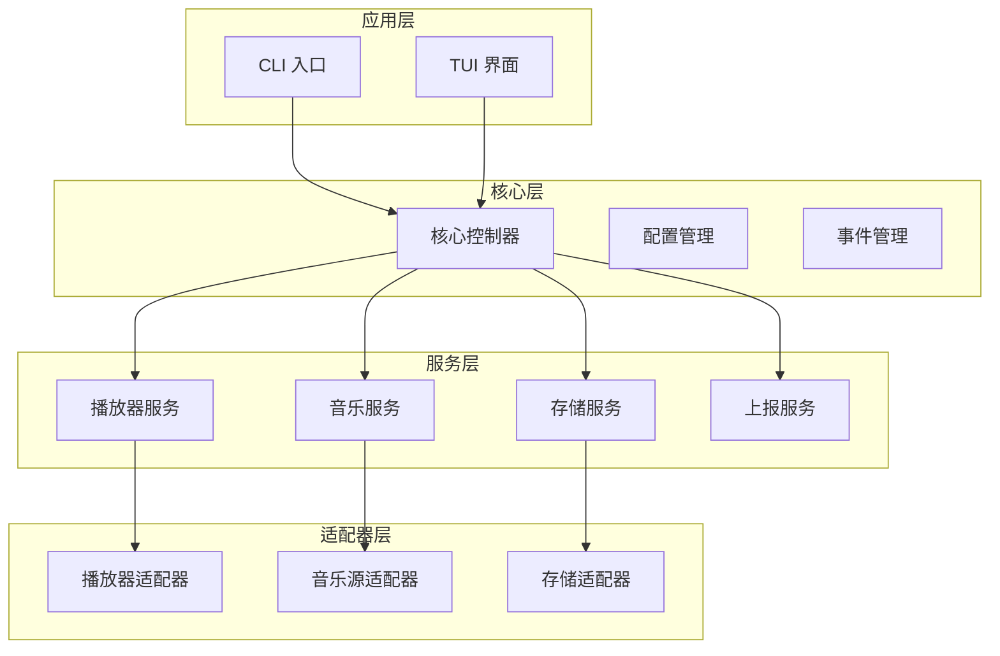
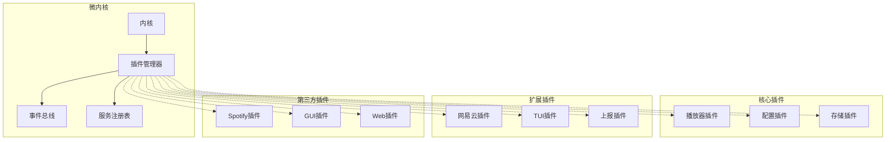
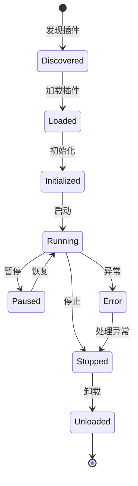
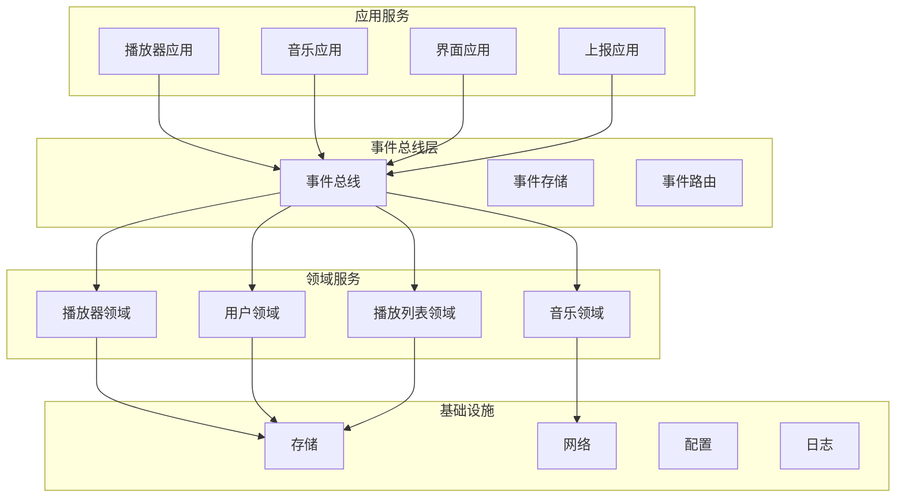
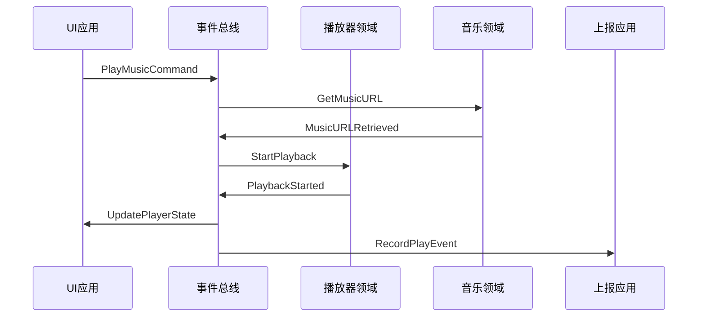

# go-musicfox 系统重构技术设计文档

## 概述

本文档基于 go-musicfox 项目的系统性重构需求，提供三种不同的技术架构方案。重构目标是将现有单体架构转换为模块化、插件化的架构体系，提升系统的可维护性、可扩展性和稳定性。

### 当前架构分析

**现有架构特点：**

* 单体架构，所有功能集中在一个应用中

* 基于 Go 语言，使用 foxful-cli 框架构建 TUI 界面

* 网易云音乐 API 直接集成在核心代码中

* 播放器支持多种引擎（Beep、MPD、MPV、OSX、Windows Media）

* 配置管理、存储、UI 等模块耦合度较高

**重构驱动因素：**

* 需要支持多种 UI 形式（TUI、GUI、Web UI）

* 需要支持多音乐源接入

* 提升代码可维护性和可测试性

* 建立插件生态系统

* 实现模块间松耦合

* 建立完整的插件协议规范

* 实现 HOOK 钩子机制

* 提供全面的风险处理机制

## 技术方案对比

| 方案          | 复杂度 | 扩展性 | 性能 | 开发成本 | 适用场景  |
| ----------- | --- | --- | -- | ---- | ----- |
| 方案一：接口抽象模块化 | 低   | 中   | 高  | 低    | 渐进式重构 |
| 方案二：插件系统微内核 | 中   | 高   | 中  | 中    | 完全重构  |
| 方案三：事件驱动架构  | 高   | 高   | 中  | 高    | 大规模扩展 |

***

# 方案一：基于接口抽象的模块化重构方案

## 架构设计

### 整体架构



### 核心设计原则

1. **接口隔离**：每个模块通过接口定义边界
2. **依赖注入**：通过构造函数注入依赖
3. **分层架构**：应用层、核心层、服务层、适配器层
4. **配置驱动**：通过配置文件控制模块行为

## 组件和接口

### 核心接口定义

```go
// 播放器服务接口
type PlayerService interface {
    Play(music Music) error
    Pause() error
    Resume() error
    Stop() error
    GetState() PlayerState
    SetVolume(volume int) error
    GetProgress() (current, total time.Duration)
    Subscribe(listener PlayerEventListener)
}

// 音乐服务接口
type MusicService interface {
    Search(query string, options SearchOptions) ([]Music, error)
    GetPlaylist(id string) (Playlist, error)
    GetMusicURL(music Music) (string, error)
    GetLyrics(music Music) (Lyrics, error)
}

// 存储服务接口
type StorageService interface {
    Save(key string, data interface{}) error
    Load(key string, data interface{}) error
    Delete(key string) error
    List(prefix string) ([]string, error)
}

// UI 服务接口
type UIService interface {
    Start() error
    Stop() error
    ShowMessage(message string)
    ShowError(error error)
    GetUserInput(prompt string) (string, error)
}
```

### 模块划分

**核心模块：**

* `core/app`: 应用程序核心控制器

* `core/config`: 配置管理

* `core/event`: 事件管理

* `core/registry`: 服务注册表

**服务模块：**

* `services/player`: 播放器服务实现

* `services/music`: 音乐服务实现

* `services/storage`: 存储服务实现

* `services/report`: 上报服务实现

**适配器模块：**

* `adapters/player`: 各种播放器适配器

* `adapters/music`: 各种音乐源适配器

* `adapters/storage`: 各种存储适配器

* `adapters/ui`: 各种 UI 适配器

## 数据模型

### 核心数据结构

```go
type Music struct {
    ID       string            `json:"id"`
    Title    string            `json:"title"`
    Artist   string            `json:"artist"`
    Album    string            `json:"album"`
    Duration time.Duration     `json:"duration"`
    Source   string            `json:"source"`
    Metadata map[string]string `json:"metadata"`
}

type Playlist struct {
    ID          string  `json:"id"`
    Name        string  `json:"name"`
    Description string  `json:"description"`
    Songs       []Music `json:"songs"`
    Source      string  `json:"source"`
}

type PlayerState struct {
    Status   PlayStatus    `json:"status"`
    Current  *Music        `json:"current"`
    Position time.Duration `json:"position"`
    Volume   int           `json:"volume"`
}
```

## 错误处理

### 错误分类

```go
type ErrorType int

const (
    ErrorTypeNetwork ErrorType = iota
    ErrorTypeAuth
    ErrorTypePlayer
    ErrorTypeStorage
    ErrorTypeConfig
)

type AppError struct {
    Type    ErrorType `json:"type"`
    Code    string    `json:"code"`
    Message string    `json:"message"`
    Cause   error     `json:"cause,omitempty"`
}
```

### 错误处理策略

1. **分层错误处理**：每层处理自己的错误类型
2. **错误包装**：使用 `pkg/errors` 包装错误信息
3. **降级策略**：关键功能失败时提供降级方案
4. **错误上报**：记录错误日志并可选择上报

## 测试策略

### 单元测试规范

```go
// 测试接口定义
type TestSuite interface {
    SetUp() error
    TearDown() error
    RunTests() error
}

// 模块测试基类
type ModuleTestSuite struct {
    module    Module
    mockDeps  map[string]interface{}
    testData  TestDataSet
}

func (s *ModuleTestSuite) SetUp() error {
    // 初始化 Mock 依赖
    s.mockDeps = make(map[string]interface{})
    
    // 创建测试数据
    s.testData = NewTestDataSet()
    
    // 初始化模块
    return s.module.Initialize(s.mockDeps)
}

// 接口 Mock 生成器
type MockGenerator interface {
    GenerateMock(interfaceType reflect.Type) (interface{}, error)
    RegisterMockBehavior(mock interface{}, method string, behavior MockBehavior)
}

// Mock 行为定义
type MockBehavior struct {
    Input    []interface{}
    Output   []interface{}
    Error    error
    CallCount int
    Delay    time.Duration
}

// 测试数据管理
type TestDataManager struct {
    datasets map[string]TestDataSet
    fixtures map[string]interface{}
}

func (m *TestDataManager) LoadTestData(name string) (TestDataSet, error) {
    if dataset, exists := m.datasets[name]; exists {
        return dataset, nil
    }
    
    // 从文件加载测试数据
    data, err := m.loadFromFile(fmt.Sprintf("testdata/%s.json", name))
    if err != nil {
        return nil, fmt.Errorf("failed to load test data %s: %w", name, err)
    }
    
    m.datasets[name] = data
    return data, nil
}
```

### 集成测试框架

```go
// 集成测试套件
type IntegrationTestSuite struct {
    testEnv     *TestEnvironment
    components  []Component
    scenarios   []TestScenario
}

// 测试环境
type TestEnvironment struct {
    core        *Core
    plugins     map[string]Plugin
    config      *TestConfig
    cleanup     []func() error
}

func (env *TestEnvironment) SetUp() error {
    // 创建测试配置
    env.config = NewTestConfig()
    
    // 初始化核心组件
    env.core = NewCore(env.config)
    if err := env.core.Initialize(); err != nil {
        return fmt.Errorf("failed to initialize core: %w", err)
    }
    
    // 加载测试插件
    env.plugins = make(map[string]Plugin)
    for _, pluginPath := range env.config.TestPlugins {
        plugin, err := env.core.LoadPlugin(pluginPath)
        if err != nil {
            return fmt.Errorf("failed to load test plugin %s: %w", pluginPath, err)
        }
        env.plugins[plugin.ID()] = plugin
    }
    
    return nil
}

// 测试场景定义
type TestScenario struct {
    Name        string
    Description string
    Steps       []TestStep
    Assertions  []Assertion
}

type TestStep struct {
    Name     string
    Action   func(*TestEnvironment) error
    Timeout  time.Duration
    Retry    int
}

type Assertion struct {
    Name      string
    Condition func(*TestEnvironment) (bool, error)
    Message   string
}
```

### 性能测试与基准测试

```go
// 性能测试套件
type PerformanceTestSuite struct {
    benchmarks []Benchmark
    profiler   *Profiler
}

// 基准测试定义
type Benchmark struct {
    Name        string
    Setup       func() error
    Teardown    func() error
    TestFunc    func(b *testing.B)
    Metrics     []PerformanceMetric
}

type PerformanceMetric struct {
    Name      string
    Unit      string
    Threshold float64
    Actual    float64
}

// 插件性能测试
func BenchmarkPluginLoad(b *testing.B) {
    pluginManager := NewPluginManager()
    pluginPath := "testdata/test-plugin.so"
    
    b.ResetTimer()
    for i := 0; i < b.N; i++ {
        plugin, err := pluginManager.LoadPlugin(pluginPath)
        if err != nil {
            b.Fatalf("Failed to load plugin: %v", err)
        }
        
        if err := pluginManager.UnloadPlugin(plugin.ID()); err != nil {
            b.Fatalf("Failed to unload plugin: %v", err)
        }
    }
}

// 内存使用测试
func TestMemoryUsage(t *testing.T) {
    var m1, m2 runtime.MemStats
    
    // 获取初始内存状态
    runtime.GC()
    runtime.ReadMemStats(&m1)
    
    // 执行测试操作
    pluginManager := NewPluginManager()
    for i := 0; i < 1000; i++ {
        plugin, _ := pluginManager.LoadPlugin("testdata/test-plugin.so")
        pluginManager.UnloadPlugin(plugin.ID())
    }
    
    // 获取最终内存状态
    runtime.GC()
    runtime.ReadMemStats(&m2)
    
    // 检查内存泄漏
    memoryIncrease := m2.Alloc - m1.Alloc
    if memoryIncrease > 1024*1024 { // 1MB threshold
        t.Errorf("Potential memory leak detected: %d bytes", memoryIncrease)
    }
}
```

### 测试覆盖率要求

```go
// 覆盖率检查器
type CoverageChecker struct {
    threshold    float64
    excludePaths []string
}

func (c *CoverageChecker) CheckCoverage(coverageFile string) error {
    coverage, err := c.parseCoverageFile(coverageFile)
    if err != nil {
        return fmt.Errorf("failed to parse coverage file: %w", err)
    }
    
    // 按模块检查覆盖率
    for module, moduleCoverage := range coverage.Modules {
        if c.isExcluded(module) {
            continue
        }
        
        if moduleCoverage.Percentage < c.threshold {
            return fmt.Errorf("module %s coverage %.2f%% below threshold %.2f%%", 
                module, moduleCoverage.Percentage, c.threshold)
        }
    }
    
    // 检查整体覆盖率
    if coverage.Overall.Percentage < c.threshold {
        return fmt.Errorf("overall coverage %.2f%% below threshold %.2f%%", 
            coverage.Overall.Percentage, c.threshold)
    }
    
    return nil
}
```

### 测试自动化

```yaml
# .github/workflows/test.yml
name: Test Suite

on:
  push:
    branches: [ main, develop ]
  pull_request:
    branches: [ main ]

jobs:
  unit-tests:
    runs-on: ubuntu-latest
    steps:
      - uses: actions/checkout@v3
      - uses: actions/setup-go@v3
        with:
          go-version: '1.21'
      
      - name: Run Unit Tests
        run: |
          go test -v -race -coverprofile=coverage.out ./...
          go tool cover -html=coverage.out -o coverage.html
      
      - name: Check Coverage
        run: |
          go tool cover -func=coverage.out | grep total | awk '{print $3}' | sed 's/%//' > coverage.txt
          COVERAGE=$(cat coverage.txt)
          if (( $(echo "$COVERAGE < 80" | bc -l) )); then
            echo "Coverage $COVERAGE% is below 80% threshold"
            exit 1
          fi
      
      - name: Upload Coverage
        uses: codecov/codecov-action@v3
        with:
          file: ./coverage.out

  integration-tests:
    runs-on: ubuntu-latest
    needs: unit-tests
    steps:
      - uses: actions/checkout@v3
      - uses: actions/setup-go@v3
        with:
          go-version: '1.21'
      
      - name: Run Integration Tests
        run: |
          go test -v -tags=integration ./tests/integration/...
      
      - name: Run Performance Tests
        run: |
          go test -v -bench=. -benchmem ./tests/performance/...
```

***

# 方案二：基于插件系统的微内核架构方案

## 架构设计

### 微内核架构



### 插件生命周期



## 组件和接口

### 插件接口规范

```go
// 插件基础接口
type Plugin interface {
    // 插件元信息
    Name() string
    Version() string
    Description() string
    Dependencies() []string
    
    // 生命周期方法
    Initialize(ctx PluginContext) error
    Start() error
    Stop() error
    Cleanup() error
    
    // 健康检查
    HealthCheck() error
}

// 插件上下文
type PluginContext interface {
    GetConfig() Config
    GetEventBus() EventBus
    GetRegistry() ServiceRegistry
    GetLogger() Logger
}

// 音乐源插件接口
type MusicSourcePlugin interface {
    Plugin
    Search(query string) ([]Music, error)
    GetPlaylist(id string) (Playlist, error)
    GetMusicURL(music Music) (string, error)
    GetLyrics(music Music) (Lyrics, error)
}

// UI 插件接口
type UIPlugin interface {
    Plugin
    Render(state AppState) error
    HandleInput(input InputEvent) error
    ShowNotification(message string) error
}

// 播放器插件接口
type PlayerPlugin interface {
    Plugin
    Play(url string) error
    Pause() error
    Resume() error
    Stop() error
    SetVolume(volume int) error
    GetState() PlayerState
}
```

### Hook 机制

```go
// Hook 类型定义
type HookType string

const (
    // 播放相关 Hook
    HookBeforePlay  HookType = "before_play"
    HookAfterPlay   HookType = "after_play"
    HookBeforeStop  HookType = "before_stop"
    HookAfterStop   HookType = "after_stop"
    HookBeforePause HookType = "before_pause"
    HookAfterPause  HookType = "after_pause"
    
    // 系统相关 Hook
    HookOnStartup   HookType = "on_startup"
    HookOnShutdown  HookType = "on_shutdown"
    HookOnError     HookType = "on_error"
    HookOnConfig    HookType = "on_config"
    
    // 数据相关 Hook
    HookBeforeSave  HookType = "before_save"
    HookAfterSave   HookType = "after_save"
    HookBeforeLoad  HookType = "before_load"
    HookAfterLoad   HookType = "after_load"
    
    // UI 相关 Hook
    HookOnUISwitch  HookType = "on_ui_switch"
    HookOnUserInput HookType = "on_user_input"
)

// Hook 上下文
type HookContext interface {
    GetData() map[string]interface{}
    SetData(key string, value interface{})
    GetPlugin() Plugin
    GetLogger() Logger
    Cancel() // 取消后续 Hook 执行
    IsCancelled() bool
}

// Hook 处理器
type HookHandler interface {
    Handle(ctx HookContext) error
    Priority() int
    Name() string
}

// Hook 管理器
type HookManager interface {
    RegisterHook(hookType HookType, handler HookHandler) error
    UnregisterHook(hookType HookType, handlerName string) error
    TriggerHook(hookType HookType, data map[string]interface{}) error
    ListHooks(hookType HookType) []HookHandler
    
    // 批量操作
    RegisterHooks(hooks map[HookType][]HookHandler) error
    UnregisterAllHooks(pluginName string) error
}

// Hook 执行策略
type HookExecutionStrategy interface {
    Execute(hooks []HookHandler, ctx HookContext) error
}

// 串行执行策略
type SerialExecutionStrategy struct {
    timeout time.Duration
}

func (s *SerialExecutionStrategy) Execute(hooks []HookHandler, ctx HookContext) error {
    for _, hook := range hooks {
        if ctx.IsCancelled() {
            break
        }
        
        if err := s.executeWithTimeout(hook, ctx); err != nil {
            return fmt.Errorf("hook %s failed: %w", hook.Name(), err)
        }
    }
    return nil
}

// 并行执行策略
type ParallelExecutionStrategy struct {
    timeout time.Duration
    maxConcurrency int
}

func (p *ParallelExecutionStrategy) Execute(hooks []HookHandler, ctx HookContext) error {
    sem := make(chan struct{}, p.maxConcurrency)
    errChan := make(chan error, len(hooks))
    
    for _, hook := range hooks {
        go func(h HookHandler) {
            sem <- struct{}{}
            defer func() { <-sem }()
            
            if err := p.executeWithTimeout(h, ctx); err != nil {
                errChan <- fmt.Errorf("hook %s failed: %w", h.Name(), err)
            } else {
                errChan <- nil
            }
        }(hook)
    }
    
    var errors []error
    for i := 0; i < len(hooks); i++ {
        if err := <-errChan; err != nil {
            errors = append(errors, err)
        }
    }
    
    if len(errors) > 0 {
        return fmt.Errorf("multiple hook failures: %v", errors)
    }
    return nil
}
```

### 插件发现和加载

```go
// 插件发现器
type PluginDiscoverer interface {
    Discover() ([]PluginInfo, error)
}

// 插件加载器
type PluginLoader interface {
    Load(info PluginInfo) (Plugin, error)
    Unload(plugin Plugin) error
}

// 插件管理器
type PluginManager interface {
    LoadPlugin(path string) error
    UnloadPlugin(name string) error
    GetPlugin(name string) Plugin
    ListPlugins() []Plugin
    EnablePlugin(name string) error
    DisablePlugin(name string) error
}
```

## 数据模型

### 插件元数据

```go
type PluginInfo struct {
    Name         string            `json:"name"`
    Version      string            `json:"version"`
    Description  string            `json:"description"`
    Author       string            `json:"author"`
    License      string            `json:"license"`
    Homepage     string            `json:"homepage"`
    Dependencies []Dependency      `json:"dependencies"`
    Capabilities []string          `json:"capabilities"`
    Config       map[string]string `json:"config"`
    Path         string            `json:"path"`
    Enabled      bool              `json:"enabled"`
}

type Dependency struct {
    Name    string `json:"name"`
    Version string `json:"version"`
    Type    string `json:"type"` // plugin, system, library
}
```

## 插件协议规范

### 插件标准接口

```go
// 插件协议版本
const PluginProtocolVersion = "1.0.0"

// 插件类型
type PluginType string

const (
    PluginTypeCore        PluginType = "core"        // 核心插件
    PluginTypeMusicSource PluginType = "music_source" // 音乐源插件
    PluginTypeUI          PluginType = "ui"           // UI插件
    PluginTypePlayer      PluginType = "player"       // 播放器插件
    PluginTypeStorage     PluginType = "storage"      // 存储插件
    PluginTypeReport      PluginType = "report"       // 上报插件
    PluginTypeExtension   PluginType = "extension"    // 扩展插件
)

// 插件状态
type PluginStatus string

const (
    PluginStatusUnknown     PluginStatus = "unknown"
    PluginStatusDiscovered  PluginStatus = "discovered"
    PluginStatusLoaded      PluginStatus = "loaded"
    PluginStatusInitialized PluginStatus = "initialized"
    PluginStatusRunning     PluginStatus = "running"
    PluginStatusPaused      PluginStatus = "paused"
    PluginStatusStopped     PluginStatus = "stopped"
    PluginStatusError       PluginStatus = "error"
)

// 插件能力定义
type PluginCapability string

const (
    // 音乐源能力
    CapabilitySearch    PluginCapability = "search"
    CapabilityPlaylist  PluginCapability = "playlist"
    CapabilityLyrics    PluginCapability = "lyrics"
    CapabilityDownload  PluginCapability = "download"
    
    // UI 能力
    CapabilityRender    PluginCapability = "render"
    CapabilityInput     PluginCapability = "input"
    CapabilityTheme     PluginCapability = "theme"
    
    // 播放器能力
    CapabilityPlayback  PluginCapability = "playback"
    CapabilityVolume    PluginCapability = "volume"
    CapabilityEqualizer PluginCapability = "equalizer"
    
    // 存储能力
    CapabilityPersist   PluginCapability = "persist"
    CapabilityCache     PluginCapability = "cache"
    CapabilitySync      PluginCapability = "sync"
)
```

### 插件配置规范

```yaml
# plugin.yaml - 插件配置文件标准格式
protocol_version: "1.0.0"  # 插件协议版本
name: netease-music         # 插件名称（唯一标识）
version: 1.2.3             # 插件版本（语义化版本）
type: music_source         # 插件类型
description: 网易云音乐数据源插件
author: go-musicfox
email: contact@go-musicfox.com
license: MIT
homepage: https://github.com/go-musicfox/go-musicfox
repository: https://github.com/go-musicfox/plugins/netease-music

# 依赖关系
dependencies:
  - name: core
    version: ">=1.0.0,<2.0.0"  # 版本范围
    type: plugin
    required: true
  - name: storage
    version: "^1.2.0"          # 兼容版本
    type: plugin
    required: false
  - name: go
    version: ">=1.21.0"
    type: runtime
    required: true

# 插件能力
capabilities:
  - search
  - playlist
  - lyrics
  - download

# 配置选项
config:
  api_base_url:
    type: string
    default: "https://music.163.com"
    description: "网易云音乐API基础URL"
    required: true
  timeout:
    type: duration
    default: "30s"
    description: "请求超时时间"
    required: false
  retry_count:
    type: int
    default: 3
    min: 1
    max: 10
    description: "重试次数"
    required: false
  enable_cache:
    type: bool
    default: true
    description: "是否启用缓存"
    required: false

# 资源需求
resources:
  memory_limit: "100MB"      # 内存限制
  cpu_limit: "0.5"           # CPU限制
  network_required: true     # 是否需要网络
  storage_required: false    # 是否需要存储

# 权限要求
permissions:
  - network.http             # HTTP网络访问
  - storage.read             # 存储读取
  - storage.write            # 存储写入
  - system.notification      # 系统通知

# Hook 注册
hooks:
  - type: before_play
    handler: onBeforePlay
    priority: 100
  - type: after_play
    handler: onAfterPlay
    priority: 50

# 健康检查
health_check:
  endpoint: "/health"
  interval: "30s"
  timeout: "5s"
  retries: 3

# 插件元数据
metadata:
  tags:
    - music
    - netease
    - streaming
  category: music_source
  maturity: stable           # alpha, beta, stable
  support_level: official    # official, community, experimental
```

### 版本兼容性检查

```go
// 版本兼容性检查器
type VersionChecker interface {
    IsCompatible(required, actual string) (bool, error)
    GetLatestCompatible(constraint string, versions []string) (string, error)
}

// 语义化版本检查器
type SemanticVersionChecker struct{}

func (c *SemanticVersionChecker) IsCompatible(constraint, version string) (bool, error) {
    // 支持的约束格式：
    // ">=1.0.0"        - 大于等于
    // "^1.2.0"         - 兼容版本（主版本相同）
    // "~1.2.3"         - 近似版本（主次版本相同）
    // ">=1.0.0,<2.0.0" - 版本范围
    
    constraints := strings.Split(constraint, ",")
    for _, c := range constraints {
        if !c.checkSingleConstraint(strings.TrimSpace(c), version) {
            return false, nil
        }
    }
    return true, nil
}

// 插件兼容性验证器
type PluginCompatibilityValidator struct {
    versionChecker VersionChecker
    systemInfo     SystemInfo
}

func (v *PluginCompatibilityValidator) ValidatePlugin(info PluginInfo) error {
    // 检查协议版本
    if info.ProtocolVersion != PluginProtocolVersion {
        return fmt.Errorf("unsupported protocol version: %s", info.ProtocolVersion)
    }
    
    // 检查依赖关系
    for _, dep := range info.Dependencies {
        if err := v.validateDependency(dep); err != nil {
            return fmt.Errorf("dependency validation failed: %w", err)
        }
    }
    
    // 检查系统要求
    if err := v.validateSystemRequirements(info); err != nil {
        return fmt.Errorf("system requirements not met: %w", err)
    }
    
    // 检查权限
    if err := v.validatePermissions(info.Permissions); err != nil {
        return fmt.Errorf("permission validation failed: %w", err)
    }
    
    return nil
}
```

## 插件风险处理机制

### 沙箱隔离

```go
// 插件沙箱接口
type PluginSandbox interface {
    CreateSandbox(pluginID string, config SandboxConfig) (Sandbox, error)
    DestroySandbox(sandboxID string) error
    ListSandboxes() []SandboxInfo
}

// 沙箱配置
type SandboxConfig struct {
    // 资源限制
    MemoryLimit    int64         // 内存限制（字节）
    CPULimit       float64       // CPU限制（核心数）
    NetworkEnabled bool          // 是否允许网络访问
    FileSystemAccess []string    // 允许访问的文件系统路径
    
    // 时间限制
    ExecutionTimeout time.Duration // 执行超时
    IdleTimeout      time.Duration // 空闲超时
    
    // 权限控制
    AllowedAPIs      []string      // 允许调用的API
    DeniedAPIs       []string      // 禁止调用的API
    
    // 监控配置
    EnableMonitoring bool          // 是否启用监控
    LogLevel         LogLevel      // 日志级别
}

// 沙箱实现
type ProcessSandbox struct {
    pluginID    string
    process     *os.Process
    config      SandboxConfig
    monitor     *ResourceMonitor
    logger      Logger
}

func (s *ProcessSandbox) Start() error {
    // 启动插件进程
    cmd := exec.Command(s.getPluginExecutable())
    
    // 设置资源限制
    if err := s.setResourceLimits(cmd); err != nil {
        return fmt.Errorf("failed to set resource limits: %w", err)
    }
    
    // 设置网络隔离
    if !s.config.NetworkEnabled {
        if err := s.disableNetwork(cmd); err != nil {
            return fmt.Errorf("failed to disable network: %w", err)
        }
    }
    
    // 启动进程
    if err := cmd.Start(); err != nil {
        return fmt.Errorf("failed to start plugin process: %w", err)
    }
    
    s.process = cmd.Process
    
    // 启动监控
    if s.config.EnableMonitoring {
        s.monitor = NewResourceMonitor(s.process.Pid, s.config)
        go s.monitor.Start()
    }
    
    return nil
}

func (s *ProcessSandbox) Stop() error {
    if s.monitor != nil {
        s.monitor.Stop()
    }
    
    if s.process != nil {
        return s.process.Kill()
    }
    
    return nil
}
```

### 资源监控与限制

```go
// 资源监控器
type ResourceMonitor struct {
    pid           int
    config        SandboxConfig
    metrics       *ResourceMetrics
    alertManager  AlertManager
    ticker        *time.Ticker
    stopChan      chan struct{}
}

// 资源指标
type ResourceMetrics struct {
    MemoryUsage    int64     // 当前内存使用量
    CPUUsage       float64   // 当前CPU使用率
    NetworkIO      NetworkIO // 网络IO统计
    FileSystemIO   FileIO    // 文件系统IO统计
    LastUpdate     time.Time // 最后更新时间
}

func (m *ResourceMonitor) Start() {
    m.ticker = time.NewTicker(time.Second)
    m.stopChan = make(chan struct{})
    
    go func() {
        for {
            select {
            case <-m.ticker.C:
                if err := m.collectMetrics(); err != nil {
                    m.alertManager.SendAlert(AlertTypeMonitoringError, err.Error())
                    continue
                }
                
                if err := m.checkLimits(); err != nil {
                    m.alertManager.SendAlert(AlertTypeResourceLimit, err.Error())
                    m.handleLimitViolation(err)
                }
                
            case <-m.stopChan:
                m.ticker.Stop()
                return
            }
        }
    }()
}

func (m *ResourceMonitor) checkLimits() error {
    // 检查内存限制
    if m.config.MemoryLimit > 0 && m.metrics.MemoryUsage > m.config.MemoryLimit {
        return fmt.Errorf("memory usage %d exceeds limit %d", 
            m.metrics.MemoryUsage, m.config.MemoryLimit)
    }
    
    // 检查CPU限制
    if m.config.CPULimit > 0 && m.metrics.CPUUsage > m.config.CPULimit {
        return fmt.Errorf("CPU usage %.2f exceeds limit %.2f", 
            m.metrics.CPUUsage, m.config.CPULimit)
    }
    
    return nil
}

func (m *ResourceMonitor) handleLimitViolation(err error) {
    // 记录违规行为
    m.logViolation(err)
    
    // 根据配置采取行动
    switch m.config.ViolationAction {
    case ActionWarn:
        // 仅警告，不采取行动
    case ActionThrottle:
        // 限制资源使用
        m.throttleResource()
    case ActionTerminate:
        // 终止插件
        m.terminatePlugin()
    }
}
```

### 权限控制系统

```go
// 权限管理器
type PermissionManager interface {
    CheckPermission(pluginID string, permission Permission) error
    GrantPermission(pluginID string, permission Permission) error
    RevokePermission(pluginID string, permission Permission) error
    ListPermissions(pluginID string) []Permission
}

// 权限定义
type Permission struct {
    Type     PermissionType `json:"type"`
    Resource string         `json:"resource"`
    Action   string         `json:"action"`
    Scope    string         `json:"scope,omitempty"`
}

type PermissionType string

const (
    PermissionTypeAPI       PermissionType = "api"
    PermissionTypeFile      PermissionType = "file"
    PermissionTypeNetwork   PermissionType = "network"
    PermissionTypeSystem    PermissionType = "system"
    PermissionTypeDatabase  PermissionType = "database"
)

// API访问控制拦截器
type APIAccessInterceptor struct {
    permissionManager PermissionManager
    logger           Logger
}

func (i *APIAccessInterceptor) Intercept(ctx context.Context, req APIRequest) error {
    pluginID := ctx.Value("plugin_id").(string)
    
    permission := Permission{
        Type:     PermissionTypeAPI,
        Resource: req.Endpoint,
        Action:   req.Method,
    }
    
    if err := i.permissionManager.CheckPermission(pluginID, permission); err != nil {
        i.logger.Warn("API access denied", 
            "plugin_id", pluginID,
            "endpoint", req.Endpoint,
            "method", req.Method,
            "error", err)
        return fmt.Errorf("access denied: %w", err)
    }
    
    return nil
}
```

### 异常处理与恢复

```go
// 插件异常处理器
type PluginExceptionHandler struct {
    pluginManager PluginManager
    logger        Logger
    alertManager  AlertManager
    recovery      RecoveryStrategy
}

// 恢复策略
type RecoveryStrategy interface {
    ShouldRecover(pluginID string, err error) bool
    Recover(pluginID string) error
    GetMaxRetries() int
    GetRetryInterval() time.Duration
}

// 自动恢复策略
type AutoRecoveryStrategy struct {
    maxRetries    int
    retryInterval time.Duration
    retryCount    map[string]int
    mutex         sync.RWMutex
}

func (s *AutoRecoveryStrategy) ShouldRecover(pluginID string, err error) bool {
    s.mutex.RLock()
    count := s.retryCount[pluginID]
    s.mutex.RUnlock()
    
    // 检查是否超过最大重试次数
    if count >= s.maxRetries {
        return false
    }
    
    // 检查错误类型是否可恢复
    return s.isRecoverableError(err)
}

func (s *AutoRecoveryStrategy) Recover(pluginID string) error {
    s.mutex.Lock()
    s.retryCount[pluginID]++
    s.mutex.Unlock()
    
    // 等待重试间隔
    time.Sleep(s.retryInterval)
    
    // 重启插件
    return s.restartPlugin(pluginID)
}

// 异常处理流程
func (h *PluginExceptionHandler) HandleException(pluginID string, err error) {
    h.logger.Error("Plugin exception occurred", 
        "plugin_id", pluginID,
        "error", err)
    
    // 发送告警
    h.alertManager.SendAlert(AlertTypePluginException, 
        fmt.Sprintf("Plugin %s encountered exception: %v", pluginID, err))
    
    // 尝试恢复
    if h.recovery.ShouldRecover(pluginID, err) {
        h.logger.Info("Attempting to recover plugin", "plugin_id", pluginID)
        
        if recoverErr := h.recovery.Recover(pluginID); recoverErr != nil {
            h.logger.Error("Failed to recover plugin", 
                "plugin_id", pluginID,
                "error", recoverErr)
            
            // 恢复失败，禁用插件
            h.pluginManager.DisablePlugin(pluginID)
        } else {
            h.logger.Info("Plugin recovered successfully", "plugin_id", pluginID)
        }
    } else {
        h.logger.Warn("Plugin recovery not attempted", "plugin_id", pluginID)
        h.pluginManager.DisablePlugin(pluginID)
    }
}
```

### 安全扫描与验证

```go
// 插件安全扫描器
type PluginSecurityScanner interface {
    ScanPlugin(pluginPath string) (*SecurityReport, error)
    ValidateSignature(pluginPath string, signature []byte) error
    CheckMalware(pluginPath string) error
}

// 安全报告
type SecurityReport struct {
    PluginPath    string            `json:"plugin_path"`
    ScanTime      time.Time         `json:"scan_time"`
    RiskLevel     RiskLevel         `json:"risk_level"`
    Vulnerabilities []Vulnerability `json:"vulnerabilities"`
    Recommendations []string        `json:"recommendations"`
}

type RiskLevel string

const (
    RiskLevelLow      RiskLevel = "low"
    RiskLevelMedium   RiskLevel = "medium"
    RiskLevelHigh     RiskLevel = "high"
    RiskLevelCritical RiskLevel = "critical"
)

type Vulnerability struct {
    ID          string    `json:"id"`
    Type        string    `json:"type"`
    Severity    string    `json:"severity"`
    Description string    `json:"description"`
    Location    string    `json:"location"`
    Suggestion  string    `json:"suggestion"`
}

// 静态代码分析扫描器
type StaticCodeScanner struct {
    rules   []SecurityRule
    logger  Logger
}

func (s *StaticCodeScanner) ScanPlugin(pluginPath string) (*SecurityReport, error) {
    report := &SecurityReport{
        PluginPath: pluginPath,
        ScanTime:   time.Now(),
        RiskLevel:  RiskLevelLow,
    }
    
    // 读取插件源码
    sourceFiles, err := s.getSourceFiles(pluginPath)
    if err != nil {
        return nil, fmt.Errorf("failed to read source files: %w", err)
    }
    
    // 应用安全规则
    for _, file := range sourceFiles {
        for _, rule := range s.rules {
            if violations := rule.Check(file); len(violations) > 0 {
                for _, violation := range violations {
                    vulnerability := Vulnerability{
                        ID:          rule.ID(),
                        Type:        rule.Type(),
                        Severity:    rule.Severity(),
                        Description: violation.Description,
                        Location:    violation.Location,
                        Suggestion:  rule.Suggestion(),
                    }
                    report.Vulnerabilities = append(report.Vulnerabilities, vulnerability)
                }
            }
        }
    }
    
    // 计算风险级别
    report.RiskLevel = s.calculateRiskLevel(report.Vulnerabilities)
    
    return report, nil
}
```

## 错误处理

### 插件异常隔离

```go
// 插件执行器
type PluginExecutor struct {
    plugin  Plugin
    timeout time.Duration
    retry   int
}

func (e *PluginExecutor) Execute(fn func() error) error {
    // 超时控制
    ctx, cancel := context.WithTimeout(context.Background(), e.timeout)
    defer cancel()
    
    // 异常恢复
    defer func() {
        if r := recover(); r != nil {
            log.Errorf("Plugin %s panicked: %v", e.plugin.Name(), r)
        }
    }()
    
    // 重试机制
    for i := 0; i < e.retry; i++ {
        select {
        case <-ctx.Done():
            return ctx.Err()
        default:
            if err := fn(); err == nil {
                return nil
            }
        }
    }
    
    return errors.New("plugin execution failed")
}
```

### 降级策略

1. **插件失败降级**：主插件失败时自动切换到备用插件
2. **功能降级**：非核心功能失败时禁用该功能
3. **安全模式**：所有插件失败时启动最小功能集

## 测试策略

### 插件测试框架

```go
// 插件测试基础
type PluginTestSuite struct {
    suite.Suite
    plugin Plugin
    ctx    PluginContext
}

func (s *PluginTestSuite) SetupTest() {
    s.ctx = NewMockPluginContext()
    s.plugin = NewTestPlugin()
    s.NoError(s.plugin.Initialize(s.ctx))
}

func (s *PluginTestSuite) TearDownTest() {
    s.NoError(s.plugin.Cleanup())
}

func (s *PluginTestSuite) TestPluginLifecycle() {
    // 测试插件生命周期
    s.NoError(s.plugin.Start())
    s.NoError(s.plugin.HealthCheck())
    s.NoError(s.plugin.Stop())
}
```

### 集成测试

* **插件兼容性测试**：测试插件间的兼容性

* **性能测试**：测试插件加载和执行性能

* **稳定性测试**：长时间运行测试

***

# 方案三：基于事件驱动的松耦合架构方案

## 架构设计

### 事件驱动架构



### 事件流设计



## 组件和接口

### 事件定义

```go
// 事件基础接口
type Event interface {
    ID() string
    Type() string
    Timestamp() time.Time
    Source() string
    Data() interface{}
}

// 命令事件
type Command interface {
    Event
    Execute() error
}

// 领域事件
type DomainEvent interface {
    Event
    AggregateID() string
    Version() int
}

// 具体事件定义
type PlayMusicCommand struct {
    BaseEvent
    MusicID string `json:"music_id"`
    UserID  string `json:"user_id"`
}

type MusicPlayedEvent struct {
    BaseEvent
    MusicID   string        `json:"music_id"`
    UserID    string        `json:"user_id"`
    Duration  time.Duration `json:"duration"`
    Timestamp time.Time     `json:"timestamp"`
}

type PlayerStateChangedEvent struct {
    BaseEvent
    OldState PlayerState `json:"old_state"`
    NewState PlayerState `json:"new_state"`
}
```

### 事件总线

```go
// 事件总线接口
type EventBus interface {
    // 发布事件
    Publish(event Event) error
    PublishAsync(event Event) error
    
    // 订阅事件
    Subscribe(eventType string, handler EventHandler) error
    Unsubscribe(eventType string, handler EventHandler) error
    
    // 事件路由
    Route(event Event) error
    
    // 事件存储
    Store(event Event) error
    Replay(from time.Time) error
}

// 事件处理器
type EventHandler interface {
    Handle(event Event) error
    CanHandle(eventType string) bool
    Priority() int
}

// 事件处理器注册
type EventHandlerRegistry interface {
    Register(eventType string, handler EventHandler) error
    Unregister(eventType string, handler EventHandler) error
    GetHandlers(eventType string) []EventHandler
}
```

### 领域服务

```go
// 播放器领域服务
type PlayerDomainService struct {
    eventBus EventBus
    players  map[string]Player
    state    PlayerState
}

func (s *PlayerDomainService) Handle(event Event) error {
    switch e := event.(type) {
    case *PlayMusicCommand:
        return s.handlePlayMusic(e)
    case *PauseMusicCommand:
        return s.handlePauseMusic(e)
    case *StopMusicCommand:
        return s.handleStopMusic(e)
    }
    return nil
}

func (s *PlayerDomainService) handlePlayMusic(cmd *PlayMusicCommand) error {
    // 获取音乐URL
    urlEvent := &GetMusicURLCommand{
        MusicID: cmd.MusicID,
    }
    
    if err := s.eventBus.Publish(urlEvent); err != nil {
        return err
    }
    
    // 等待URL获取完成...
    // 开始播放
    // 发布播放开始事件
    
    return nil
}
```

### CQRS 模式

```go
// 命令处理器
type CommandHandler interface {
    Handle(cmd Command) error
}

// 查询处理器
type QueryHandler interface {
    Handle(query Query) (interface{}, error)
}

// 命令总线
type CommandBus interface {
    Execute(cmd Command) error
    Register(cmdType string, handler CommandHandler)
}

// 查询总线
type QueryBus interface {
    Query(query Query) (interface{}, error)
    Register(queryType string, handler QueryHandler)
}
```

## 数据模型

### 事件存储模型

```go
type EventStore interface {
    Save(events []Event) error
    Load(aggregateID string, fromVersion int) ([]Event, error)
    LoadByType(eventType string, from, to time.Time) ([]Event, error)
    Subscribe(eventType string, handler func(Event)) error
}

type StoredEvent struct {
    ID          string    `json:"id"`
    Type        string    `json:"type"`
    AggregateID string    `json:"aggregate_id"`
    Version     int       `json:"version"`
    Data        []byte    `json:"data"`
    Metadata    []byte    `json:"metadata"`
    Timestamp   time.Time `json:"timestamp"`
}
```

### 聚合根

```go
// 聚合根基础
type AggregateRoot struct {
    id       string
    version  int
    events   []DomainEvent
    snapshot interface{}
}

func (a *AggregateRoot) ApplyEvent(event DomainEvent) {
    a.events = append(a.events, event)
    a.version++
}

func (a *AggregateRoot) GetUncommittedEvents() []DomainEvent {
    return a.events
}

func (a *AggregateRoot) ClearEvents() {
    a.events = nil
}

// 播放器聚合
type PlayerAggregate struct {
    AggregateRoot
    state    PlayerState
    playlist []Music
    current  *Music
}

func (p *PlayerAggregate) Play(music Music) error {
    if p.state.Status == Playing {
        return errors.New("already playing")
    }
    
    event := &MusicPlayStartedEvent{
        AggregateID: p.id,
        MusicID:     music.ID,
        Timestamp:   time.Now(),
    }
    
    p.ApplyEvent(event)
    p.apply(event)
    
    return nil
}

func (p *PlayerAggregate) apply(event DomainEvent) {
    switch e := event.(type) {
    case *MusicPlayStartedEvent:
        p.state.Status = Playing
        p.current = &Music{ID: e.MusicID}
    }
}
```

## 错误处理

### 事件处理错误

```go
// 错误处理策略
type ErrorHandlingStrategy interface {
    Handle(event Event, err error) error
}

// 重试策略
type RetryStrategy struct {
    maxRetries int
    backoff    time.Duration
}

func (s *RetryStrategy) Handle(event Event, err error) error {
    for i := 0; i < s.maxRetries; i++ {
        time.Sleep(s.backoff * time.Duration(i+1))
        if err := event.Execute(); err == nil {
            return nil
        }
    }
    return err
}

// 死信队列
type DeadLetterQueue interface {
    Send(event Event, reason string) error
    Receive() (Event, error)
    Retry(eventID string) error
}
```

### 补偿机制

```go
// 补偿事件
type CompensationEvent interface {
    Event
    Compensate() error
}

// Saga 模式
type Saga interface {
    Start(event Event) error
    Handle(event Event) error
    Compensate(event Event) error
}

type PlayMusicSaga struct {
    steps []SagaStep
}

type SagaStep struct {
    Action      func() error
    Compensation func() error
}
```

## 测试策略

### 事件测试

```go
// 事件测试工具
type EventTestSuite struct {
    suite.Suite
    eventBus   EventBus
    eventStore EventStore
    handlers   []EventHandler
}

func (s *EventTestSuite) TestEventFlow() {
    // 发布事件
    event := &PlayMusicCommand{
        MusicID: "test-music",
        UserID:  "test-user",
    }
    
    s.NoError(s.eventBus.Publish(event))
    
    // 验证事件处理
    time.Sleep(100 * time.Millisecond)
    
    // 检查事件存储
    events, err := s.eventStore.LoadByType("MusicPlayedEvent", time.Now().Add(-time.Hour), time.Now())
    s.NoError(err)
    s.Len(events, 1)
}

// 事件回放测试
func (s *EventTestSuite) TestEventReplay() {
    // 重放事件
    s.NoError(s.eventBus.Replay(time.Now().Add(-time.Hour)))
    
    // 验证状态重建
    // ...
}
```

### 性能测试

```go
func BenchmarkEventPublish(b *testing.B) {
    eventBus := NewInMemoryEventBus()
    event := &TestEvent{}
    
    b.ResetTimer()
    for i := 0; i < b.N; i++ {
        eventBus.Publish(event)
    }
}

func BenchmarkEventHandling(b *testing.B) {
    eventBus := NewInMemoryEventBus()
    handler := &TestEventHandler{}
    eventBus.Subscribe("TestEvent", handler)
    
    b.ResetTimer()
    for i := 0; i < b.N; i++ {
        event := &TestEvent{ID: fmt.Sprintf("test-%d", i)}
        eventBus.Publish(event)
    }
}
```

***

# 实施建议

## 迁移策略

### 渐进式迁移（推荐方案一）

1. **第一阶段**：接口抽象化

   * 为现有模块定义接口

   * 实现依赖注入

   * 重构配置管理

2. **第二阶段**：模块分离

   * 分离播放器模块

   * 分离音乐源模块

   * 分离存储模块

3. **第三阶段**：UI 插件化

   * 抽象 UI 接口

   * 实现 TUI 插件

   * 预留其他 UI 扩展

### 完全重构（推荐方案二）

1. **设计阶段**：完整的插件系统设计
2. **实现阶段**：核心插件开发
3. **迁移阶段**：逐步迁移现有功能
4. **扩展阶段**：开发新插件

### 大规模重构（推荐方案三）

1. **架构设计**：完整的事件驱动架构
2. **基础设施**：事件总线和存储
3. **领域建模**：重新设计领域模型
4. **应用重写**：基于新架构重写应用

## 风险评估

| 风险    | 方案一 | 方案二 | 方案三 |
| ----- | --- | --- | --- |
| 开发复杂度 | 低   | 中   | 高   |
| 迁移风险  | 低   | 中   | 高   |
| 性能影响  | 低   | 中   | 中   |
| 学习成本  | 低   | 中   | 高   |
| 维护成本  | 低   | 中   | 中   |

## 技术选型建议

### 通用技术栈

* **语言**：Go 1.23+

* **依赖注入**：wire 或 dig

* **配置管理**：viper

* **日志**：slog 或 logrus

* **测试**：testify

* **文档**：godoc

### 方案特定技术

**方案一**：

* **接口定义**：标准 Go interface

* **模块管理**：Go modules

* **配置**：YAML/TOML

**方案二**：

* **插件系统**：Go plugin 或 hashicorp/go-plugin

* **事件总线**：自实现或 EventBus

* **插件发现**：文件系统扫描

**方案三**：

* **事件存储**：EventStore 或 PostgreSQL

* **消息队列**：NATS 或 Redis Streams

* **CQRS**：自实现或 go-cqrs

## 总结

三种方案各有优劣，建议根据项目实际情况选择：

* **追求稳定和渐进**：选择方案一

* **追求扩展性和插件生态**：选择方案二

* **追求最佳架构和长远发展**：选择方案三

无论选择哪种方案，都需要：

1. 完善的测试覆盖
2. 详细的文档说明
3. 渐进式的迁移策略
4. 充分的风险评估
5. 团队的技术储备

