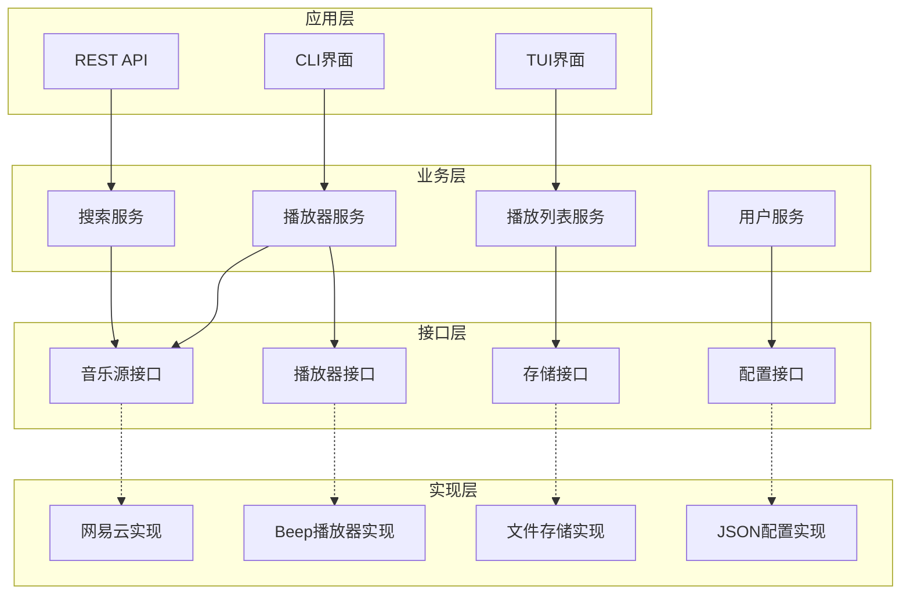
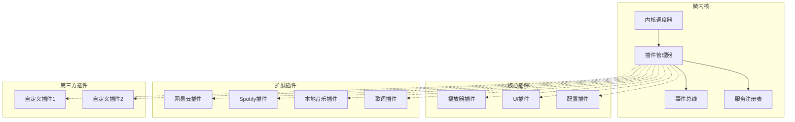
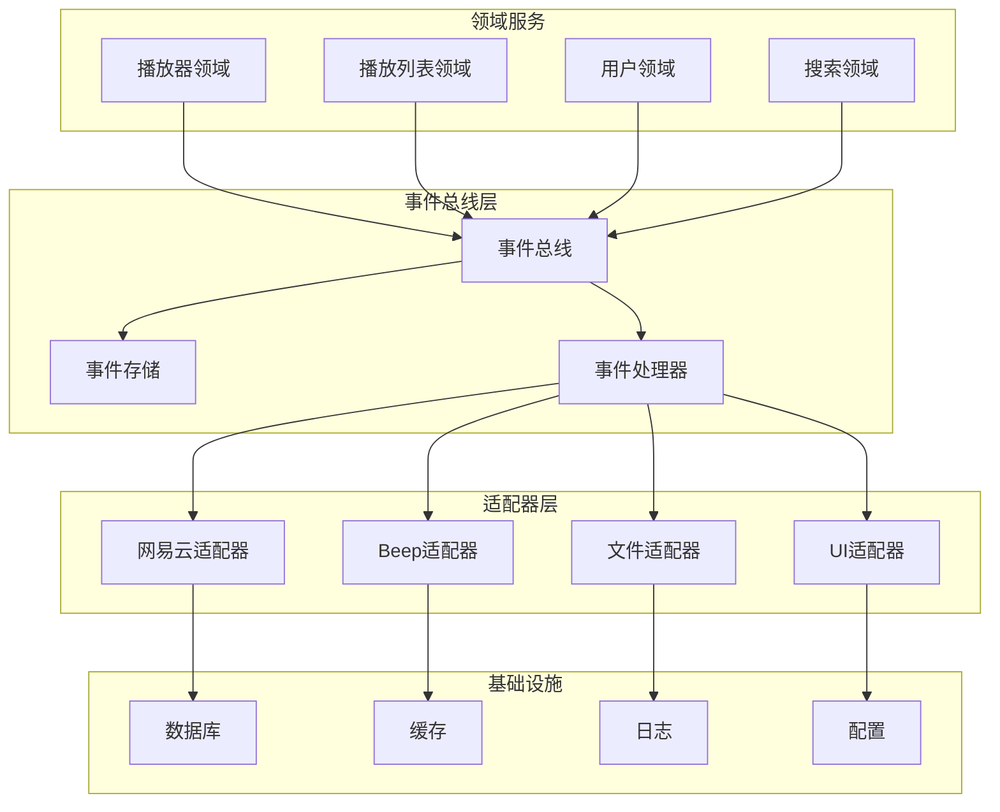

# go-musicfox 系统重构技术方案

## 概述

本文档从原有的系统重构设计文档中抽取出三种核心技术方案，为 go-musicfox 项目的系统性重构提供技术选择。这些方案经过深入分析和对比，每种方案都有其适用场景和优缺点。

## 当前架构分析

### 现有架构问题

1. **模块耦合度高**：各模块间直接依赖，难以独立开发和测试
2. **扩展性不足**：添加新的音乐源或功能需要修改核心代码
3. **配置管理分散**：配置散布在各个模块中，缺乏统一管理
4. **错误处理不统一**：各模块的错误处理方式不一致
5. **测试覆盖率低**：缺乏完善的测试框架和策略
6. **代码复用性差**：相似功能在不同模块中重复实现

### 重构目标

* 降低模块间耦合度，提高内聚性

* 建立标准化的接口和协议

* 实现插件化架构，支持动态扩展

* 统一配置管理和错误处理

* 建立完善的测试体系

* 提高代码复用性和可维护性

## 技术方案对比

| 方案          | 复杂度 | 扩展性 | 性能 | 开发成本 | 维护成本 | 适用场景            |
| ----------- | --- | --- | -- | ---- | ---- | --------------- |
| 方案一：接口抽象模块化 | 低   | 中   | 高  | 低    | 低    | 渐进式重构，团队技术水平一般  |
| 方案二：插件系统微内核 | 高   | 高   | 中  | 高    | 中    | 需要高度扩展性，支持第三方开发 |
| 方案三：事件驱动架构  | 中   | 高   | 中  | 中    | 中    | 大规模系统，需要松耦合     |

## 方案一：基于接口抽象的模块化重构方案

### 架构设计



### 核心组件接口

```go
// 音乐源接口
type MusicSource interface {
    Search(ctx context.Context, keyword string) ([]*Song, error)
    GetPlaylist(ctx context.Context, id string) (*Playlist, error)
    GetSongURL(ctx context.Context, songID string) (string, error)
    Login(ctx context.Context, credentials map[string]string) error
}

// 播放器接口
type Player interface {
    Play(song *Song) error
    Pause() error
    Resume() error
    Stop() error
    SetVolume(volume float64) error
    GetStatus() PlayerStatus
}

// 存储接口
type Storage interface {
    Save(key string, data interface{}) error
    Load(key string, data interface{}) error
    Delete(key string) error
    Exists(key string) bool
}

// 配置接口
type Config interface {
    Get(key string) interface{}
    Set(key string, value interface{}) error
    GetString(key string) string
    GetInt(key string) int
    GetBool(key string) bool
}
```

### 依赖注入容器

```go
type Container struct {
    services map[reflect.Type]interface{}
    mutex    sync.RWMutex
}

func (c *Container) Register(service interface{}) {
    c.mutex.Lock()
    defer c.mutex.Unlock()
    
    serviceType := reflect.TypeOf(service)
    c.services[serviceType] = service
}

func (c *Container) Resolve(serviceType reflect.Type) interface{} {
    c.mutex.RLock()
    defer c.mutex.RUnlock()
    
    return c.services[serviceType]
}
```

### 优势

* 实现简单，学习成本低

* 渐进式重构，风险可控

* 性能开销小

* 易于理解和维护

### 劣势

* 扩展性有限

* 不支持动态加载

* 第三方扩展困难

## 方案二：基于插件系统的微内核架构方案

### 架构设计



### 插件接口规范

```go
// 插件基础接口
type Plugin interface {
    GetInfo() *PluginInfo
    Initialize(ctx PluginContext) error
    Start() error
    Stop() error
    Cleanup() error
}

// 插件信息
type PluginInfo struct {
    Name        string   `json:"name"`
    Version     string   `json:"version"`
    Description string   `json:"description"`
    Author      string   `json:"author"`
    Dependencies []string `json:"dependencies"`
}

// 插件上下文
type PluginContext interface {
    GetEventBus() EventBus
    GetServiceRegistry() ServiceRegistry
    GetConfig() Config
    GetLogger() Logger
}

// 音乐源插件接口
type MusicSourcePlugin interface {
    Plugin
    Search(ctx context.Context, query string) ([]*Song, error)
    GetPlaylist(ctx context.Context, id string) (*Playlist, error)
    GetSongURL(ctx context.Context, songID string) (string, error)
}
```

### 插件管理器

```go
type PluginManager struct {
    plugins map[string]*LoadedPlugin
    loaders map[string]PluginLoader
    eventBus EventBus
    registry ServiceRegistry
    mutex   sync.RWMutex
}

type LoadedPlugin struct {
    Plugin   Plugin
    Info     *PluginInfo
    State    PluginState
    LoadTime time.Time
}

func (pm *PluginManager) LoadPlugin(path string) error {
    // 检测插件类型
    loader := pm.detectPluginType(path)
    if loader == nil {
        return fmt.Errorf("unsupported plugin type")
    }
    
    // 加载插件
    plugin, err := loader.Load(path)
    if err != nil {
        return err
    }
    
    // 初始化插件
    ctx := NewPluginContext(pm.eventBus, pm.registry)
    if err := plugin.Initialize(ctx); err != nil {
        return err
    }
    
    // 注册插件
    pm.registerPlugin(plugin)
    
    return nil
}
```

### 事件总线

```go
type EventBus interface {
    Subscribe(eventType string, handler EventHandler) error
    Unsubscribe(eventType string, handler EventHandler) error
    Publish(eventType string, data interface{}) error
}

type EventHandler func(event *Event) error

type Event struct {
    Type      string      `json:"type"`
    Source    string      `json:"source"`
    Data      interface{} `json:"data"`
    Timestamp time.Time   `json:"timestamp"`
}

type SimpleEventBus struct {
    handlers map[string][]EventHandler
    mutex    sync.RWMutex
}

func (eb *SimpleEventBus) Publish(eventType string, data interface{}) error {
    eb.mutex.RLock()
    handlers := eb.handlers[eventType]
    eb.mutex.RUnlock()
    
    event := &Event{
        Type:      eventType,
        Data:      data,
        Timestamp: time.Now(),
    }
    
    for _, handler := range handlers {
        if err := handler(event); err != nil {
            return err
        }
    }
    
    return nil
}
```

### 优势

* 高度可扩展，支持第三方插件

* 模块间完全解耦

* 支持动态加载和卸载

* 易于测试和维护

### 劣势

* 实现复杂度高

* 性能开销较大

* 学习成本高

## 方案三：基于事件驱动的松耦合架构方案

### 架构设计



### 事件驱动核心组件

```go
// 领域事件
type DomainEvent interface {
    GetEventID() string
    GetEventType() string
    GetAggregateID() string
    GetTimestamp() time.Time
    GetVersion() int
}

// 事件处理器
type EventHandler interface {
    Handle(ctx context.Context, event DomainEvent) error
    GetEventTypes() []string
}

// 事件存储
type EventStore interface {
    SaveEvents(aggregateID string, events []DomainEvent, expectedVersion int) error
    GetEvents(aggregateID string, fromVersion int) ([]DomainEvent, error)
}

// 播放器领域事件
type SongPlayedEvent struct {
    EventID     string    `json:"event_id"`
    SongID      string    `json:"song_id"`
    UserID      string    `json:"user_id"`
    PlayTime    time.Time `json:"play_time"`
    Duration    int       `json:"duration"`
    Timestamp   time.Time `json:"timestamp"`
}

func (e *SongPlayedEvent) GetEventType() string {
    return "song.played"
}

// 事件处理器实现
type PlayHistoryHandler struct {
    storage Storage
}

func (h *PlayHistoryHandler) Handle(ctx context.Context, event DomainEvent) error {
    if playedEvent, ok := event.(*SongPlayedEvent); ok {
        return h.storage.SavePlayHistory(playedEvent)
    }
    return nil
}

func (h *PlayHistoryHandler) GetEventTypes() []string {
    return []string{"song.played"}
}
```

### 聚合根设计

```go
// 聚合根基类
type AggregateRoot struct {
    id       string
    version  int
    events   []DomainEvent
}

func (ar *AggregateRoot) GetUncommittedEvents() []DomainEvent {
    return ar.events
}

func (ar *AggregateRoot) ClearEvents() {
    ar.events = nil
}

func (ar *AggregateRoot) ApplyEvent(event DomainEvent) {
    ar.events = append(ar.events, event)
    ar.version++
}

// 播放器聚合
type Player struct {
    AggregateRoot
    currentSong *Song
    status      PlayerStatus
    volume      float64
}

func (p *Player) Play(song *Song) error {
    if p.status == StatusPlaying {
        return errors.New("already playing")
    }
    
    p.currentSong = song
    p.status = StatusPlaying
    
    event := &SongPlayedEvent{
        EventID:   uuid.New().String(),
        SongID:    song.ID,
        PlayTime:  time.Now(),
        Timestamp: time.Now(),
    }
    
    p.ApplyEvent(event)
    return nil
}
```

### 优势

* 高度解耦，易于扩展

* 支持复杂的业务流程

* 天然支持审计和回放

* 易于实现最终一致性

### 劣势

* 学习曲线陡峭

* 调试复杂

* 事件版本管理困难

## 实施建议

### 选择标准

1. **团队技术水平**

   * 初级团队：选择方案一

   * 中级团队：选择方案三

   * 高级团队：选择方案二

2. **项目规模**

   * 小型项目：方案一

   * 中型项目：方案三

   * 大型项目：方案二

3. **扩展需求**

   * 低扩展需求：方案一

   * 中等扩展需求：方案三

   * 高扩展需求：方案二

4. **性能要求**

   * 高性能要求：方案一

   * 中等性能要求：方案三

   * 可接受性能开销：方案二

### 实施路径

1. **渐进式重构**：从方案一开始，逐步演进到方案二或三
2. **混合方案**：在不同模块中采用不同的架构方案
3. **分阶段实施**：核心功能先用简单方案，扩展功能用复杂方案

### 风险控制

1. **技术风险**：充分的原型验证和技术调研
2. **进度风险**：分阶段实施，设置里程碑
3. **质量风险**：建立完善的测试体系
4. **人员风险**：技术培训和知识分享

## 技术选型建议

### 通用技术栈

* **语言**：Go 1.21+

* **依赖注入**：wire 或 dig

* **配置管理**：viper 或 koanf

* **日志**：logrus 或 zap

* **测试**：testify

* **文档**：godoc

### 方案特定技术

**方案一**：

* 接口设计：Go interface

* 依赖注入：dig

* 配置管理：viper

**方案二**：

* 插件系统：plugin 包或 hashicorp/go-plugin

* 事件总线：自实现或 EventBus

* 服务发现：consul 或自实现

**方案三**：

* 事件存储：EventStore 或 PostgreSQL

* 消息队列：NATS 或 Redis

* CQRS框架：自实现

## 总结

三种技术方案各有优劣，选择时需要综合考虑团队能力、项目需求、时间成本等因素。建议采用渐进式重构的方式，从简单方案开始，根据实际需要逐步演进到更复杂的架构。

无论选择哪种方案，都需要注重以下几点：

1. 建立完善的测试体系
2. 制定详细的实施计划
3. 做好风险评估和控制
4. 保持代码质量和文档完整性
5. 定期回顾和优化架构设计

