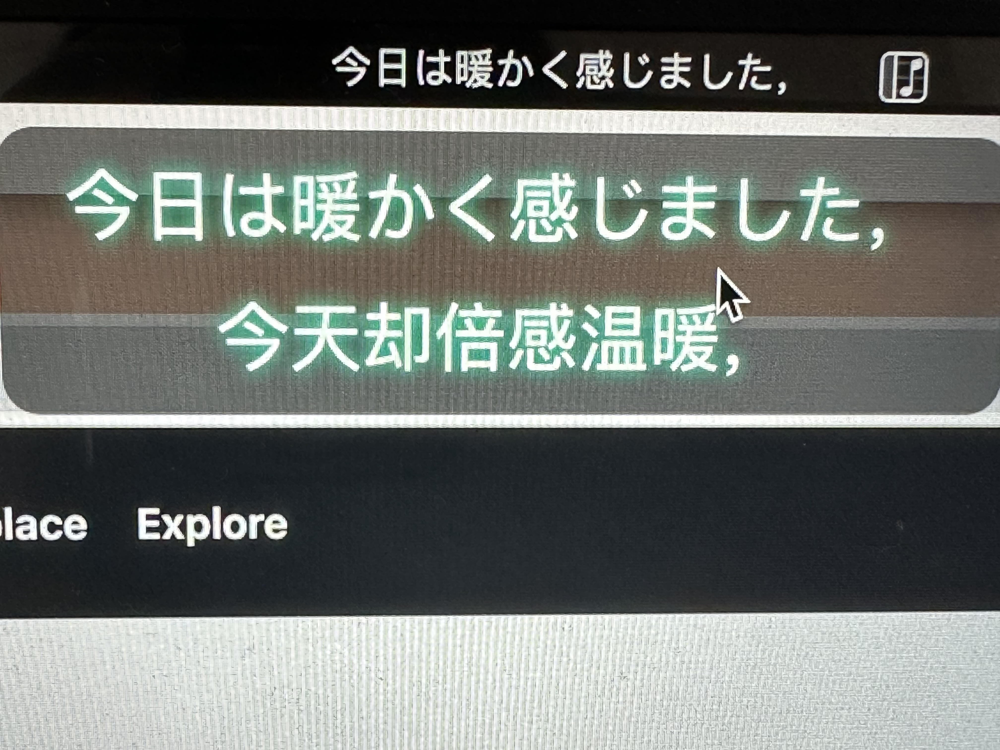

# go-musicfox

go-musicfox是用Go写的又一款网易云音乐命令行客户端，支持UnblockNeteaseMusic、各种音质级别、lastfm、MPRIS、MacOS交互响应（睡眠暂停、蓝牙耳机连接断开响应、菜单栏控制等）...

> UI基于 [charmbracelet/bubbletea](https://github.com/charmbracelet/bubbletea) ，做了一些定制

    

 

## v3.0.0

* go-mp3 => minimp3 降低CPU占用
* flac => C版flac解析（依赖flac），降低CPU占用
* 播放引擎: 
  * beep（已有）
  * 新增mpd，需要安装配置mpd
  * 新增osx，使用Mac系统原生播放器，Mac系统下可用（推荐）
* 保存音量
* 上报lastfm
* Mac优化：
  * 接入MPNowPlayinginfoCenter，在菜单显示播放信息
  * 接入MPRemoteCommandCenter，支持菜单栏、Airpods等控制播放、暂停等，可响应系统中断，例如蓝牙断开
  * 接入NSWorkspace，响应睡眠通知，睡眠前自动暂停
  * LyricsX菜单栏、桌面歌词显示
* 支持当前播放列表
* Windows窗口大小变更优化
* 增加环境变量配置go-musicfox目录: `MUSICFOX_ROOT`
* UnblockNeteaseMusic
* 增加单双列显示配置
* 支持MPRIS
* 其他优化...

## 预览

#### 1. 启动


#### 2. 主界面


#### 3. 通知


#### 4. 登录


#### 5. 搜索


#### 6. lastfm授权


#### 7. Mac NowPlaying


#### 8. UnblockNeteaseMusic


#### 9. MacOS歌词显示



## 安装

**请务必使用等宽字体，或将配置doubleColumn设为false，否则双列显示很乱**

> Mac推荐使用Iterm2或Kitty 
> 
> Linux推荐Kitty
> 
> Windows推荐使用Windows Terminal，UI及体验好很多

### Mac

#### 1. 使用Homebrew安装

```sh
brew install anhoder/go-musicfox/go-musicfox
```

如果你之前安装过musicfox，需要使用下列命令重新链接:

```sh
brew unlink musicfox && brew link --overwrite go-musicfox
```

#### 2. 直接下载

下载Mac可执行文件: https://github.com/anhoder/go-musicfox/releases/latest

### Linux

#### 1. 使用Homebrew安装

```sh
brew install anhoder/go-musicfox/go-musicfox
```

如果你之前安装过musicfox，需要使用下列命令重新链接:

```sh
brew unlink musicfox && brew link --overwrite go-musicfox
```

#### 2. Arch Linux可使用AUR安装：

```sh
paru -S go-musicfox
```

#### 3. Gentoo Linux可使用gentoo-zh overlay安装：

```
eselect repository enable gentoo-zh
emerge --sync
emerge -a media-sound/go-musicfox
```

#### 4. 直接下载

下载Linux可执行文件: https://github.com/anhoder/go-musicfox/releases/latest

### Windows

下载Windows可执行文件: https://github.com/anhoder/go-musicfox/releases/latest

### 手动编译

```sh
> git clone https://github.com/anhoder/go-musicfox

> go mod download

(Linux编译前需要安装flac)

> go build cmd/musicfox.go
```


## 使用

```sh
$ musicfox
```

|    按键     |       作用       |             备注              |
|:---------:|:--------------:|:---------------------------:|
| h/H/LEFT  |       左        |                             |
| l/L/RIGHT |       右        |                             |
|  k/K/UP   |       上        |                             |
| j/J/DOWN  |       下        |                             |
|    q/Q    |       退出       |                             |
|   space   |     暂停/播放      |                             |
|     [     |      上一曲       |                             |
|     ]     |      下一曲       |                             |
|     -     |      减小音量      |                             |
|     =     |      加大音量      |                             |
| n/N/ENTER |    进入选中的菜单     |                             |
|  b/B/ESC  |     返回上级菜单     |                             |
|    w/W    |    退出并退出登录     |                             |
|     p     |     切换播放方式     |                             |
|     P     | 心动模式(仅在歌单中时有效) |                             |
|    r/R    |     重新渲染UI     | 如果UI界面因为某种原因出现错乱，可以使用这个重新渲染 |
|    c/C    |     当前播放列表     |                             |
|     ,     |    喜欢当前播放歌曲    |                             |
|     <     |    喜欢当前选中歌曲    |                             |
|     .     |  当前播放歌曲移除出喜欢   |                             |
|     >     |  当前选中歌曲移除出喜欢   |                             |
|     t     |  标记当前播放歌曲为不喜欢  |                             |
|     T     |  标记当前选中歌曲为不喜欢  |                             |
|     /     |     搜索当前列表     |                             |

## 配置文件

配置文件路径为用户目录下的.go-musicfox/go-musicfox.ini，相关配置有：

```ini
# 启动页配置
[startup]
# 是否显示启动页
show=true
# 启动页进度条是否有回弹效果
progressOutBounce=true
# 启动页时长
loadingSeconds=2
# 启动页欢迎语
welcome=musicfox
# 启动时自动签到
signin=true

# 进度条配置
[progress]
# 进度条已加载字符
fullChar=#
# 进度条未加载字符
emptyChar=

# 主页面配置
[main]
# 是否显示标题
showTitle=true
# 加载中提示
loadingText=[加载中...]
# 歌曲码率，128000, 320000...，视网络情况而定
songBr=320000
# 主题颜色
# 随机
# primaryColor=random
# 经典网易云音乐红
primaryColor="#f90022"
# 是否显示歌词
showLyric=true
# 歌词偏移 ms
lyricOffset=0
# 是否显示通知信息
showNotify=true
# 通知icon，仅MacOS下terminal-notifier可用
notifySender=com.netease.163music
# 开启pprof, --pprof时会开启
pprofPort=9876
# altScreen显示模式
altScreen=true
# 双列显示，开启务必使用等宽字体
doubleColumn=true

[player]
# 播放引擎 beep / mpd(需要安装配置mpd) / osx(Mac才可用)
# 不填Mac默认使用osx，其他系统默认使用beep
#engine=beep

# mpd配置
mpdBin=/usr/local/bin/mpd
# !!!注意!!! 一定要在配置文件中设置pid_file，否则在退出时不会kill掉mpd进程
mpdConfigFile=/Users/anhoder/.mpd/mpd.conf
mpdNetwork=unix
mpdAddr=

[unm]
# UNM开关
switch=false
# UNM源: kuwo,kugou,migu,qq
sources=kuwo
# UNM搜索其他平台限制 0-3
searchLimit=0
# 解除会员限制
enableLocalVip=true
# 解除音质限制
unlockSoundEffects=true
# QQ音乐cookie文件
qqCookieFile=
```


## TODO

* [x] 我的歌单
* [x] 每日推荐歌曲
* [x] 每日推荐歌单
* [x] 私人FM
* [x] 歌词显示
* [x] 欢迎界面
* [x] 搜索
    * [x] 按歌曲
    * [x] 按歌手
    * [x] 按歌词
    * [x] 按歌单
    * [x] 按专辑
    * [x] 按用户
* [x] 排行榜
* [x] 精选歌单
* [x] 最新专辑
* [x] 热门歌手
* [x] 云盘
* [x] 播放方式切换
* [x] 喜欢/取消喜欢
* [x] 心动模式/智能模式
* [x] 音乐电台
* [x] 配置文件
* [x] 通知功能
* [x] 歌单内搜索
* [x] 听歌统计(网易云、last.fm)
* [x] 播放列表
* [x] 支持UnblockNeteaseMusic
    
## 伴生项目

1. [anhoder/bubbletea](https://github.com/anhoder/bubbletea): 基于 [bubbletea](https://github.com/charmbracelet/bubbletea) 进行部分定制 
2. [anhoder/bubbles](https://github.com/anhoder/bubbles): 基于 [bubbles](https://github.com/charmbracelet/bubbles) 进行部分定制
3. [anhoder/netease-music](https://github.com/anhoder/netease-music): fork自 [NeteaseCloudMusicApiWithGo](https://github.com/sirodeneko/NeteaseCloudMusicApiWithGo) ，在原项目的基础上去除API功能，只保留service、util作为一个独立的包，方便在其他go项目中调用

## 感谢

感谢以下项目及其贡献者们（不限于）：

* [bubbletea](https://github.com/charmbracelet/bubbletea)
* [beep](https://github.com/faiface/beep)
* [musicbox](https://github.com/darknessomi/musicbox)
* [NeteaseCloudMusicApi](https://github.com/Binaryify/NeteaseCloudMusicApi)
* [NeteaseCloudMusicApiWithGo](https://github.com/sirodeneko/NeteaseCloudMusicApiWithGo)
* [gcli](https://github.com/gookit/gcli)
* ...
