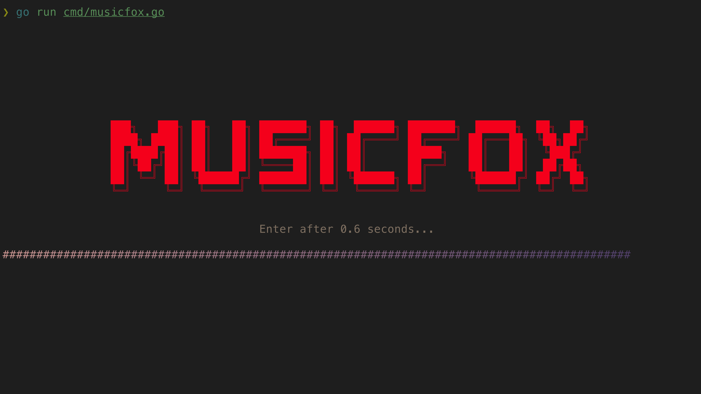
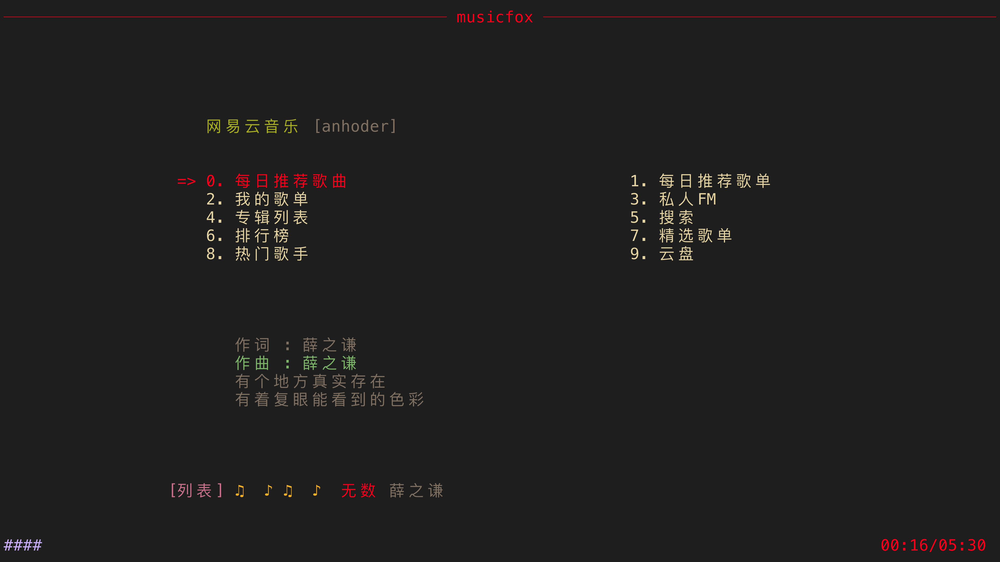
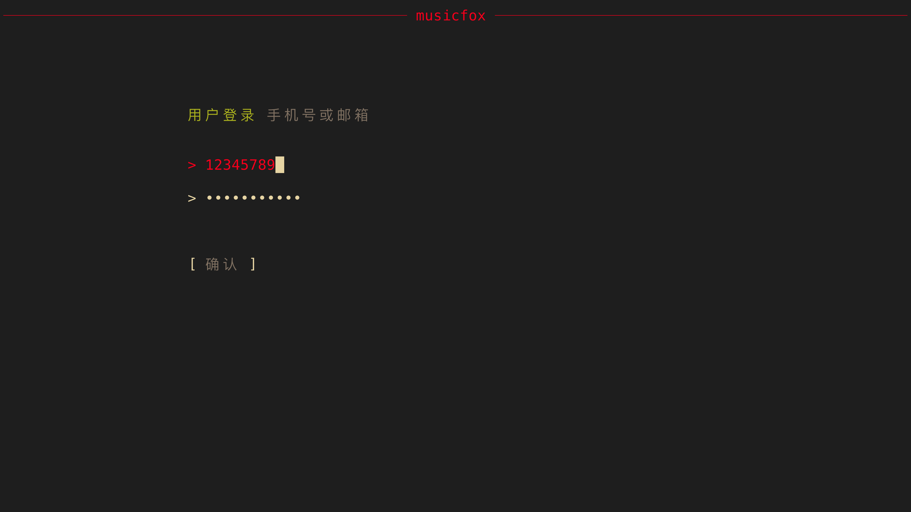
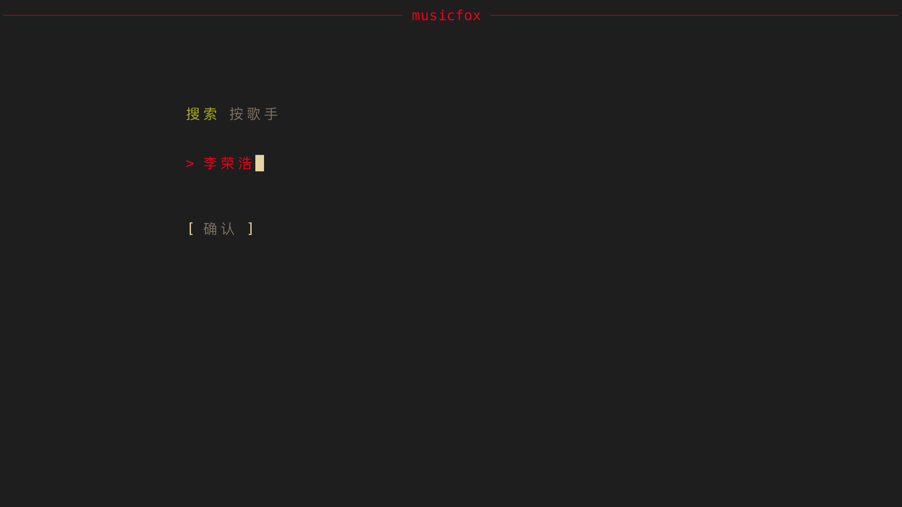
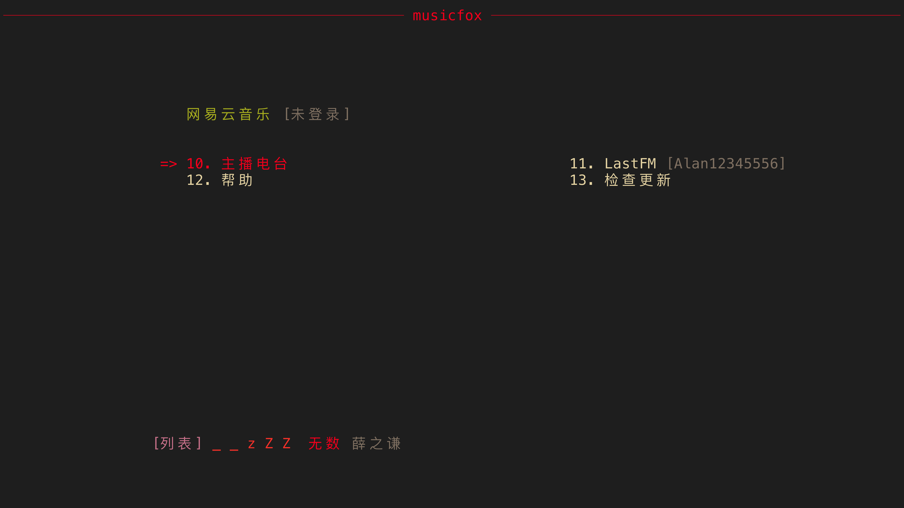
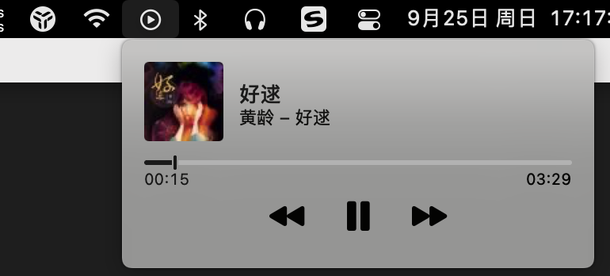
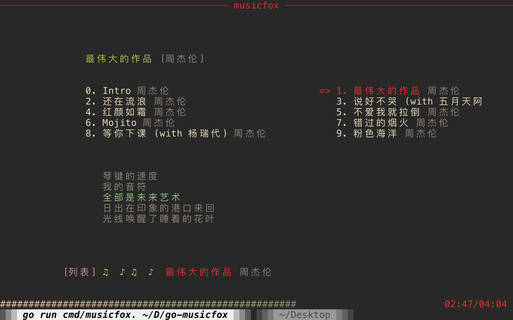

# go-musicfox

go-musicfox 是用 Go 写的又一款网易云音乐命令行客户端，支持各种音质级别、UnblockNeteaseMusic、Last.fm、MPRIS 和 macOS 交互响应（睡眠暂停、蓝牙耳机连接断开响应和菜单栏控制等）等功能特性。

> UI 基于 [charmbracelet/bubbletea](https://github.com/charmbracelet/bubbletea) 进行了部分定制

    

 

<p></p>

([The icon](https://github.com/go-musicfox/go-musicfox-icon) is based on [kitty-icon](https://github.com/DinkDonk/kitty-icon))

------------------------------

## 预览

#### 1. 启动



#### 2. 主界面



#### 3. 通知


#### 4. 登录



#### 5. 搜索



#### 6. Last.fm 授权



#### 7. macOS NowPlaying



#### 8. UnblockNeteaseMusic



#### 9. macOS 歌词显示


> 需要满足以下条件：
> 1. go-musicfox >= v3.7.7
> 2. 下载和安装 [LyricsX 的 go-musicfox 的 fork 版本](https://github.com/go-musicfox/LyricsX/releases/latest)
> 3. 在 LyricsX 设置中，打开`使用系统正在播放的应用`

## 安装

### macOS

#### 1. 通过 Homebrew 安装

```sh
$ brew install anhoder/go-musicfox/go-musicfox
```

如果你之前安装过 musicfox，需要使用下列命令重新链接:

```sh
$ brew unlink musicfox && brew link --overwrite go-musicfox
```

#### 2. 直接下载

在 [Release](https://github.com/go-musicfox/go-musicfox/releases/latest) 下载 macOS 的可执行文件。

### Linux

#### 1. 使用发行版软件包（推荐）

##### Arch Linux

###### 从 [AUR](https://aur.archlinux.org/) 安装

```sh
$ paru -S go-musicfox # 下载源代码编译安装
$ paru -S go-musicfox-bin # 下载安装预编译好的二进制
```

###### 从 `archlinuxcn` 安装

首先[添加 archlinuxcn 仓库到系统](https://www.archlinuxcn.org/archlinux-cn-repo-and-mirror/)。

```sh
# pacman -S go-musicfox
```

##### Gentoo Linux

###### 从 [gentoo-zh Overlay](https://github.com/microcai/gentoo-zh) 安装

```sh
$ eselect repository enable gentoo-zh
$ emerge --sync
$ emerge -a media-sound/go-musicfox
```

##### NixOS

<details>
<summary>
<b>1. flake support</b>
</summary>
下面是一个在nixos配置中使用它的例子

```nix
{
  description = "My configuration";

  inputs = {
    nixpkgs.url = "github:NixOS/nixpkgs/nixos-unstable";
    go-musicfox.url = "github:go-musicfox/go-musicfox";
  };

  outputs = { nixpkgs, go-musicfox, ... }:
    {
      nixosConfigurations = {
        hostname = nixpkgs.lib.nixosSystem
          {
            system = "x86_64-linux";
            modules = [
              {
                nixpkgs.overlays = [ go-musicfox.overlays.default ];
                environment.systemPackages = with pkgs;[
                  go-musicfox
                ];
              }
            ];
          };
      };
    };
}
```

临时运行:

```sh
$ nix run github:go-musicfox/go-musicfox
```

</details>
<details>
<summary>
<b>2. 配置 configuration.nix 或使用 Home Manager（推荐）</b>
</summary>

```nix
# configuration.nix
environment.systemPackages = [
  pkgs.go-musicfox
];

# home manager
home.packages = [
  pkgs.go-musicfox
];
```

</details>
<details>
<summary>
<b>3. 从 <a href="https://search.nixos.org/packages?channel=unstable&show=go-musicfox&from=0&size=50&sort=relevance&type=packages&query=go-musicfox">Nixpkgs </a>安装</b>
</summary>
安装到本地 profile：

```sh
$ nix-env -iA nixos.go-musicfox
```

临时安装：

```sh
$ nix-shell -p go-musicfox
```
</details>

##### Void Linux

从 [void-packages-zh](https://github.com/voidlinux-zh-association/void-packages-zh#readme) 安装。

#### 2. 通过 Homebrew 安装

```sh
$ brew install anhoder/go-musicfox/go-musicfox
```

如果你之前安装过 musicfox，需要使用下列命令重新链接:

```sh
$ brew unlink musicfox && brew link --overwrite go-musicfox
```

#### 3. 直接下载

在 [Release](https://github.com/go-musicfox/go-musicfox/releases/latest) 下载 Linux 的可执行文件。

### Windows

#### 1. 通过 scoop 安装

```sh
scoop bucket add go-musicfox https://github.com/go-musicfox/go-musicfox.git

scoop install go-musicfox
```

#### 2. 直接下载

在 [Release](https://github.com/go-musicfox/go-musicfox/releases/latest) 下载 Windows 的可执行文件。

### 手动编译

需要 Go v1.13 及以上版本

```sh
$ git clone https://github.com/go-musicfox/go-musicfox

$ go mod download

# Linux 编译前需要安装 flac

$ make # 编译到 bin 目录下
$ make install # 安装到 $GOPATH/bin下
```

## 使用

```sh
$ musicfox
```

### 注意事项

- **请务必使用等宽字体，或将配置项 `doubleColumn` 设为 `false`，否则双列显示排版可能会混乱**

- **如果在使用时出现莫名奇妙的光标移动、切歌或暂停等现象，请将配置项 `enableMouseEvent` 设置为 `false`**

- **本应用不对 macOS 原生终端和 Windows 的命令提示符（CMD）做兼容处理（[#99](https://github.com/go-musicfox/go-musicfox/issues/99)）**

> macOS 用户推荐使用 [iTerm2](https://iterm2.com/) 或 [Kitty](https://sw.kovidgoyal.net/kitty/) 
> 
> Linux 用户推荐使用 [Kitty](https://sw.kovidgoyal.net/kitty/)
> 
> Windows 用户推荐使用 [Windows Terminal](https://apps.microsoft.com/store/detail/windows-terminal/9N0DX20HK701)，使用体验更佳

### 快捷键

|           按键          |             作用             |                          备注                          |
|:-----------------------:|:----------------------------:|:------------------------------------------------------:|
|   `h`/`H`/`← (左方向)`  |              左              |                                                        |
|   `l`/`L`/`→ (右方向)`  |              右              |                                                        |
|   `k`/`K`/`↑ (上方向)`  |              上              |                                                        |
|   `j`/`J`/`↓ (下方向)`  |              下              |                                                        |
|           `g`           |          上移到顶部          |                                                        |
|           `G`           |          下移到底部          |                                                        |
|         `q`/`Q`         |             退出             |                                                        |
|      `Space (空格)`     |           暂停/播放          |                                                        |
|           `[`           |            上一曲            |                                                        |
|           `]`           |            下一曲            |                                                        |
|        `-/滚轮下`       |           减小音量           |                                                        |
|        `=/滚轮上`       |           加大音量           |                                                        |
|  `n`/`N`/`Enter (回车)` |        进入选中的菜单        |                                                        |
| `b`/`B`/`Escape (退出)` |         返回上级菜单         |                                                        |
|         `w`/`W`         |        退出并退出登录        |                                                        |
|           `p`           |         切换播放方式         |                                                        |
|           `P`           | 心动模式（仅在歌单中时有效） |                                                        |
|         `r`/`R`         |          重新渲染 UI         | 如果 UI 界面因为某种原因出现错乱，可以使用这个重新渲染 |
|         `c`/`C`         |         当前播放列表         |                                                        |
|         `v`/`V`         |        快进 5 s / 10 s       |                                                        |
|         `x`/`X`         |        快退 1 s / 5 s        |                                                        |
|           `,`           |       喜欢当前播放歌曲       |                                                        |
|           `<`           |       喜欢当前选中歌曲       |                                                        |
|           `.`           |    当前播放歌曲移除出喜欢    |                                                        |
|           `>`           |    当前选中歌曲移除出喜欢    |                                                        |
|         `` ` ``         |     当前播放歌曲加入歌单     |                                                        |
|           `~`           |     当前播放歌曲移出歌单     |                                                        |
|          `Tab`          |     当前选中歌曲加入歌单     |                                                        |
|       `Shift+Tab`       |     当前选中歌曲移出歌单     |                                                        |
|           `>`           |    当前选中歌曲移除出喜欢    |                                                        |
|           `>`           |    当前选中歌曲移除出喜欢    |                                                        |
|           `t`           |   标记当前播放歌曲为不喜欢   |                                                        |
|           `T`           |   标记当前选中歌曲为不喜欢   |                                                        |
|           `d`           |       下载当前播放歌曲       |                                                        |
|           `D`           |       下载当前选中歌曲       |                                                        |
|           `/`           |         搜索当前列表         |                                                        |
|           `?`           |           帮助信息           |                                                        |
|           `a`           |     播放中歌曲的所属专辑     |                                                        |
|           `A`           |      选中歌曲的所属专辑      |                                                        |
|           `s`           |     播放中歌曲的所属歌手     |                                                        |
|           `S`           |      选中歌曲的所属歌手      |                                                        |
|           `o`           |      网页打开播放中歌曲      |                                                        |
|           `O`           |   网页打开选中歌曲/专辑...   |                                                        |
|           `e`           |       添加为下一曲播放       |                                                        |
|           `E`           |      添加到播放列表末尾      |                                                        |
|           `\`           |    从播放列表删除选中歌曲    |                仅在当前播放列表界面有效                |
|         `;`/`:`         |         收藏选中歌单         |                                                        |
|         `'`/`"`         |       取消收藏选中歌单       |                                                        |
|         `u`/`U`         |         清除音乐缓存         |                                                        |

## 配置文件

配置文件路径为用户配置目录下的 `go-musicfox.ini` 文件，详细可参见[配置示例](./utils/embed/go-musicfox.ini)。

> 用户配置目录路径：
> 
> macOS：`$HOME/Library/Application Support/go-musicfox`
>
> Linux：`$XDG_CONFIG_HOME/go-musicfox` 或 `$HOME/.config/go-musicfox`
> 
> Windows：`%AppData%\go-musicfox`

> 你可以通过设置 `MUSICFOX_ROOT` 环境变量来自定义用户配置的存储位置

> 旧版本的 go-musicfox 的默认用户配置目录为 `$HOME/.go-musicfox`（*nix）或 `%USERPROFILE%\.go-musicfox`（Windows），升级到新版本时将自动迁移到上述的新路径

## 相关项目

1. [go-musicfox/bubbletea](https://github.com/go-musicfox/bubbletea)：基于 [bubbletea](https://github.com/charmbracelet/bubbletea) 进行部分定制
2. [go-musicfox/netease-music](https://github.com/go-musicfox/netease-music)：fork 自 [NeteaseCloudMusicApiWithGo](https://github.com/sirodeneko/NeteaseCloudMusicApiWithGo) ，在原项目的基础上去除 API 功能，只保留 service 和 util 作为一个独立的包，方便在其他 Go 项目中调用

## 感谢

感谢以下项目及其贡献者们（但不限于）：

* [bubbletea](https://github.com/charmbracelet/bubbletea)
* [beep](https://github.com/faiface/beep)
* [musicbox](https://github.com/darknessomi/musicbox)
* [NeteaseCloudMusicApi](https://github.com/Binaryify/NeteaseCloudMusicApi)
* [NeteaseCloudMusicApiWithGo](https://github.com/sirodeneko/NeteaseCloudMusicApiWithGo)
* [gcli](https://github.com/gookit/gcli)
* ...

感谢 [JetBrains Open Source](https://www.jetbrains.com/zh-cn/opensource/?from=archery) 为项目提供免费的 IDE 授权    
[](https://www.jetbrains.com/opensource/)

[](https://star-history.com/#go-musicfox/go-musicfox&Date)
