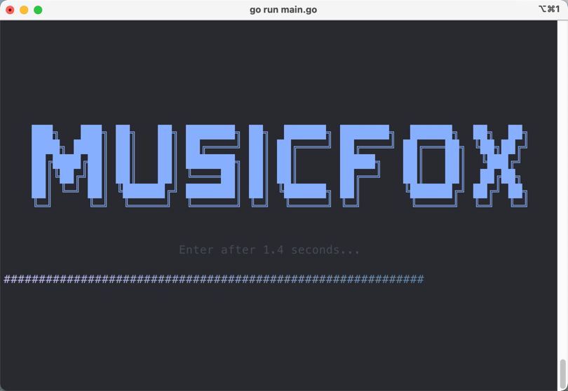

# go-musicfox

**给个star✨吧**

go-musicfox是 [musicfox](https://github.com/anhoder/musicfox) 的重置版，为了解决一些问题，采用go重写。

> 基于 [charmbracelet/bubbletea](https://github.com/charmbracelet/bubbletea) ，做了一些定制

    

 


## 预览




## 安装

### Mac

提供两种方式安装：

* 使用brew安装: `brew tap anhoder/go-musicfox && brew install go-musicfox`
* 直接下载[Mac可执行文件](./bin/musicfox.mac)，在iTerm或Terminal中打开

### Linux

- 直接下载[Linux可执行文件](./bin/musicfox.ubuntu)，在终端中执行。

> 本人没有Linux系统，该执行文件是在WSL2(Ubuntu 2004)下打包的，不保证其他Linux系统也能正常使用

### Windows

下载[Windows可执行文件](./bin/musicfox.exe)，在命令行中运行即可。

> **推荐使用Windows Terminal，UI及体验好很多**

## 使用

```sh
$ musicfox
```

| 按键 | 作用 | 备注 |
| --- | --- | --- |
| h/H/LEFT | 左 |  |
| l/L/RIGHT | 右 |  |
| k/K/UP | 上 |  |
| j/J/DOWN | 下 | |
| q/Q | 退出 | |
| space | 暂停/播放 | |
| [ | 上一曲 | |
| ] | 下一曲 | |
| - | 减小音量 | |
| = | 加大音量 | |
| n/N/ENTER | 进入选中的菜单 | |
| b/B/ESC | 返回上级菜单 | |
| w/W | 退出并退出登录 | |
| p | 切换播放方式 | |
| P | 心动模式(仅在歌单中时有效) | |
| r/R | 重新渲染UI | Windows调整窗口大小后，没有事件触发，可以使用该方法手动重新渲染 |
| , | 喜欢当前播放歌曲 | |
| < | 喜欢当前选中歌曲 | |
| . | 当前播放歌曲移除出喜欢 | |
| > | 当前选中歌曲移除出喜欢 | |
| / | 标记当前播放歌曲为不喜欢 | |
| ? | 标记当前选中歌曲为不喜欢 | |

## TODO

* [x] 我的歌单
* [x] 每日推荐歌曲
* [x] 每日推荐歌单
* [x] 私人FM
* [x] 歌词显示
* [x] 欢迎界面
* [x] 搜索
    * [x] 按歌曲
    * [x] 按歌手
    * [x] 按歌词
    * [x] 按歌单
    * [x] 按专辑
    * [x] 按用户
* [x] 排行榜
* [x] 精选歌单
* [x] 最新专辑
* [x] 热门歌手
* [x] 云盘
* [x] 播放方式切换
* [x] 喜欢/取消喜欢
* [x] 心动模式/智能模式
* [x] 音乐电台
* [ ] 配置文件
* [ ] 通知功能
    
## 伴生项目

1. [anhoder/bubbletea](https://github.com/anhoder/bubbletea): 基于 [bubbletea](https://github.com/charmbracelet/bubbletea) 进行部分定制 
2. [anhoder/bubbles](https://github.com/anhoder/bubbles): 基于 [bubbles](https://github.com/charmbracelet/bubbles) 进行部分定制
3. [anhoder/netease-music](https://github.com/anhoder/netease-music): fork自 [NeteaseCloudMusicApiWithGo](https://github.com/sirodeneko/NeteaseCloudMusicApiWithGo) ，在原项目的基础上去除API功能，只保留service、util作为一个独立的包，方便在其他go项目中调用

## 感谢

感谢以下项目及其贡献者们（不限于）：

* [bubbletea](https://github.com/charmbracelet/bubbletea)
* [beep](https://github.com/faiface/beep)
* [musicbox](https://github.com/darknessomi/musicbox)
* [NeteaseCloudMusicApi](https://github.com/Binaryify/NeteaseCloudMusicApi)
* [NeteaseCloudMusicApiWithGo](https://github.com/sirodeneko/NeteaseCloudMusicApiWithGo)
* [gcli](https://github.com/gookit/gcli)
* ...