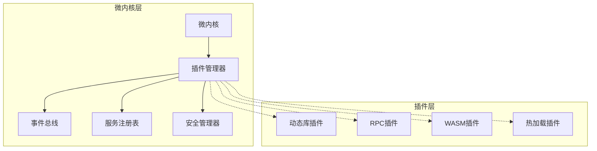
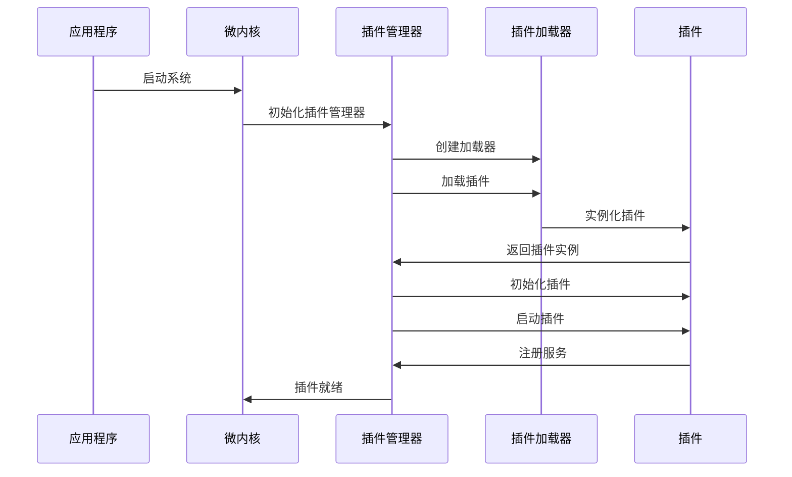
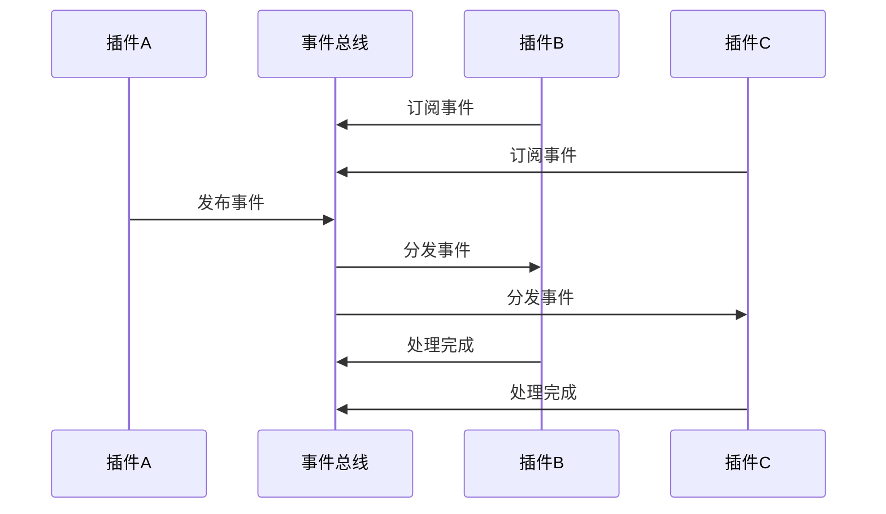

# 架构设计文档索引

本目录包含 go-musicfox v2 微内核插件架构的详细设计文档，深入解析系统架构和设计理念。

## 核心架构

### [微内核架构概述](microkernel.md)
详细介绍微内核架构的设计理念、核心组件和工作原理。

**主要内容：**
- 微内核设计模式
- 核心组件职责
- 组件间通信机制
- 系统启动流程

### [插件系统设计](plugin-system.md)
深入解析混合插件系统的设计和实现细节。

**主要内容：**
- 插件类型和特点
- 插件加载机制
- 插件生命周期管理
- 插件间通信

### [安全机制说明](security.md)
详细说明系统的安全设计和防护机制。

**主要内容：**
- 插件沙箱机制
- 权限控制系统
- 安全验证流程
- 威胁模型分析

### [性能优化指南](performance.md)
系统性能优化的策略和最佳实践。

**主要内容：**
- 性能瓶颈分析
- 优化策略和技巧
- 性能监控和调优
- 基准测试结果

## 架构特点

### 微内核设计



### 核心优势

1. **高度模块化**
   - 核心功能最小化
   - 功能通过插件扩展
   - 组件间松耦合

2. **灵活扩展**
   - 支持多种插件类型
   - 动态加载和卸载
   - 热更新支持

3. **安全可靠**
   - 插件沙箱隔离
   - 权限控制机制
   - 故障隔离和恢复

4. **高性能**
   - 异步事件通信
   - 资源池化管理
   - 性能监控和优化

## 设计原则

### 1. 单一职责原则
每个组件都有明确的职责边界：
- 微内核：生命周期管理和组件协调
- 插件管理器：插件加载和管理
- 事件总线：异步通信
- 服务注册表：服务发现和管理
- 安全管理器：安全验证和控制

### 2. 开放封闭原则
系统对扩展开放，对修改封闭：
- 通过插件扩展功能
- 核心接口保持稳定
- 向后兼容性保证

### 3. 依赖倒置原则
高层模块不依赖低层模块：
- 基于接口编程
- 依赖注入管理
- 可测试性设计

### 4. 接口隔离原则
客户端不应依赖不需要的接口：
- 细粒度接口设计
- 按需实现接口
- 避免接口污染

## 技术栈

### 核心技术
- **语言**: Go 1.21+
- **依赖注入**: uber-go/dig
- **配置管理**: knadh/koanf
- **日志**: log/slog
- **测试**: stretchr/testify

### 插件技术
- **动态库**: Go plugin 包
- **RPC通信**: gRPC/HTTP
- **WebAssembly**: wasmtime-go
- **热加载**: 文件监控 + 反射

### 监控和调试
- **性能监控**: pprof
- **链路追踪**: OpenTelemetry
- **健康检查**: 自定义健康检查器
- **日志聚合**: 结构化日志

## 部署架构

### 单机部署
```
┌─────────────────────────────────────┐
│              go-musicfox            │
├─────────────────────────────────────┤
│  微内核 + 插件管理器 + 核心组件      │
├─────────────────────────────────────┤
│  动态库插件 │ RPC插件 │ WASM插件    │
├─────────────────────────────────────┤
│         操作系统 (Linux/macOS)       │
└─────────────────────────────────────┘
```

### 分布式部署
```
┌─────────────┐    ┌─────────────┐    ┌─────────────┐
│  主节点      │    │  RPC插件节点 │    │  存储节点    │
│  微内核      │◄──►│  音乐源服务  │◄──►│  数据库      │
│  核心插件    │    │  外部API    │    │  缓存        │
└─────────────┘    └─────────────┘    └─────────────┘
```

## 数据流

### 插件加载流程


### 事件通信流程


## 扩展点

### 1. 插件类型扩展
可以添加新的插件类型：
```go
type CustomPluginLoader struct {
    // 自定义加载器实现
}

func (l *CustomPluginLoader) LoadPlugin(path string) (Plugin, error) {
    // 自定义加载逻辑
}
```

### 2. 事件类型扩展
可以定义新的事件类型：
```go
const (
    EventCustomAction = "custom.action"
    EventCustomState  = "custom.state"
)
```

### 3. 服务类型扩展
可以注册新的服务类型：
```go
type CustomService interface {
    DoCustomWork() error
}
```

## 版本演进

### v2.0.0 (当前版本)
- 微内核架构实现
- 混合插件系统
- 基础安全机制
- 核心组件完成

### v2.1.0 (计划中)
- 分布式插件支持
- 增强安全机制
- 性能优化
- 监控和诊断工具

### v2.2.0 (规划中)
- 插件市场集成
- 自动更新机制
- 云原生支持
- AI 辅助开发

## 相关文档

- [API 文档](../api/README.md)
- [开发指南](../guides/README.md)
- [示例代码](../examples/README.md)
- [开发工具](../tools/README.md)

---

更多详细的架构信息请查看具体的设计文档。