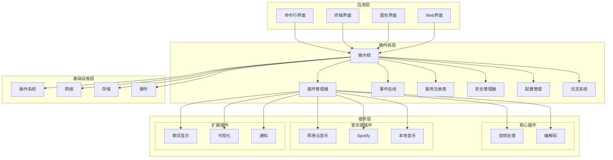
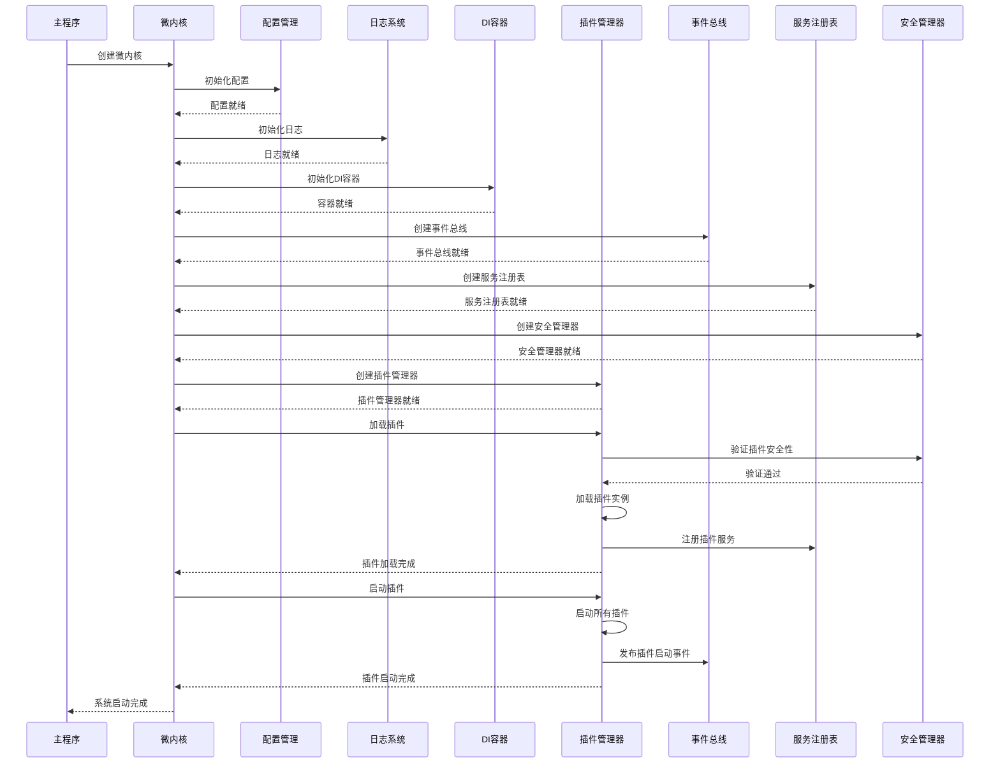

# 微内核架构概述

## 概述

go-musicfox v2 采用微内核架构模式，将系统分为最小化的内核和可扩展的插件层。微内核负责核心的系统服务和插件管理，而具体的业务功能通过插件实现。

## 设计理念

### 核心原则

1. **最小化内核**：内核只包含最基本的系统服务
2. **插件化扩展**：所有业务功能通过插件实现
3. **松耦合设计**：组件间通过接口和事件通信
4. **高度可扩展**：支持动态加载和卸载插件
5. **安全隔离**：插件在受控环境中运行

### 架构优势

- **模块化**：功能模块独立开发和维护
- **可扩展性**：易于添加新功能和集成第三方服务
- **稳定性**：插件故障不影响核心系统
- **灵活性**：支持多种插件实现方式
- **可测试性**：组件间接口清晰，便于单元测试

## 系统架构

### 整体架构图



### 核心组件

#### 1. 微内核 (Kernel)

微内核是系统的核心，负责：

- **生命周期管理**：系统启动、运行、关闭
- **组件协调**：管理各个核心组件的交互
- **资源管理**：内存、CPU、文件句柄等系统资源
- **依赖注入**：管理组件间的依赖关系

```go
type Kernel interface {
    // 生命周期管理
    Initialize(ctx context.Context) error
    Start(ctx context.Context) error
    Stop(ctx context.Context) error
    Shutdown(ctx context.Context) error
    
    // 组件访问
    GetPluginManager() PluginManager
    GetEventBus() EventBus
    GetServiceRegistry() ServiceRegistry
    GetSecurityManager() SecurityManager
    
    // 系统服务
    GetConfig() *koanf.Koanf
    GetLogger() *slog.Logger
    GetContainer() *dig.Container
}
```

#### 2. 插件管理器 (PluginManager)

插件管理器负责：

- **插件加载**：支持多种插件类型的加载
- **生命周期管理**：插件的初始化、启动、停止、清理
- **依赖管理**：处理插件间的依赖关系
- **健康监控**：监控插件运行状态

```go
type PluginManager interface {
    // 插件管理
    LoadPlugin(path string, pluginType PluginType) error
    UnloadPlugin(pluginID string) error
    StartPlugin(pluginID string) error
    StopPlugin(pluginID string) error
    
    // 插件查询
    GetPlugin(pluginID string) (Plugin, error)
    ListPlugins() []PluginInfo
    GetPluginStatus(pluginID string) PluginStatus
    
    // 批量操作
    LoadPluginsFromConfig() error
    StartAllPlugins() error
    StopAllPlugins() error
}
```

#### 3. 事件总线 (EventBus)

事件总线提供异步通信机制：

- **事件发布**：组件可以发布事件
- **事件订阅**：组件可以订阅感兴趣的事件
- **事件路由**：根据事件类型路由到订阅者
- **事件过滤**：支持事件过滤和优先级

```go
type EventBus interface {
    // 事件发布订阅
    Publish(eventType string, data interface{}) error
    Subscribe(eventType string, handler EventHandler) error
    Unsubscribe(eventType string, handler EventHandler) error
    
    // 事件过滤
    SubscribeWithFilter(eventType string, filter EventFilter, handler EventHandler) error
    
    // 批量操作
    PublishBatch(events []Event) error
    SubscribeBatch(subscriptions []Subscription) error
}
```

#### 4. 服务注册表 (ServiceRegistry)

服务注册表管理系统中的服务：

- **服务注册**：插件可以注册提供的服务
- **服务发现**：其他组件可以发现和使用服务
- **健康检查**：监控服务的健康状态
- **负载均衡**：支持多实例服务的负载均衡

```go
type ServiceRegistry interface {
    // 服务注册
    RegisterService(service ServiceInfo) error
    UnregisterService(serviceID string) error
    
    // 服务发现
    GetService(serviceID string) (ServiceInfo, error)
    FindServices(criteria ServiceCriteria) ([]ServiceInfo, error)
    
    // 健康检查
    CheckHealth(serviceID string) (HealthStatus, error)
    SetHealthChecker(serviceID string, checker HealthChecker) error
}
```

#### 5. 安全管理器 (SecurityManager)

安全管理器负责系统安全：

- **插件验证**：验证插件的合法性和安全性
- **权限控制**：控制插件的访问权限
- **沙箱管理**：管理插件的沙箱环境
- **审计日志**：记录安全相关的操作

```go
type SecurityManager interface {
    // 插件安全
    ValidatePlugin(pluginPath string, pluginType PluginType) error
    CreateSandbox(pluginID string, config SandboxConfig) (Sandbox, error)
    
    // 权限控制
    CheckPermission(pluginID string, permission Permission) error
    GrantPermission(pluginID string, permission Permission) error
    RevokePermission(pluginID string, permission Permission) error
    
    // 审计
    LogSecurityEvent(event SecurityEvent) error
    GetSecurityEvents(filter SecurityEventFilter) ([]SecurityEvent, error)
}
```

## 系统启动流程

### 启动序列图



### 启动步骤详解

1. **配置初始化**
   ```go
   func (k *MicroKernel) initializeConfig() error {
       k.config = koanf.New(".")
       
       // 加载配置文件
       if err := k.config.Load(file.Provider("config.yaml"), yaml.Parser()); err != nil {
           return err
       }
       
       // 加载环境变量
       if err := k.config.Load(env.Provider("MUSICFOX_", ".", nil), nil); err != nil {
           return err
       }
       
       return nil
   }
   ```

2. **日志初始化**
   ```go
   func (k *MicroKernel) initializeLogger() error {
       level := k.config.String("log.level")
       format := k.config.String("log.format")
       
       var handler slog.Handler
       switch format {
       case "json":
           handler = slog.NewJSONHandler(os.Stdout, &slog.HandlerOptions{
               Level: parseLogLevel(level),
           })
       default:
           handler = slog.NewTextHandler(os.Stdout, &slog.HandlerOptions{
               Level: parseLogLevel(level),
           })
       }
       
       k.logger = slog.New(handler)
       return nil
   }
   ```

3. **依赖注入容器初始化**
   ```go
   func (k *MicroKernel) initializeContainer() error {
       // 注册核心组件
       if err := k.container.Provide(func() *koanf.Koanf { return k.config }); err != nil {
           return err
       }
       
       if err := k.container.Provide(func() *slog.Logger { return k.logger }); err != nil {
           return err
       }
       
       return nil
   }
   ```

4. **核心组件初始化**
   ```go
   func (k *MicroKernel) initializeCoreComponents() error {
       // 创建事件总线
       k.eventBus = NewEventBus(k.logger)
       
       // 创建服务注册表
       k.serviceRegistry = NewServiceRegistry(k.logger)
       
       // 创建安全管理器
       k.securityManager = NewSecurityManager(k.config, k.logger)
       
       // 创建插件管理器
       k.pluginManager = NewPluginManager(
           k.container,
           k.eventBus,
           k.serviceRegistry,
           k.securityManager,
           k.logger,
       )
       
       return nil
   }
   ```

## 组件间通信

### 通信方式

1. **直接调用**：通过接口直接调用
2. **事件通信**：通过事件总线异步通信
3. **服务调用**：通过服务注册表发现和调用服务
4. **依赖注入**：通过DI容器获取依赖

### 通信模式

#### 1. 同步通信
```go
// 直接接口调用
result, err := pluginManager.GetPlugin("audio-processor")
if err != nil {
    return err
}

// 服务调用
service, err := serviceRegistry.GetService("music-source")
if err != nil {
    return err
}
```

#### 2. 异步通信
```go
// 发布事件
eventBus.Publish("song.started", &SongEvent{
    SongID: "123",
    Title:  "My Song",
})

// 订阅事件
eventBus.Subscribe("song.started", func(event *SongEvent) {
    // 处理歌曲开始事件
    logger.Info("Song started", "title", event.Title)
})
```

#### 3. 请求-响应模式
```go
// 发布请求事件
response := make(chan *SearchResponse)
eventBus.PublishWithResponse("search.request", &SearchRequest{
    Query: "hello world",
}, response)

// 等待响应
select {
case result := <-response:
    // 处理搜索结果
case <-time.After(30 * time.Second):
    // 超时处理
}
```

## 错误处理和恢复

### 错误分类

1. **系统错误**：内核组件故障
2. **插件错误**：插件加载或运行错误
3. **通信错误**：组件间通信失败
4. **资源错误**：资源不足或访问失败

### 恢复策略

1. **重试机制**：对临时性错误进行重试
2. **降级服务**：在部分功能不可用时提供基础服务
3. **故障隔离**：隔离故障组件，防止影响其他组件
4. **自动恢复**：自动重启故障组件

```go
type ErrorHandler struct {
    logger *slog.Logger
    maxRetries int
    retryDelay time.Duration
}

func (h *ErrorHandler) HandleError(err error, component string) error {
    h.logger.Error("Component error", "component", component, "error", err)
    
    switch {
    case isRetryableError(err):
        return h.retryOperation(component)
    case isCriticalError(err):
        return h.shutdownComponent(component)
    default:
        return h.logAndContinue(err)
    }
}
```

## 性能考虑

### 性能优化策略

1. **异步处理**：使用事件总线进行异步通信
2. **连接池**：复用网络连接和数据库连接
3. **缓存机制**：缓存频繁访问的数据
4. **资源池化**：复用昂贵的资源对象
5. **并发控制**：合理控制并发度

### 性能监控

```go
type PerformanceMonitor struct {
    metrics map[string]*Metric
    mutex   sync.RWMutex
}

func (m *PerformanceMonitor) RecordLatency(operation string, duration time.Duration) {
    m.mutex.Lock()
    defer m.mutex.Unlock()
    
    metric := m.metrics[operation]
    if metric == nil {
        metric = &Metric{}
        m.metrics[operation] = metric
    }
    
    metric.RecordLatency(duration)
}
```

## 扩展性设计

### 水平扩展

- **插件分布式部署**：RPC插件可以部署在不同节点
- **负载均衡**：支持多实例插件的负载均衡
- **服务发现**：自动发现分布式服务

### 垂直扩展

- **资源配置**：支持动态调整资源配置
- **性能调优**：支持运行时性能参数调整
- **缓存扩展**：支持多级缓存和分布式缓存

## 总结

微内核架构为 go-musicfox v2 提供了：

1. **清晰的架构边界**：核心功能和扩展功能分离
2. **高度的可扩展性**：通过插件系统扩展功能
3. **良好的稳定性**：插件故障不影响核心系统
4. **灵活的部署方式**：支持单机和分布式部署
5. **优秀的开发体验**：组件间接口清晰，便于开发和测试

这种架构设计使得系统既保持了核心的稳定性，又具备了良好的扩展性和灵活性，为后续的功能扩展和性能优化奠定了坚实的基础。